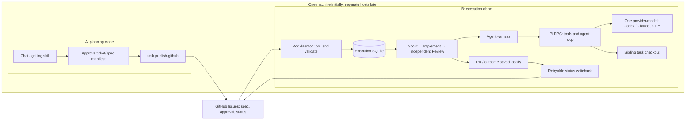
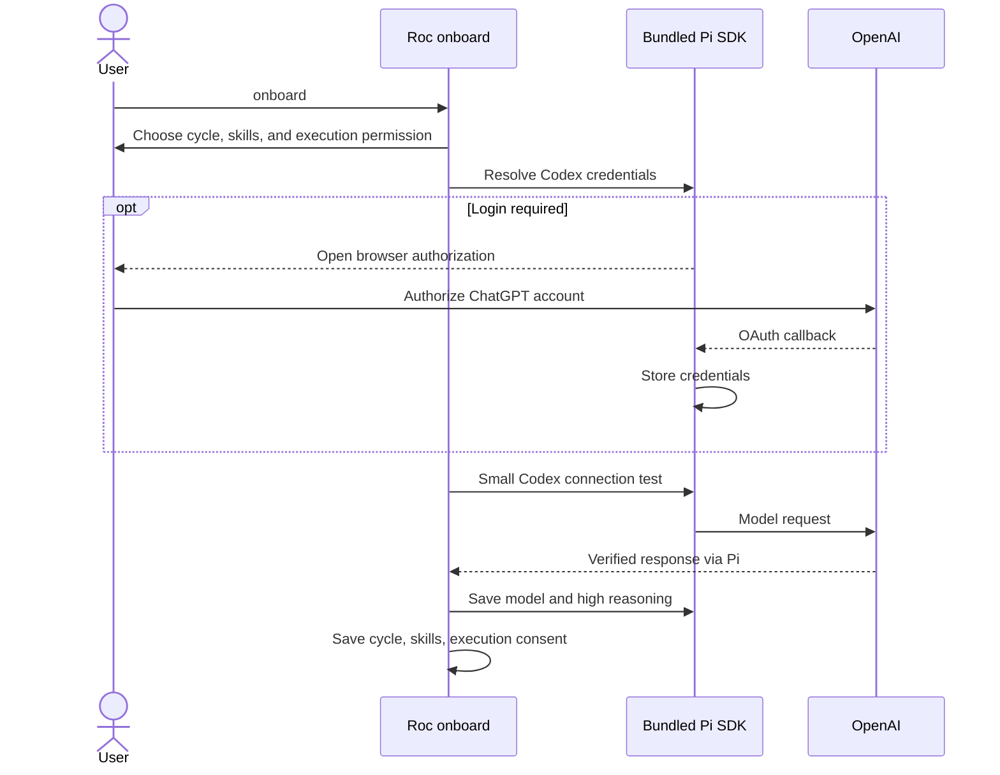
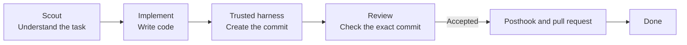

# Roc detailed guide

[Quick start](README.md) · [繁體中文詳細指南](README.details.zh-HK.md)

Use this guide for architecture, daemon deployment, task recovery, runtime options,
and the complete command reference. Start with [the README](README.md) for your first task.

- [Architecture and validation status](#architecture-one-machine-first)
- [Daemon and provider setup](#roc-daemon-setup)
- [Task board and retiring tasks](#the-task-board)
- [Execution and recovery](#how-it-works)
- [Other task sources](#other-ways-to-add-tasks)
- [Commands](#commands)
- [Current limits](#current-limits)

## Architecture: one machine first

Start with two independent project clones on one machine. A handles chat,
grilling, and approval through `roc-create-tasks`, then publishes the approved
ticket/spec manifest. B runs the daemon and owns execution. GitHub Issues carry
the shared specs, approvals, and visible status; B's SQLite database stores
attempts, results, and pending status updates.



Only B runs a daemon. Reuse the same daemon sequentially, with a branch per task
in `<project>.agile-checkout`. A has no executable task imported by remote
publication. The clones keep separate `.agile/runtime/agile.db` files; even a
nested clone cannot resolve to an outer project's database.

The Roc daemon runs on B and polls GitHub Issues for tasks. Install the execution
CLI, project tools, and credentials on B. Later, move B to another host using
the daemon transfer procedure below. A can then go
offline after publication; physical two-host operation still needs validation.

Pi is the sole execution backend. It calls provider models directly, without
launching Codex CLI or Claude Code CLI. Roc reuses its daemon, database and
checkout sequentially; each role gets a separate Pi child/session. The selected
provider/model is fixed for the daemon session, including independent Review.
Roc retains scheduling, approvals, trusted commits, PR publication, and status.

### Context compaction

Roc uses Pi's built-in auto-compaction. It is enabled by default unless disabled
in Pi's user settings. Near the model's context limit, Pi summarizes older
messages and keeps recent messages for subsequent requests.

Scout, Implement, and Review each use a separate Pi session. Compaction applies
within that session; Roc stores task specs and execution state separately in
files and SQLite. Roc does not add a second compaction mechanism.

See [Pi's compaction documentation](https://github.com/earendil-works/pi/blob/main/packages/coding-agent/docs/compaction.md)
for triggers, retained context, and the `compaction` settings.

### Validation status

As of 2026-09-07:

| Scope | Result |
| --- | --- |
| Pi RPC fixtures and orchestration tests | Deterministic checks cover roles, attribution, rejection, recovery and cleanup |
| Bundled Pi 0.82.1 RPC probe | Process and RPC respond without a global Pi executable |
| Roc Codex onboarding | Browser authorization and real model response verified with `openai-codex/gpt-5.6-terra`, `high`; default saved |
| Pi with real Codex | Scout → Implement → independent Review → local `done` passed with `gpt-5.6-terra`, `high` for every role; PR publication stubbed |
| Pi with real Claude and GLM | Not yet verified |
| Same-host GitHub exercise before the Pi migration | Publication, admission, retries and failure writeback verified; no complete accepted flow |
| Physical two-host operation | Not yet verified |

The Codex live test completed on 2026-09-07 in 80.42 seconds with 21 assertions.
It recorded 62,386 input/output tokens, including any cached input, and verified
implementation commit `a572aeb5480966a9c4b317b8fa070e0645f70ac8` in its isolated
fixture checkout. It made real model requests and ran the project's test;
publication alone was stubbed. Real GitHub PR publication and remote status
writeback are still separate acceptance checks.

Earlier native Codex CLI probes are historical evidence, not Pi acceptance.
The native Codex and ZCode adapters and their dedicated tests have been removed; `--backend codex` and `--backend zcode` are no longer supported.
Finish active native-adapter tasks on the previous version before upgrading.
Native session cursors cannot resume in Pi; preserve databases and checkouts.

See the [workflow diagram](docs/design/remote-task-workflow.md) and
[specification](docs/specs/remote-task-workflow.md) for acceptance criteria.
This architecture is unreleased. Set `ROC_CLI_ENTRY` to this checkout's absolute
`src/cli/main.ts` path in every terminal; examples below use that source entrypoint.
`ROC_CLI_ENTRY` is a shell/skill convention, not a scheduler configuration flag.

## Roc daemon setup

Use A and B as separate clones on one machine first. They must use the same
GitHub repository and target branch. The same publication and polling design
applies when B later moves to a separate machine.

On machine A, authenticate `gh` as the publisher, create the approved manifest,
and publish it:

```bash
bun "$ROC_CLI_ENTRY" task publish-github .agile/backlog/approved.json
```

This creates or reconciles one `roc:task` Issue per task, records an approval of
the exact task envelope, and only then adds `roc:ready`. Remote publication does
not import the tasks into machine A's local database.

### Pi provider setup

B needs Bun 1.3+, Node.js 22.19+, Git, GitHub CLI, Roc, a clone with push
access, and the project's build/test tools. `bun install` in the Roc checkout
installs the pinned Pi dependency. No global Pi CLI installation is needed.

```bash
cd /absolute/path/to/execution-clone
gh auth login
bun "$ROC_CLI_ENTRY" onboard
```

Onboarding reuses Pi's Codex credentials or opens browser authorization with
your ChatGPT account. Pi owns credential storage and token refresh. Roc sends
one small test prompt before saving `openai-codex/gpt-5.5` with `high` reasoning.
An existing Codex default is retained if it supports the required reasoning.
Failed login or model checks leave previous defaults and Roc settings unchanged.
Press `Ctrl-C` to cancel and rerun onboarding to retry. Login is limited to five
minutes, and the test request to one minute. Browser authorization remains a
human step; on a headless host open the displayed URL locally and paste the
callback URL into the execution host's terminal, never into an Issue or chat.



The default model lives in `~/.pi/agent/settings.json`; credentials live in Pi's
`~/.pi/agent/auth.json`. `PI_CODING_AGENT_DIR` overrides that directory when set.
Roc stores the cycle, skill allowlist, and `execution.allowUnsandboxed` consent
in `~/.config/roc/settings.json`. Use the same OS account and configuration
paths for onboarding and the daemon. Project-local Pi configuration is disabled
for Roc execution so it cannot replace the verified default or load extra tools.
Rerunning onboarding verifies Codex again. To repair an invalid saved Codex
model, remove `defaultModel` from Pi's settings and rerun onboarding.

For an advanced Claude or GLM setup, use Pi's model configuration under the daemon
account after onboarding. You can open the bundled CLI from the Roc checkout with
`bun x --no-install pi`, use `/login` where supported, then `/model` and **Ctrl+S**
to save the default. API keys must be available in the daemon environment.
Rerunning Roc onboarding selects Codex again.

| Model family | Pi provider | Authentication |
| --- | --- | --- |
| Codex | `openai-codex` | ChatGPT browser authorization through Roc onboarding |
| Claude | `anthropic` | `ANTHROPIC_API_KEY` or Pi-supported login |
| GLM (global Coding Plan) | `zai` | `ZAI_API_KEY` |

See Pi's [providers](https://github.com/earendil-works/pi/blob/main/packages/coding-agent/docs/providers.md)
and [RPC documentation](https://github.com/earendil-works/pi/blob/main/packages/coding-agent/docs/rpc.md).
Available models depend on the account and Pi version; GLM API endpoints/plans
must match the selected provider. Credentials stay on the execution host.
Configure the default using the same OS account as the daemon. The chosen model
must support `high` reasoning; Roc exits with `PI_MODEL_UNSUPPORTED` rather than
silently switching models. Put the trusted publisher login in a service-account-readable daemon environment file with mode `0600`, for example
`/etc/roc/daemon.env`:

```bash
ROC_GITHUB_PUBLISHERS=publisher-login
```

Then run the only daemon for this project:

```bash
set -a
. /etc/roc/daemon.env
set +a
bun "$ROC_CLI_ENTRY" scheduler run --source github --backend pi --base-branch main
```

Keep the service working directory fixed at the project root; that keeps its
database at the stable project-owned path `.agile/runtime/agile.db`. Omitting
`--source github` preserves the existing local-queue scheduler behavior.

The daemon polls all managed Issues every 30 seconds, validates the complete
plan and trusted approval, and freezes that approved envelope in SQLite. A
network outage pauses new work and state advancement; a running agent result is
still persisted locally and synchronized after recovery. Status labels and one
daemon-owned status comment are retryable projections of the local database.

A task reaches local `done` after its pull request is opened, but a dependent
task remains blocked until GitHub reports that pull request merged into the
configured target branch. Roc fetches the target, verifies that it contains the
actual merge commit, and pins that fresh target commit immediately before the
dependent task is claimed. A closed-unmerged pull request, changed approval, or
retired dependency moves the affected work to attention for explicit replanning.

Onboarding records execution permission once. Advanced automation can instead
set `ROC_ALLOW_UNSANDBOXED=1` explicitly. Pi has no built-in filesystem sandbox. Its working directory is a starting
directory, not a security boundary, so run an unattended daemon in an OS sandbox
or container that exposes only the repository, its sibling Roc checkout, and
the credentials it needs.

For systemd, install Roc with its dependencies at a stable absolute path, run
onboarding as the service account once, and use one unit:

```ini
[Unit]
Description=Roc daemon
After=network-online.target

[Service]
Type=simple
User=roc
WorkingDirectory=/srv/project
EnvironmentFile=/etc/roc/daemon.env
Environment=PATH=/usr/local/bin:/home/roc/.bun/bin:/usr/bin:/bin
ExecStart=/home/roc/.bun/bin/bun /opt/Roc/src/cli/main.ts scheduler run --source github --backend pi --base-branch main
Restart=on-failure

[Install]
WantedBy=multi-user.target
```

On macOS, the equivalent launchd job can keep the non-secret settings in the
plist while Pi and `gh` continue to use the service account's local credential
stores:

```xml
<?xml version="1.0" encoding="UTF-8"?>
<!DOCTYPE plist PUBLIC "-//Apple//DTD PLIST 1.0//EN"
  "http://www.apple.com/DTDs/PropertyList-1.0.dtd">
<plist version="1.0">
<dict>
  <key>Label</key>
  <string>dev.roc.daemon</string>
  <key>WorkingDirectory</key>
  <string>/Users/roc/project</string>
  <key>ProgramArguments</key>
  <array>
    <string>/Users/roc/.bun/bin/bun</string>
    <string>/Users/roc/Roc/src/cli/main.ts</string>
    <string>scheduler</string><string>run</string>
    <string>--source</string><string>github</string>
    <string>--backend</string><string>pi</string>
    <string>--base-branch</string><string>main</string>
  </array>
  <key>EnvironmentVariables</key>
  <dict>
    <key>PATH</key>
    <string>/opt/homebrew/bin:/usr/local/bin:/Users/roc/.bun/bin:/usr/bin:/bin</string>
    <key>ROC_GITHUB_PUBLISHERS</key>
    <string>publisher-login</string>
  </dict>
  <key>KeepAlive</key><true/>
  <key>RunAtLoad</key><true/>
</dict>
</plist>
```

To move the daemon, stop the old service first and leave it stopped. With no Roc
process running, copy the project checkout, its complete `.agile/runtime/`
directory including any SQLite sidecar files, and the sibling
`<project>.agile-checkout` to the new machine. Run onboarding as the new service account to authorize execution and reconnect
Codex, restore GitHub credentials, verify the target branch and paths, then start the new
service. Roc does not provide hot failover or multi-daemon coordination.

Remote mode deliberately has one operational bound: if the repository has
1,000 managed `roc:task` Issues, publication and polling fail visibly because
the bounded Issue listing can no longer prove identity uniqueness. Preserve all
managed Issues and their identity labels; v1 has no supported workaround at the
bound. Live provider and two-machine checks remain operator-run release
evidence; the repository test suite uses deterministic local seams.

### Remaining live checks

Repeat the same-host exercise using Pi with
a new approved task in a private fixture repository. Keep A's queue empty and
retain the three-role results, implementation SHA, PR, and original Issue's
final status. The CLI/RPC probes above do not replace this complete workflow
check. Record same-host, Pi-provider, and physical two-host results separately.

For release acceptance, run three separate tasks through Pi, setting its default to a
Codex, Claude, then GLM model that advertises `high`. For each run, retain the managed Issue URL,
structured scheduler log or `scheduler inspect` evidence for Scout, Implement,
and Review, the implementation commit SHA, pull-request URL, and the final
daemon-owned status comment. Verify that the recorded model is the selected Pi
default and that Roc never switches providers.

Then perform the machine-boundary check: publish a new approved plan on A, stop
Roc on A, and leave A offline while B polls, executes, publishes the pull
request, and writes status. Retain A's publication output, B's log and database
snapshot, the Issue history, commit, and pull request. For a dependent task,
merge its prerequisite and retain the fetched target SHA showing the actual
merge result before the dependent claim. These live checks are not part of the
local evidence reported by this change.

## Planning skills

Roc installs `roc-create-tasks` for your coding assistant during onboarding.
The task-creation skill requires `grilling` and `unslop` in your planning assistant.
Install them separately if missing. Choose
`--agent` for the assistant where you plan tasks, for example:

```bash
npx skills add mattpocock/skills --skill grilling --global --agent codex
npx skills add backnotprop/pstack --skill unslop --global --agent codex
```

Rerun onboarding to add installed skills to the daemon's trusted allowlist.
From `mattpocock/skills`, Roc offers only `grilling` for requirement discovery
and `tdd` for implementation tests. You do not need the whole collection.
Other skills from that source are excluded from execution, including older saved selections.
Planning uses your assistant's own login; daemon authentication is handled by Roc.

## The task board

The board is a read-only terminal UI. Wide terminals keep four task columns and
a right-side preview; narrow terminals stack the columns and open details
full-screen. It groups tasks by what needs your attention:

```text
Cycle 2026-W35 · 4 tasks · 8420 / 12000 tok

Ready · 1                   │ In progress · 1             │ Attention · 1               │ Done · 1
─────────────────────────── │ ─────────────────────────── │ ─────────────────────────── │ ───────────────────────────
    email  Add email login  │ ▌ ● api  Build auth API     │     tests  Fix auth tests   │   d to expand
    ready                   │     implement · implementing│     needs_input             │
                            │                             │     blocked by api          │

↑↓ move · Space preview · Enter details · d Done · ? help · q quit
```

The selected bar, semantic status colors, and compact count/token summary make
the next action clear without surrounding every card with a border. The detail
view groups status, run data, dependencies, and the task brief. Press `Space`
for a quick preview or `Enter` for the full view.

Keyboard controls are `↑`/`↓` or `J`/`K` to move, `Space` to preview, `Enter`
for details, `D` to expand Done, `R` to refresh, `?` for help, `Esc` to return,
and `Q` or `Ctrl-C` to quit. Opening either `task board` or the shorter `tui`
never starts the scheduler or changes a task; both show the same read-only
board. Run `bun "$ROC_CLI_ENTRY" task board --all` to include older cycles.

Retire an obsolete draft, input, replan, or ready task without deleting its
history:

```bash
bun "$ROC_CLI_ENTRY" task retire TASK_ID --reason "obsolete approach" [--replacement TASK_ID]
```

Roc calls this Archived when there is no replacement and Superseded when there
is one. Retired tasks are hidden from normal task lists and boards; use
`task list --history` or `task board --history` to inspect their retained reason,
replacement, and retirement time.

## How it works

Roc picks one ready task and passes it through three agent roles.



Each task gets its own branch in the dedicated checkout. Review receives the
implementation commit created by the trusted harness in a separate session.
It is instructed not to edit; Roc checks checkout state before and after Review.
These checks are not a filesystem sandbox and do not cover external writes.

After an accepted Review, Roc runs the trusted posthook and verifies that the
Implement commit is clean. It then pushes `agile/<task-id>` and creates or updates one
pull request before the task becomes done. If Review rejects it,
Roc creates a follow-up ticket and moves on to the next ready task. A publishing
failure moves the task to `needs_replan` and keeps the local commit for recovery.

In GitHub source mode, `done` means execution completed and the PR was published.
It does not mean merged. Code dependencies wait for the prerequisite PR to merge
into the target branch before the next task starts.

Use `--base-branch` to name the GitHub branch that should receive the pull
request. Use `--base` separately if task branches should start from a particular
local commit.

Roc records task state, attempts, events, model choices, and token use. A token
target is an estimate for planning. It does not stop an agent when the target is
reached.

## Other ways to add tasks

Import a Roc backlog JSON file:

```bash
bun "$ROC_CLI_ENTRY" task import .agile/backlog/my-backlog.json
```

Or import open GitHub Issues labelled `roc:ready`:

```bash
bun "$ROC_CLI_ENTRY" task import-github
```

GitHub import is one-way. Roc skips an Issue after importing its ID, so later
edits to the Issue do not update the stored task.

## Commands

```text
bun "$ROC_CLI_ENTRY" onboard                 Set up Roc in this project
bun "$ROC_CLI_ENTRY" cycle current           Show the current Agile cycle
bun "$ROC_CLI_ENTRY" task list [--history]   List active tasks or retained history
bun "$ROC_CLI_ENTRY" task retire TASK_ID --reason TEXT [--replacement TASK_ID]
bun "$ROC_CLI_ENTRY" task board [--all] [--history] Open the read-only board
bun "$ROC_CLI_ENTRY" tui                     Open the read-only board
bun "$ROC_CLI_ENTRY" scheduler run --base-branch BRANCH [--base REF] [--backend pi]
bun "$ROC_CLI_ENTRY" scheduler inspect       Inspect scheduler state
bun "$ROC_CLI_ENTRY" tokens [--no-color]     Show token use
bun "$ROC_CLI_ENTRY" help                    Show all commands
```

## Current limits

One Pi backend, one task at a time, one daemon per project. Pi uses one resolved
provider/model per daemon session, with no automatic provider switching.
Roc does not merge PRs or send notifications. Scout/Review role instructions
and checkout checks do not constrain Pi's process permissions.

## More detail

- [Architecture notes](docs/architecture.md)
- [Roc daemon workflow and acceptance diagram](docs/design/remote-task-workflow.md)
- [Task delivery specification](docs/specs/remote-task-workflow.md)
- [Earlier interactive architecture diagram](output/archify/roc-system-architecture.html)
- [Contributing guide](CONTRIBUTING.md)
- [Research and project comparisons](docs/research/agent-agile-orchestration-landscape.md)

## License

Roc uses the [Apache License 2.0](LICENSE).
