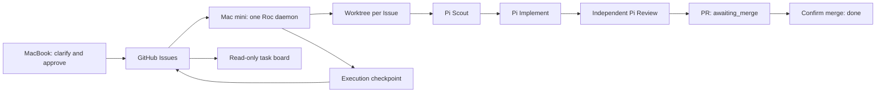

# Roc detailed guide

[Quick start](README.md) · [繁體中文詳細指南](README.details.zh-HK.md)

## Architecture: GitHub tasks and one executor

GitHub Issues hold approved task specifications and execution checkpoints.
The daemon saves attempts, model choices, usage, role results and PR receipts
in one comment per Issue owned by its GitHub account. Labels show status; they
do not lock tasks or grant execution permission.



The daemon runs up to two independent Issues. Each task has its own retained worktree at
`<project>.agile-worktrees/issue-<number>` and branch `agile/issue-<number>`.
No task database is created. Local files hold configuration, worktrees, locks,
diagnostic logs and Pi sessions. Guarded automatic PR merge is opt-in, with at
most two clean base refresh/re-review cycles per task. Superset is deferred.

### Validation status

The GitHub-native implementation is unreleased. Use this checkout's absolute
`src/cli/main.ts` path through `ROC_CLI_ENTRY` in every terminal.

Deterministic tests exercise a real temporary Git worktree with the Pi harness
and a recorded Pi client. They cover the accepted role flow, remote checkpoints,
recovery, approval withdrawal and uncertain cleanup. These tests do not call a
live provider or publish a real PR.

A historical Codex test on 2026-09-07 completed Scout, Implement and independent
Review using `gpt-5.6-terra` with `high` reasoning. It took 80.42 seconds and
recorded 62,386 input/output tokens, including cached input. Publication was
stubbed and the test used the old SQLite runtime. That result does not validate
this new daemon. On 2026-09-09, a separate live sandbox exercise used
`openai-codex/gpt-6-astra` with `high` and actual GitHub Issues/PRs. Seven Issues
produced six reviewed PRs and one cancelled task. Restart, merge dependencies,
parallel execution, slot refill, cancellation containment and overlapping-scope
serialization passed. See the [live acceptance report](docs/validation/m1-m2-live-2026-09-09.md).
Claude/GLM and physical MacBook-to-Mac-mini operation remain unverified.

## Roc daemon setup

Planning and execution machines need clones of the same GitHub repository.
Only the execution machine runs a daemon. You can first use two clones on one
machine to check configuration.

On the planning machine, authenticate GitHub CLI, use `roc-create-tasks`, and
approve the plan. The skill publishes its approved manifest with:

```bash
bun "$ROC_CLI_ENTRY" task publish-github .agile/backlog/approved.json
```

Publication reconciles task identities before adding exact approval comments
and `roc:ready`. The manifest is publication input, not a local queue. The
planning machine can go offline after publication.

The execution machine needs Bun 1.3+, Node.js 22.19+, Git, GitHub CLI, the Roc
checkout with `bun install` completed, and the project's build/test tools.
Enter its project clone and run:

```bash
export ROC_CLI_ENTRY=/absolute/path/to/Roc/src/cli/main.ts
gh auth login
bun "$ROC_CLI_ENTRY" onboard
export ROC_GITHUB_PUBLISHERS=your-publisher-login
bun "$ROC_CLI_ENTRY" scheduler run --base-branch main
```

`ROC_GITHUB_PUBLISHERS` accepts comma-separated trusted GitHub logins and defaults
to the current `gh` account. The executor defaults to that account too;
`ROC_GITHUB_EXECUTOR` can name it explicitly. Read-only clients using a different
account must set it to the daemon's login to read the same owned checkpoints.
The daemon itself must authenticate as that executor.

The target defaults to the GitHub repository's default branch if omitted.
`--source github` is optional because GitHub is the only task source.
`--once` processes one eligible task and exits. Continuous mode polls every
30 seconds for remote changes while idle or running. GitHub read failures stop the invocation; a service manager
can restart it after connectivity returns. Unknown checkpoint writes retain the
ownership lock until reconciled.

### Optional automatic PR merge

Manual publication is the default. To merge independently reviewed PRs automatically:

```bash
bun "$ROC_CLI_ENTRY" scheduler run --base-branch main --auto-merge
```

Configure **classic branch protection** on the target with at least one required
status check, **Require branches to be up to date before merging**, and enforcement
for administrators (**Do not allow bypassing the above settings**). Squash merging
must be enabled. Roc never modifies protection, uses an administrator bypass, or
pushes directly to the target. GitHub's merge API accepts the expected head SHA,
not a base SHA condition; strict server protection guards the final base race.

The executor needs Issue/comment write access, PR read/write and contents write
access for publication/merge, plus checks, commit statuses and branch
protection/active repository and organization rules read access. Missing or
unreadable protection/rules (including private repositories without rules API
access) block merge visibly. Human GitHub reviews remain required when configured;
Pi Review does not replace them. Every reported check/status must succeed on the
exact reviewed head, including configured app identities for required checks.
Skipped, neutral, pending or failed results wait. Merge queues and unsupported
active rules also wait; Roc does not bypass them.

Only managed, still-open, exactly approved Issues with persisted successful
independent Review evidence can auto-merge. Pending requirements stay
`awaiting_merge` with a readable reason, without rerunning agents or rewriting
identical checkpoints every 30 seconds. Changed external heads, closed-unmerged
PRs or missing Review evidence (including legacy accepted records) require replan.

If the target advances, Roc allows **at most two clean rebase/re-review cycles**
per task, with the budget preserved across restarts. It checkpoints intent before
Git mutation, verifies the retained clean task worktree has exactly its trusted
commit and expected remote head, then rebases the same patch onto the freshly
fetched target. Only the task branch is pushed, with an explicit expected-old-head
force-with-lease. Conflicts abort to the original work. Dirty files, unexpected
history, external head changes, ambiguous pushes or an exhausted budget require
`needs_replan`, without discarding work. Old commits remain under
`refs/agile-refresh/` for inspection.

A confirmed refresh starts a **new independent Pi Review** of the exact rewritten
head/base, including the approved validation commands. The original specification,
Implement output, historical attempts and usage stay intact; a Git-only rebase
is not an Implement/model attempt. Fresh Review records its actual model, effort
and usage. Rejection requires replan; acceptance waits for CI on the new head
before all merge guards are checked again. A confirmed refresh can resume its
Review after restart, but an interrupted intent without a confirmed result must
be reconciled explicitly, never blindly rerun.

Refresh, fresh Review and merge decisions are serialized even with `--concurrency 2`.
Shutdown drains selector-owned Git/Review work as well as workers; uncertain
cleanup or checkpoint writes retain the ownership lock. Roc reads back the
PR after every merge response, including lost responses, then fetches the target
and verifies merge ancestry before saving `done` and releasing dependencies.
`--once` can reconcile already published PRs but does not keep waiting for newly
published CI; use continuous mode for automatic completion. Automatic merge has
deterministic transport/Fake Harness tests, including refresh/re-review, and
real-Git conflict/lease tests. [Live protected-branch acceptance](docs/validation/m3-live-2026-09-09.md)
also passed for two parallel tasks, including one rebase, fresh independent
Review and CI before automatic merge. That test used one Mac.

### Parallel admission

The default is `--concurrency 2`; use `--concurrency 1` to serialize execution.
When one task finishes, its slot can start another without waiting for a slower
task. `--once` still processes only one task. The board shows all running Issues,
and terminal events include their task IDs.

Only disjoint literal path scopes can overlap. For example, `src/auth/` overlaps
`src/auth/login.ts`, but not `src/billing.ts`. Comparison ignores case for macOS.
Root scopes, globs, prose, paths outside the repository and tasks with hooks run
alone. Include shared-resource constraints in the approved scope, such as
`TCP port 3000`, to keep that task exclusive. This admission rule cannot detect
undeclared shared resources or confine an agent's filesystem access.

Dependencies still wait for merged PRs. Closing an active Issue or withdrawing
approval requests cancellation at the next poll. Confirmed task-local failure
or cancellation records attention without stopping its sibling. Pi child exit
must be confirmed before a role completes or a worker releases its slot.
Unconfirmed cleanup or checkpoint writes stop admission and retain the daemon
lock. Global `Ctrl-C` cancels every active task.

### Pi provider setup

Onboarding reuses Pi credentials or opens ChatGPT browser authorization. Follow
the displayed URL and callback instructions. Keep callback URLs and credentials
out of Issues. Roc tests one small request before saving settings; failed or
cancelled login leaves prior settings unchanged.

New Codex setups select `gpt-6-astra` with `high` reasoning. An explicitly saved
Codex model is preserved. Pi settings and credentials live in
`~/.pi/agent/settings.json` and `~/.pi/agent/auth.json`, or the directory selected
by `PI_CODING_AGENT_DIR`. Roc settings live in `~/.config/roc/settings.json`.
Use the same OS account for onboarding and the daemon.

Optional `models.luna`, `models.terra` and `models.sol` map Scout, Implement and
Review profiles to exact Pi `provider/modelId` values. Omitted profiles use the
Pi default. Configured models must exist in the catalog and support `high`.
High-risk tasks use Sol with `xhigh`; unsupported routes become `needs_replan`.
Each role gets at most three attempts. A first retry normally keeps its profile;
model unavailability or the final retry can advance the profile. Existing
attempts keep their recorded model and effort on restart.

For the same model across all roles, merge this field into existing Roc settings:

```json
"models": {
  "luna": "openai-codex/gpt-6-astra",
  "terra": "openai-codex/gpt-6-astra",
  "sol": "openai-codex/gpt-6-astra"
}
```

For advanced Claude or GLM setup, configure the bundled Pi CLI under the daemon
account with `bun x --no-install pi`. Use its `/login` and `/model` commands where
supported and save the default. Provider keys must be in the daemon environment.
Rerunning Roc onboarding selects Codex again.

Onboarding records permission to execute coding tools once. Automation can set
`ROC_ALLOW_UNSANDBOXED=1` explicitly. Pi runs with its OS account's permissions;
a worktree is not a filesystem sandbox. Use OS/container isolation when needed.

### Keeping the Mac mini daemon running

Use a launchd job under the account used for onboarding. Set `WorkingDirectory`
to the execution clone and use absolute Bun and Roc paths in `ProgramArguments`.
Supply `ROC_GITHUB_PUBLISHERS`, the correct `PATH`, and non-secret configuration
through its environment. Pi and `gh` use that account's credential stores.
A launchd `KeepAlive` restart never overrides an existing Roc ownership lock.

To move the executor, stop the old daemon and confirm its children have exited.
Completed checkpoints are on GitHub, but unpublished commits and dirty work
remain on the old host. Finish or preserve those worktrees and their shared Git
directory before moving. There is no automatic worktree transfer, hot failover
or multi-host claim protocol. Do not start a second executor while the first may
still be working.

## Planning skills

The planning assistant needs `grilling` and `unslop`. Install them if missing:

```bash
npx skills add mattpocock/skills --skill grilling --global
npx skills add backnotprop/pstack --skill unslop --global
```

Roc onboarding installs its packaged skills into the project and lets you choose
trusted installed skills for Pi. It refuses to overwrite modified skill files.
Use `roc-create-tasks` in your coding assistant to create and approve tasks.

## The task board

`task board` reads GitHub checkpoints every 30 seconds and shows persisted
status, attempts, models, usage and PR links. Use `--all` for other cycles and
`--history` to include retired Issues. Press Enter for details and Q to quit.
Current tool activity appears in the daemon terminal; the remote board does not
stream every tool event.

`tokens` reports confirmed usage and marks incomplete totals. A crash can lose
usage that never reached a checkpoint. Token ceilings are planning estimates,
not enforced limits. Concise Scout output has no separate byte cap.

## How it works

Before claiming a task, Roc validates its complete plan and dependency graph.
It checks exact trusted approval at role boundaries. Dependencies require a PR
merged into the intended target with the recorded implementation head. Roc
fetches that target, verifies its merge commits and pins the new task's base.

Roc saves the attempt descriptor before starting Pi. Scout inspects, Implement
writes, and the harness creates a single trusted commit. Review uses a separate
Pi session and checks that exact clean commit. Accepted work runs its trusted
posthook before PR publication. An open PR stays `awaiting_merge`; only a
verified merge makes it `done`. Rejected work stays `rejected` for replanning.
Roc does not generate an automatically approved replacement task.

Restart reuses confirmed role outputs. An interrupted attempt is reconciled even
without a cursor, then retried within its budget. Unconfirmed implementation
history requires `needs_replan`. Roc does not reattach to a dead Pi process.
Changed task bodies or withdrawn approvals block further roles and publication.

Hooks require separate trust for the exact command configuration:

```bash
bun "$ROC_CLI_ENTRY" task trust-hooks 41 --phase prehook
bun "$ROC_CLI_ENTRY" task trust-hooks 41 --phase posthook
```

Known hook failures get at most three attempts. An interrupted hook is not
automatically repeated because its side effects may already have happened.
It records a reconciliation reason. A terminal task keeps its outcome when
its posthook needs attention. Inspect the hook's effects before explicitly
reconciling the owned receipt or publishing a separately approved recovery task.

### Retained ownership and legacy tasks

Unresolved backend close, unknown checkpoint writes or uncertain cancellation
keep `<canonical-project>.agile-checkout.lock`. Stop every Roc session, inspect
the lock metadata, confirm owned children have stopped, and inspect worktrees
and the remote checkpoint before removing that exact lock. A missing PID alone
does not prove that child work has ended.

Existing SQLite databases and old sibling checkouts remain on disk. This version
cannot resume their executions. Finish active legacy work on its prior version
or migrate it explicitly. An old daemon-owned `roc:status` comment without a
native execution checkpoint blocks automatic admission. Preserve that evidence;
do not remove it just to make a task run again.

## Commands

```text
onboard                                  Set up skills, provider and permissions
cycle current                            Show the active Agile cycle
task publish-github MANIFEST              Publish approved tasks to GitHub
task list [--all] [--history]              List GitHub tasks
task board [--all] [--history]             Open the read-only board
tui                                      Open the same board
task trust-hooks ISSUE --phase PHASE      Approve an exact hook configuration
task retire ISSUE --reason TEXT           Close an Issue without completing it
scheduler run [--base-branch BRANCH] [--concurrency 1|2] [--once] [--auto-merge]
scheduler inspect                        Read GitHub execution checkpoints
tokens [--no-color]                       Show confirmed token usage
```

Run these after `bun "$ROC_CLI_ENTRY"`. Task identifiers are Issue numbers,
`#41` or `issue-41`. `task import`, `task import-github`, local queue mode and
`--base` have been removed. See [architecture](docs/architecture.md),
[M1 specification](docs/specs/github-native-execution.md),
[M2 specification](docs/specs/parallel-execution.md),
[automatic merge specification](docs/specs/automatic-merge.md) and
[roadmap](docs/roadmap.md) for implementation scope.
