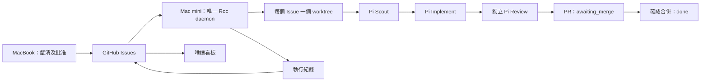

# Roc 詳細指南

[快速開始](README.zh-HK.md) · [English detailed guide](README.details.md)

## 架構與執行方式

GitHub Issues 保存規格、批准和執行紀錄。Daemon 在自己帳戶擁有的一則 Issue comment
中保存 attempt、模型、用量、角色結果及 PR 資料。Labels 只顯示狀態，不能代替批准或鎖。



目前最多同時執行兩項獨立任務。每個 Issue 使用
`<project>.agile-worktrees/issue-<number>` 及 `agile/issue-<number>` branch。
Roc 不再建立任務資料庫；設定、worktree、程序鎖、診斷 log 和 Pi session 留在本機。
可選擇啟用有保護檢查的自動合併 PR；M3 下一部分才加入有限次數的 base refresh／重新 Review，Superset 暫緩。

### 驗證狀態

GitHub-native 版本尚未發佈，請把 `ROC_CLI_ENTRY` 設成這份原始碼
`src/cli/main.ts` 的絕對路徑。

確定性測試使用真實臨時 Git worktree、Pi harness 和預錄 Pi client，驗證角色流程、
遠端紀錄、恢復、撤回批准及清理不確定時的處理。測試沒有呼叫真實模型或建立真實 PR。

2026-09-07 的歷史 Codex 測試用 `gpt-5.6-terra`、`high` 完成三個角色，
耗時 80.42 秒，記錄 62,386 個輸入及輸出 tokens，包含快取輸入。
當時使用 SQLite，PR 發佈是 stub，不能視為新版 daemon 的驗收。
2026-09-09 已另用 `openai-codex/gpt-6-astra`、`high` 在 sandbox 跑過真實 GitHub
流程。七個 Issues 產生六個通過 Review 的 PR，一項取消。重啟、合併依賴、平行執行、
補位、取消隔離及 scope 重疊的序列執行均通過，詳見[驗收報告](docs/validation/m1-m2-live-2026-09-09.md)。
Claude/GLM 和實體 MacBook/Mac mini 雙機流程仍待驗收。

## 設定執行端

規劃端和執行端各自 clone 同一 GitHub repository，只在執行端啟動 daemon。
可先在同一台機器用兩個 clone 核對設定。

規劃端登入 `gh`，透過 `roc-create-tasks` 批准計劃後，skill 會執行：

```bash
bun "$ROC_CLI_ENTRY" task publish-github .agile/backlog/approved.json
```

Manifest 是發佈輸入，不是本機佇列。發佈完成後，規劃端可以離線。

執行端需要 Bun 1.3+、Node.js 22.19+、Git、GitHub CLI、已完成 `bun install`
的 Roc 原始碼，以及專案測試工具。在執行端的專案 clone 執行：

```bash
export ROC_CLI_ENTRY=/absolute/path/to/Roc/src/cli/main.ts
gh auth login
bun "$ROC_CLI_ENTRY" onboard
export ROC_GITHUB_PUBLISHERS=your-publisher-login
bun "$ROC_CLI_ENTRY" scheduler run --base-branch main
```

`ROC_GITHUB_PUBLISHERS` 以逗號分隔可信 GitHub 帳戶，預設為目前 `gh` 帳戶。
執行紀錄的擁有者預設也是該帳戶，可用 `ROC_GITHUB_EXECUTOR` 指定。
若看板用另一個 GitHub 帳戶登入，要把它設為 daemon 的帳戶，才能讀取同一批紀錄。
Daemon 本身必須以該帳戶登入。

未指定目標 branch 時使用 repository 預設 branch。GitHub 已是唯一任務來源，
不必加 `--source github`。`--once` 處理一項符合條件的任務後結束；持續模式閒置時
每 30 秒輪詢。GitHub 讀取失敗會停止本次執行，連線恢復後可重新啟動。
無法確認 checkpoint 寫入結果時保留本機鎖，須先核對遠端結果。

### 可選的自動合併 PR

預設仍由人手合併。要啟用獨立 Review 後的自動 squash merge：

```bash
bun "$ROC_CLI_ENTRY" scheduler run --base-branch main --auto-merge
```

目標 branch 必須設定 **classic branch protection**，至少一項 required status check、
**Require branches to be up to date before merging**，以及對管理員同樣生效的保護
（**Do not allow bypassing the above settings**），並允許 squash merge。
Roc 不會修改保護、不會使用管理員 bypass，也不會直接 push 到目標 branch。
GitHub merge API 只可指定預期 head SHA，不能指定 base SHA 條件；最後一刻的 base
變動靠伺服器強制執行的 strict checks 保護。

Daemon 帳戶需要 Issue/comment 寫入、PR 讀寫及 contents 寫入權限，以及 checks、
commit statuses、branch protection 和 repository／organization active rules 讀取權限。
缺少保護或無法讀取 policy（包括未能使用 rules API 的 private repository）會顯示等待原因，
不會繞過。已設定的人類 GitHub Review 仍須通過，Pi Review 不能代替。
所有回報的 checks/statuses 必須在精確 reviewed head 成功；required checks 亦核對指定
app 身份。Pending、failed、skipped、neutral、merge queue 或未支援的 active rule 均會等待。

只有仍開啟、具精確可信批准及已保存獨立成功 Review 證據的受管理 Issue 可自動合併。
等待維持 `awaiting_merge`，原因不變就不重寫 checkpoint，也不重跑 agent。
外部 head 變動、PR 未合併便關閉、缺少 Review 證據（包括舊 accepted 紀錄），或 reviewed
base 已前進，都要求明確 `needs_replan`；這一部分**不會自動 rebase／重新 Review**。

即使 `--concurrency 2`，合併決策仍逐項執行。每次 merge 回應（包括遺失回應）後都讀回
PR，fetch 目標並核對 merge ancestry，確認 `done` 寫入後才釋放依賴任務。
`--once` 可核對已有 PR，但不會持續等待新 PR 的 CI；完整自動完成請用持續模式。
自動合併已有確定性的 transport／Fake Harness 測試，真實 protected branch 驗收仍待完成。

### 平行執行

預設為 `--concurrency 2`，`--concurrency 1` 可切回逐項執行。
一項任務完成後會立即補位，不必等待另一項較慢的任務。
`--once` 仍只處理一項。看板列出所有執行中 Issue，terminal 事件附有任務 ID。

只有明確且不重疊的相對路徑 scope 可並行。例如 `src/auth/` 與
`src/auth/login.ts` 重疊，與 `src/billing.ts` 則不重疊；比較時忽略大小寫。
Root、glob、文字描述、repository 外的路徑，以及帶 hooks 的任務會單獨執行。
共用資源應寫入批准的 scope，例如 `TCP port 3000`，讓該任務保持獨佔。
這項規則不能偵測未聲明的共用資源，也不限制 agent 的檔案存取權限。

依賴任務仍須等待 PR 合併。關閉執行中的 Issue 或撤回批准，會在下一次輪詢要求取消。
個別任務失敗或取消，確認清理後只把該任務標為待處理，另一項可繼續。
Pi 子程序退出獲確認後才會放行下一個角色或釋放名額。清理或 checkpoint 寫入結果
不明時，停止新任務並保留鎖；`Ctrl-C` 會取消全部執行中任務。

### Pi 和模型

Onboarding 會重用 Pi 認證，或開啟瀏覽器讓你授權 ChatGPT。依終端指示完成登入，
不要把 callback URL 或憑證貼到 Issue。Roc 發送小型測試請求，成功後才保存設定。

新的 Codex 設定預設使用 `gpt-6-astra`、`high`。已有的明確 Codex 模型設定會保留。
Pi 設定及憑證位於 `~/.pi/agent/settings.json`、`~/.pi/agent/auth.json`，
或 `PI_CODING_AGENT_DIR` 指定的目錄。Roc 設定位於 `~/.config/roc/settings.json`。
Onboarding 和 daemon 要使用同一個 OS 帳戶。

`models.luna`、`models.terra`、`models.sol` 分別指定 Scout、Implement、Review
的 Pi `provider/modelId`，未指定時用 Pi 預設。高風險任務使用 Sol、`xhigh`；
模型不支援時轉為 `needs_replan`。每個角色最多三次 attempt，重啟會保留已有 attempt
的模型和 reasoning。三個角色都用 GPT-6 時，把以下欄位合併進現有 Roc 設定：

```json
"models": {
  "luna": "openai-codex/gpt-6-astra",
  "terra": "openai-codex/gpt-6-astra",
  "sol": "openai-codex/gpt-6-astra"
}
```

Claude 或 GLM 可在 daemon 帳戶下用 `bun x --no-install pi` 設定 provider 和預設模型。
重新執行 Roc onboarding 會選回 Codex。Pi 工具擁有 OS 帳戶權限，worktree 不是
filesystem sandbox；需要隔離時使用 OS/container。Onboarding 會記錄一次執行許可。

### Mac mini 常駐

可用同一帳戶的 launchd job 啟動 daemon。`WorkingDirectory` 指向專案 clone，
`ProgramArguments` 使用 Bun 和 Roc 的絕對路徑，環境包含正確 `PATH` 和
`ROC_GITHUB_PUBLISHERS`。Pi、`gh` 使用該帳戶的認證。`KeepAlive` 不會越過 Roc 的鎖。

搬移 daemon 前，停止舊 daemon 並確認子程序已退出。Checkpoint 在 GitHub，但未推送
commit 和 dirty worktree 仍在舊機器，須先完成或保留它們及共享 Git 目錄。
目前沒有自動搬移 worktree、熱切換或多機搶任務協議。

## 規劃 skills

規劃 assistant 需要 `grilling` 和 `unslop`，缺少時可安裝：

```bash
npx skills add mattpocock/skills --skill grilling --global
npx skills add backnotprop/pstack --skill unslop --global
```

Roc onboarding 安裝隨附 skills，並讓你選擇可信 Pi skills。
目標 skill 檔案已有不同內容時，會拒絕覆寫。

## 進度、恢復及 hooks

`task board` 每 30 秒讀取 GitHub checkpoints，顯示狀態、attempt、模型、用量及 PR。
按 Enter 查看詳情，Q 離開；`--all` 包含其他週期，`--history` 包含已退役 Issue。
即時工具動作在 daemon terminal 顯示，看板不會串流每個工具事件。

`tokens` 只計算已確認用量，缺少 receipt 時標示總數不完整。
Token ceiling 是規劃估算，不會強制中止 agent；Scout 也沒有額外 bytes 硬上限。

Daemon 先驗證完整計劃、依賴關係及精確批准。依賴任務的 PR 必須合併到指定 branch，
且 head 與保存的 implementation commit 一致。Roc fetch 目標 branch，核對
merge commit 後才固定新任務的 base。

Scout 閱讀程式，Implement 修改，harness 建立單一可信 commit，再由獨立 Pi session
Review。接受後執行可信 posthook，再發佈 PR。開啟 PR 是 `awaiting_merge`，
確認合併才是 `done`。拒絕的任務保留 `rejected`，由規劃流程處理後續。

重啟重用已確認角色結果，沒有 cursor 的中斷 attempt 也先 reconcile。
若已有無法確認來源的 implementation commit，會要求重新規劃，不會直接重跑。
Roc 不會重新接管已死的 Pi process。修改規格或撤回批准會阻止後續角色及發佈。

Hook 指令需要額外明確批准：

```bash
bun "$ROC_CLI_ENTRY" task trust-hooks 41 --phase prehook
bun "$ROC_CLI_ENTRY" task trust-hooks 41 --phase posthook
```

已知失敗最多嘗試三次。中斷 hook 的副作用可能已發生，因此記錄待核對原因，
不會自動重複執行。任務失敗後的 posthook 需要處理時，仍保留原本任務結果。
先檢查副作用，再明確修正擁有者的 receipt，或建立另行批准的恢復任務。

## 舊資料及鎖

無法確認子程序退出、取消或 GitHub 寫入時，會保留
`<canonical-project>.agile-checkout.lock`。先停止所有 Roc session、讀取鎖資料、
確認子程序已停止，並檢查 worktree 和遠端 checkpoint，才可手動移除該鎖。
單憑 PID 不存在不足以證明所有工作已停止。

舊 SQLite 資料庫和 checkout 保留在磁碟，新版不接續其執行。
請用舊版完成工作或明確遷移。只有舊 `roc:status` comment、沒有新 execution checkpoint
的 Issue 會阻擋自動開始；不要為啟動任務而刪除這些紀錄。

完整指令見 [English guide](README.details.md#commands)。舊 `task import`、
`task import-github`、local queue mode 和 `--base` 已移除。
