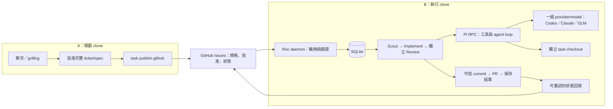
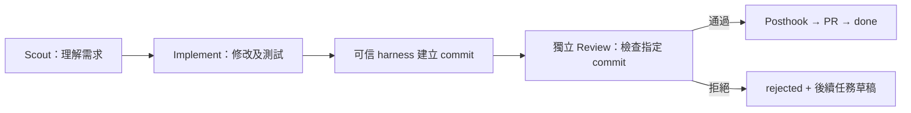

# Roc 詳細指南

[快速開始](README.zh-HK.md) · [English detailed guide](README.details.md)

## 架構：先在同一台電腦執行

A 負責聊天、grilling、批准與發佈；B 負責執行。先用同一台電腦上的兩個獨立
clone，各自保留資料庫，只有 B 啟動 daemon。之後可把 B 搬到另一台機器。



Pi 是唯一公開執行 backend，直接呼叫 provider 的模型，不啟動 Codex CLI 或
Claude Code CLI。同一個 daemon、資料庫及 checkout 會依序重用；每個角色
使用獨立 Pi process/session。一個 daemon session 固定使用同一組 provider/model，
不會按任務或角色自動換供應商。Roc 負責排程、批准、commit、PR 與任務狀態。

### 驗證狀態

截至 2026-09-07：

| 範圍 | 結果 |
| --- | --- |
| Pi RPC fixture 與排程測試 | 驗證角色流程、模型紀錄、拒絕、恢復及清理 |
| 隨 Roc 安裝的 Pi 0.82.1 RPC 探測 | 不依賴全域 Pi，process 與 RPC 有回應 |
| Roc Codex onboarding | 瀏覽器授權及真實模型回應通過，已保存 `openai-codex/gpt-5.6-terra`、`high` |
| Pi 真實 Codex | Scout → Implement → 獨立 Review → 本機 `done` 通過；每個角色均為 `gpt-5.6-terra`、`high`，PR 發佈使用測試替身 |
| Pi 真實 Claude、GLM | 尚未驗證 |
| 改用 Pi 前的單機 GitHub 演練 | 發佈、拉取、重試及失敗回寫已驗證；完整通過流程未完成 |
| 實體兩台機器 | 尚未驗證 |

2026-09-07 的 Codex 實測花費 80.42 秒，21 項斷言通過。
紀錄輸入／輸出用量為 62,386 tokens，包含可能的快取輸入。
獨立測試 checkout 的 implementation commit 為 `a572aeb5480966a9c4b317b8fa070e0645f70ac8`。
模型呼叫及專案測試均為真實執行；只有 PR 發佈使用替身。
真實 GitHub PR 發佈及遠端狀態回寫仍須另外驗證。

舊 Codex CLI 探測不等於 Pi 驗收。原生 Codex/ZCode adapter 程式及專用測試已移除，
公開 CLI 不再接受 `--backend codex` 或 `--backend zcode`。
升級前先用舊版本完成進行中的原生 adapter 任務；原生 session cursor 不能在 Pi
恢復。保留資料庫、checkout 與 task branches。

## Roc daemon 設定

這個版本尚未發佈到 npm。每個 terminal 都要把 `ROC_CLI_ENTRY` 設為這份 Roc
原始碼的絕對 `src/cli/main.ts` 路徑，並先在 Roc 目錄執行 `bun install`。
這個變數只是 shell 與規劃 skill 的指令慣例，不是 scheduler 設定。

A、B 使用同一個 GitHub repository 及目標 branch。在 A 以可信發佈者登入 `gh`，
透過 `roc-create-tasks` 批准完整 manifest，選擇 GitHub Issues 目的地後發佈：

```bash
bun "$ROC_CLI_ENTRY" task publish-github .agile/backlog/approved.json
```

每項任務建立或對應一個 `roc:task` Issue；完整規格、依賴及批准 hash 保存後才加上
`roc:ready`。這不會將任務匯入 A 的執行佇列，A 發佈後可離線。

### Pi provider 設定

B 需要 Bun 1.3+、Node.js 22.19+、Git、gh、Roc、可 push 的 clone、
專案 build/test 工具，以及自己的 provider 憑證。
在 Roc 目錄執行 `bun install` 會一併安裝指定版本的 Pi，毋須全域安裝 Pi CLI。

```bash
cd /absolute/path/to/execution-clone
gh auth login
bun "$ROC_CLI_ENTRY" onboard
```

Onboarding 會重用 Pi 的 Codex 認證；需要登入時，開啟瀏覽器讓你授權 ChatGPT。
Pi 負責認證保存及 token 更新。Roc 發送一個小型測試，收到正確回應後，才將
`openai-codex/gpt-5.5` 與 `high` reasoning 存為預設。
已有支援所需 reasoning 的 Codex 預設模型會保留。登入或連線測試失敗時，
原本的模型預設與 Roc 設定不變。按 `Ctrl-C` 取消，重新執行 onboard 重試。
登入最多等候五分鐘，模型測試最多一分鐘。
無桌面環境時，可在另一台電腦開啟 terminal 顯示的授權網址，登入後把 callback URL
貼回執行端 terminal；不要貼到 Issue 或聊天。

流程圖見[登入時序圖](README.details.md#pi-provider-setup)。
模型預設保存在 `~/.pi/agent/settings.json`，認證由 Pi 存在 `~/.pi/agent/auth.json`。
設定 `PI_CODING_AGENT_DIR` 時會改用該目錄。
週期、skills allowlist 與 `execution.allowUnsandboxed` 執行許可保存在
`~/.config/roc/settings.json`。Onboarding 與 daemon 必須使用相同 OS 帳戶及設定路徑。
Roc 停用專案內的 Pi 設定，避免它覆蓋已驗證模型或額外載入工具。
若保存的 Codex 模型已失效，刪除 Pi settings 的 `defaultModel` 後重跑 onboarding。

Claude、GLM 屬進階設定。在 onboarding 後，以 daemon 的帳戶設定 Pi provider。
可在 Roc 原始碼目錄執行 `bun x --no-install pi` 開啟隨附 CLI，以 `/login` 登入，
使用 `/model` 並按 **Ctrl+S** 儲存預設；API key 須提供給 daemon process。
模型必須支援 `high` reasoning。再次執行 Roc onboarding 會選回 Codex。

| 模型 | Pi provider | 認證 |
| --- | --- | --- |
| Codex | `openai-codex` | Roc onboarding 的 ChatGPT 瀏覽器授權 |
| Claude | `anthropic` | `ANTHROPIC_API_KEY` 或 Pi 支援的登入方式 |
| GLM（全球 Coding Plan） | `zai` | `ZAI_API_KEY` |

模型清單視帳戶與 Pi 版本而定。GLM 的 endpoint／方案須符合所選 provider。
API key 必須存在於 daemon 的執行環境；只在 A 或互動 terminal 設定並不足夠。
以啟動 daemon 的同一 OS 帳戶設定 Pi 預設。
參考 Pi 官方 [providers](https://github.com/earendil-works/pi/blob/main/packages/coding-agent/docs/providers.md)
與 [RPC](https://github.com/earendil-works/pi/blob/main/packages/coding-agent/docs/rpc.md)。

在 B 啟動唯一的 daemon：

```bash
ROC_GITHUB_PUBLISHERS=publisher-login \
  bun "$ROC_CLI_ENTRY" scheduler run --source github --base-branch main
```

`--backend pi` 可省略。省略 `--source github` 就使用本機佇列。
執行目錄固定為 B 的 project root；資料庫位於 `.agile/runtime/agile.db`。
Onboarding 會保存一次執行許可；進階自動化仍可明確設定 `ROC_ALLOW_UNSANDBOXED=1`。
Pi 沒有內建 sandbox，工具具有目前帳戶的權限。無人看管時應使用 OS/container 隔離，僅開放 repository、相鄰 task checkout
及必要憑證。工作目錄本身不是安全邊界。

### 常駐服務與搬移

[英文詳細指南的 systemd／launchd 範例](README.details.md#pi-provider-setup)
提供完整服務檔。使用固定 working directory、明確的 Bun/Node 路徑，並在服務帳戶
設定 provider 與 GitHub 憑證。環境檔應限制為 `0600`，不要把密鑰提交到 repository。

搬移前停止舊 daemon，保持它停止。確認沒有 Roc process 後，複製 project clone、
完整 `.agile/runtime/`（包含 SQLite sidecar）及相鄰 `<project>.agile-checkout`，
再以新機服務帳戶執行 onboarding，確認執行權限並連接 Codex，設定 GitHub 憑證及路徑。Roc 沒有熱備援或多 daemon 協調。
若留下 checkout ownership lock，先依照[架構恢復指引](docs/architecture.md)
確認相關 process／child 已停止；不要直接刪除 lock、資料庫或 checkout。

## 任務怎樣執行



任務各有一個 `agile/<task-id>` branch。Review 被指示只讀，Roc 比較其前後 checkout
狀態；這不等於 filesystem sandbox，也偵測不到 checkout 以外的寫入。
通過後才執行可信 posthook、push 並建立或更新 PR。發佈失敗會保留 commit，
任務進入 `needs_replan`。拒絕會保留結果並建立一個未批准的後續草稿，回到聊天規劃。

GitHub 模式每約 30 秒輪詢；無法驗證批准時暫停新工作，但會保存執行中角色的結果。
回寫失敗只重試同步，不重新執行已完成任務。Issue 的 Roc 標籤及 daemon 狀態留言
反映 SQLite 的最新狀態，保留使用者其他留言與標籤。

`done` 表示 PR 已發佈，不代表已合併。GitHub 模式的下游任務須等上游 PR 合併，
並確認最新目標 branch 包含實際 merge commit，才鎖定 base 開始工作。
規格／批准變更、缺少 context 或依賴失效時，任務進入需要處理的狀態。

`Ctrl-C` 後重新執行相同指令可恢復持久狀態；Pi 中斷的 turn 可能從 ticket 重試，
不會重新連接死亡的 session。Roc 記錄模型、用量與事件；token target 是估算，
不是自動中止的硬限制。可信 prehook/posthook 設定及清理契約見[架構](docs/architecture.md)。

## 規劃 skills

Onboarding 會為 coding assistant 安裝 `roc-create-tasks`。
建立任務須使用 `grilling` 及 `unslop`，缺少時請分別安裝。
`--agent` 請選擇你用來規劃的 assistant，例如：

```bash
npx skills add mattpocock/skills --skill grilling --global --agent codex
npx skills add backnotprop/pstack --skill unslop --global --agent codex
```

重跑 onboarding 可把已安裝 skills 加入 daemon 的可信清單。
規劃使用 assistant 本身的登入；daemon 的模型登入由 Roc 處理。

## 看板與指令

```bash
bun "$ROC_CLI_ENTRY" task list
bun "$ROC_CLI_ENTRY" task board
bun "$ROC_CLI_ENTRY" scheduler inspect
bun "$ROC_CLI_ENTRY" tokens
bun "$ROC_CLI_ENTRY" help
```

看板唯讀：方向鍵或 J/K 移動、Space 預覽、Enter 詳情、D 展開 Done、R 更新、
Esc 返回、Q 離開。`--all` 包含舊週期，`--history` 包含已退役任務。

```bash
bun "$ROC_CLI_ENTRY" task retire TASK_ID --reason "不再需要"
bun "$ROC_CLI_ENTRY" task import .agile/backlog/approved.json
bun "$ROC_CLI_ENTRY" task import-github
```

退役保留歷史；可用 `--replacement TASK_ID` 記錄替代任務。`task import-github`
是單向匯入，不是 daemon 的持續同步模式。

## 驗收與限制

分別使用支援 `high` 的 Codex、Claude、GLM 模型完成一次真實 Pi 三角色流程，
保留 Issue、模型及用量紀錄、implementation SHA、PR 和 done 回寫。
先完成同機 A/B，再測試 A 離線、B 在另一台機器獨立完成工作，以及依賴合併後的 base。
沒有做過的測試一律記為未驗證；RPC 探測不能取代完整流程。

一個專案只支援一個 daemon、逐項任務執行，不自動合併或切換 provider。
達到 1,000 個 managed Issues 時會明確停止發佈／輪詢，以免無法確認身份唯一性；
不要刪除 identity 標籤來繞過上限。

更多資料：[架構](docs/architecture.md)、[流程與驗收圖](docs/design/remote-task-workflow.md)、
[完整規格](docs/specs/remote-task-workflow.md)、[開發指南](CONTRIBUTING.md)。
