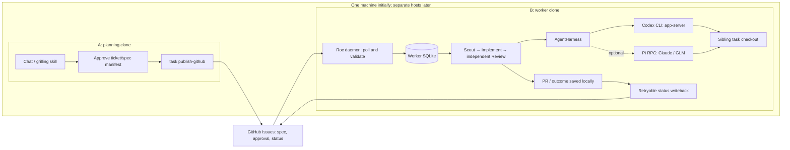
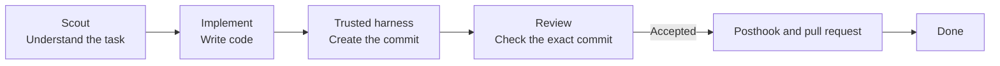

<p align="center">
  
</p>

<p align="center">
  <strong>English</strong> · <a href="README.zh-HK.md">繁體中文</a>
</p>

# Roc

Roc runs coding tasks through a small, repeatable workflow:

```text
Ready → Scout → Implement → Review → Pull request → Done
```

- Scout reads the task and plans the change.
- Implement writes the code on a separate Git branch; Roc's trusted harness creates the commit.
- Review checks that exact commit without changing it.
- Roc publishes an accepted commit as a pull request.

Roc saves every task and attempt in SQLite. If you stop the process, you can
continue later. If Review rejects a change, Roc creates a draft follow-up task
with the feedback instead of retrying forever.

Roc runs one task at a time. It pushes accepted task branches and opens or
updates their pull requests. It does not merge pull requests or delete branches.

## Architecture: one machine first

Start with two independent project clones on one machine. A handles chat,
grilling, and approval through `roc-create-tasks`, then publishes the approved
ticket/spec manifest. B runs the daemon and owns execution. GitHub Issues carry
the shared specs, approvals, and visible status; B's SQLite database stores
attempts, results, and pending status updates.



Only B runs a daemon. Reuse the same worker sequentially, with a branch per task
in `<project>.agile-checkout`. A has no executable task imported by remote
publication. The clones keep separate `.agile/runtime/agile.db` files; even a
nested clone cannot resolve to an outer project's database.

The daemon polls GitHub directly, so this design does not need a GitHub Actions
runner. Install the execution CLI, project tools, and credentials on B. Later,
move B to another host using the worker transfer procedure below. A can then go
offline after publication; physical two-host operation still needs validation.

Codex is the first runtime being validated. The existing experimental Pi backend
uses the same scheduler and RPC-based harness boundary for providers such as
Claude and GLM. Pi selects one provider/model per daemon session; it does not
switch providers per task. The Pi deployment examples below are an optional
runtime path, not a prerequisite for Codex. ZCode remains an experimental backend.

### Validation status

As of 2026-09-06:

| Scope | Result |
| --- | --- |
| Direct Codex CLI 0.144.4, `gpt-5.5`, `high` | File editing, tests, and independent commit Review passed |
| Codex app-server detached Review with explicit startup model settings | Returned `accepted` JSON matching Roc's Review schema |
| Same-host Roc with real GitHub | Publication, admission, bounded retries, worker reuse, and failure writeback verified; Review → PR → done has not passed |
| Pi with real Claude/GLM; physical two-host operation | Not yet verified |

The Codex probe exposed a model propagation gap: detached Review used the global
default model despite the anchor thread's requested model. Pinning `model` and
`review_model` to `gpt-5.5` at app-server startup made the probe pass. Roc's backend
still needs to apply the selected startup settings and keep profile routing and
recorded model attribution consistent. CLI success does not establish that the
default Roc scheduler configuration works. Native Review usage accounting also
remains unverified.

See the [workflow diagram](docs/design/remote-task-workflow.md) and
[task delivery specification](docs/specs/remote-task-workflow.md) for the full
acceptance criteria. The GitHub worker additions are not in the npm release yet;
use this branch's source commands below to evaluate them.

## Quick start

You need [Bun](https://bun.sh/) 1.3 or later, Git, the
[Codex CLI](https://github.com/openai/codex), and the
[GitHub CLI](https://cli.github.com/) signed in with `gh auth login`.

Run Roc inside a Git project:

```bash
npx roc-it@latest onboard
```

Onboarding creates Roc's local database and installs two skills:

- `roc-create-tasks` turns a requirement into an approved backlog.
- `pr-review-to-closure` tracks findings across repeated pull-request reviews.

The repeat-review skill needs Python 3.9 or later. Roc's scheduler and task
commands only need Bun.

Create a backlog in Codex:

```text
$roc-create-tasks Add team invitations
```

The skill shows you the proposed tasks before it imports anything. It needs the
`grilling` skill, which you can install with:

```bash
npx skills add mattpocock/skills --skill grilling --global --agent codex
```

Check the tasks, run them, then open the board:

```bash
npx roc-it@latest task list
npx roc-it@latest scheduler run --base-branch main
npx roc-it@latest task board
```

Roc writes task code in a sibling folder named `<project>.agile-checkout`. Your
current checkout stays on its existing branch.

## GitHub worker setup

Use A and B as separate clones on one machine first. They must use the same
GitHub repository and target branch. The same publication and polling design
applies when B later moves to a separate machine.

On machine A, authenticate `gh` as the publisher, create the approved manifest,
and publish it:

```bash
/absolute/path/to/bun /absolute/path/to/Roc/src/cli/main.ts task publish-github .agile/backlog/approved.json
```

This creates or reconciles one `roc:task` Issue per task, records an approval of
the exact task envelope, and only then adds `roc:ready`. Remote publication does
not import the tasks into machine A's local database.

This workflow is not in the current npm release yet. When validating this
branch, replace each `roc-it` invocation below with
`/absolute/path/to/bun /absolute/path/to/Roc/src/cli/main.ts`; do not use
`npx roc-it@latest` as evidence for the unreleased workflow.

### Codex worker validation

B needs Bun, Git, GitHub CLI, Codex CLI, Roc, a clone with push access, and the
project's build/test tools. Authenticate Codex and GitHub on B. After the model
propagation fix described above, use this entrypoint for the next workflow check:

```bash
cd /absolute/path/to/worker-clone
ROC_GITHUB_PUBLISHERS=publisher-login /absolute/path/to/bun /absolute/path/to/Roc/src/cli/main.ts scheduler run --source github --backend codex --base-branch main
```

This is the existing scheduler entrypoint. It does not yet pin the tested
`gpt-5.5` configuration; the successful CLI probe used separate explicit
app-server startup settings. Keep one daemon per repository.

### Optional Pi worker

For the Pi runtime, B needs Bun, Git, GitHub CLI, Node.js 22.19 or later, Pi, Roc, a clone
with push access, the target project's build and test tools, and provider
credentials for Pi. Install the CLIs and authenticate GitHub:

```bash
npm install -g @earendil-works/pi-coding-agent
gh auth login
cd /absolute/path/to/project
/absolute/path/to/bun /absolute/path/to/Roc/src/cli/main.ts onboard
```

Configure Pi's default provider and model before starting Roc. The chosen model
must support `high` reasoning; Roc exits with `PI_MODEL_UNSUPPORTED` rather than
silently switching models. Put the trusted publisher login in a root-readable
service-account-readable worker environment file with mode `0600`, for example
`/etc/roc/worker.env`:

```bash
ROC_GITHUB_PUBLISHERS=publisher-login
ROC_PI_EXPERIMENTAL=1
```

Then run the only worker for this project:

```bash
set -a
. /etc/roc/worker.env
set +a
/absolute/path/to/bun /absolute/path/to/Roc/src/cli/main.ts scheduler run --source github --backend pi --base-branch main
```

Keep the service working directory fixed at the project root; that keeps its
database at the stable project-owned path `.agile/runtime/agile.db`. Omitting
`--source github` preserves the existing local-queue scheduler behavior.

The worker polls all managed Issues every 30 seconds, validates the complete
plan and trusted approval, and freezes that approved envelope in SQLite. A
network outage pauses new work and state advancement; a running agent result is
still persisted locally and synchronized after recovery. Status labels and one
worker-owned status comment are retryable projections of the local database.

A task reaches local `done` after its pull request is opened, but a dependent
task remains blocked until GitHub reports that pull request merged into the
configured target branch. Roc fetches the target, verifies that it contains the
actual merge commit, and pins that fresh target commit immediately before the
dependent task is claimed. A closed-unmerged pull request, changed approval, or
retired dependency moves the affected work to attention for explicit replanning.

Pi has no built-in filesystem sandbox. Its working directory is a starting
directory, not a security boundary, so run an unattended worker in an OS sandbox
or container that exposes only the repository, its sibling Roc checkout, and
the credentials it needs.

For systemd, install Roc and Pi at stable absolute paths and use one unit:

```ini
[Unit]
Description=Roc GitHub worker
After=network-online.target

[Service]
Type=simple
User=roc
WorkingDirectory=/srv/project
EnvironmentFile=/etc/roc/worker.env
Environment=PATH=/usr/local/bin:/home/roc/.bun/bin:/usr/bin:/bin
ExecStart=/home/roc/.bun/bin/bun /opt/Roc/src/cli/main.ts scheduler run --source github --backend pi --base-branch main
Restart=on-failure

[Install]
WantedBy=multi-user.target
```

On macOS, the equivalent launchd job can keep the non-secret settings in the
plist while Pi and `gh` continue to use the service account's local credential
stores:

```xml
<?xml version="1.0" encoding="UTF-8"?>
<!DOCTYPE plist PUBLIC "-//Apple//DTD PLIST 1.0//EN"
  "http://www.apple.com/DTDs/PropertyList-1.0.dtd">
<plist version="1.0">
<dict>
  <key>Label</key>
  <string>dev.roc.github-worker</string>
  <key>WorkingDirectory</key>
  <string>/Users/roc/project</string>
  <key>ProgramArguments</key>
  <array>
    <string>/Users/roc/.bun/bin/bun</string>
    <string>/Users/roc/Roc/src/cli/main.ts</string>
    <string>scheduler</string><string>run</string>
    <string>--source</string><string>github</string>
    <string>--backend</string><string>pi</string>
    <string>--base-branch</string><string>main</string>
  </array>
  <key>EnvironmentVariables</key>
  <dict>
    <key>PATH</key>
    <string>/opt/homebrew/bin:/usr/local/bin:/Users/roc/.bun/bin:/usr/bin:/bin</string>
    <key>ROC_GITHUB_PUBLISHERS</key>
    <string>publisher-login</string>
    <key>ROC_PI_EXPERIMENTAL</key><string>1</string>
  </dict>
  <key>KeepAlive</key><true/>
  <key>RunAtLoad</key><true/>
</dict>
</plist>
```

To move the worker, stop the old service first and leave it stopped. With no Roc
process running, copy the project checkout, its complete `.agile/runtime/`
directory including any SQLite sidecar files, and the sibling
`<project>.agile-checkout` to the new machine. Restore the Pi and GitHub service
account credentials, verify the target branch and paths, then start the new
service. Roc does not provide hot failover or multi-worker coordination.

Remote mode deliberately has one operational bound: if the repository has
1,000 managed `roc:task` Issues, publication and polling fail visibly because
the bounded Issue listing can no longer prove identity uniqueness. Preserve all
managed Issues and their identity labels; v1 has no supported workaround at the
bound. Live provider and two-machine checks remain operator-run release
evidence; the repository test suite uses deterministic local seams.

### Remaining live checks

After fixing Codex startup model propagation, repeat the same-host exercise with
a new approved task in a private fixture repository. Keep A's queue empty and
retain the three-role results, implementation SHA, PR, and original Issue's
final status. The CLI/RPC probes above do not replace this complete workflow
check. Record same-host, Pi-provider, and physical two-host results separately.

For release acceptance, run two separate three-role tasks through Pi: one with
Pi's default set to a Claude model that advertises `high`, then one with a GLM
model that advertises `high`. For each run, retain the managed Issue URL,
structured scheduler log or `scheduler inspect` evidence for Scout, Implement,
and Review, the implementation commit SHA, pull-request URL, and the final
worker-owned status comment. Verify that the recorded model is the selected Pi
default and that Roc never switches providers.

Then perform the machine-boundary check: publish a new approved plan on A, stop
Roc on A, and leave A offline while B polls, executes, publishes the pull
request, and writes status. Retain A's publication output, B's log and database
snapshot, the Issue history, commit, and pull request. For a dependent task,
merge its prerequisite and retain the fetched target SHA showing the actual
merge result before the dependent claim. These live checks are not part of the
local evidence reported by this change.

## The task board

The board is a read-only terminal UI. Wide terminals keep four task columns and
a right-side preview; narrow terminals stack the columns and open details
full-screen. It groups tasks by what needs your attention:

```text
Cycle 2026-W35 · 4 tasks · 8420 / 12000 tok

Ready · 1                   │ In progress · 1             │ Attention · 1               │ Done · 1
─────────────────────────── │ ─────────────────────────── │ ─────────────────────────── │ ───────────────────────────
    email  Add email login  │ ▌ ● api  Build auth API     │     tests  Fix auth tests   │   d to expand
    ready                   │     implement · implementing│     needs_input             │
                            │                             │     blocked by api          │

↑↓ move · Space preview · Enter details · d Done · ? help · q quit
```

The selected bar, semantic status colors, and compact count/token summary make
the next action clear without surrounding every card with a border. The detail
view groups status, run data, dependencies, and the task brief. Press `Space`
for a quick preview or `Enter` for the full view.

Keyboard controls are `↑`/`↓` or `J`/`K` to move, `Space` to preview, `Enter`
for details, `D` to expand Done, `R` to refresh, `?` for help, `Esc` to return,
and `Q` or `Ctrl-C` to quit. Opening either `task board` or the shorter `tui`
never starts the scheduler or changes a task; both show the same read-only
board. Run `npx roc-it@latest task board --all` to include older cycles.

Retire an obsolete draft, input, replan, or ready task without deleting its
history:

```bash
npx roc-it@latest task retire TASK_ID --reason "obsolete approach" [--replacement TASK_ID]
```

Roc calls this Archived when there is no replacement and Superseded when there
is one. Retired tasks are hidden from normal task lists and boards; use
`task list --history` or `task board --history` to inspect their retained reason,
replacement, and retirement time.

## How it works

Roc picks one ready task and passes it through three agent roles.



Each task gets its own branch in the dedicated checkout. Review receives the
implementation commit created by the trusted harness and cannot edit the working tree.

After an accepted Review, Roc runs the trusted posthook and verifies that the
Implement commit is clean. It then pushes `agile/<task-id>` and creates or updates one
pull request before the task becomes done. If Review rejects it,
Roc creates a follow-up ticket and moves on to the next ready task. A publishing
failure moves the task to `needs_replan` and keeps the local commit for recovery.

In GitHub source mode, `done` means execution completed and the PR was published.
It does not mean merged. Code dependencies wait for the prerequisite PR to merge
into the target branch before the next task starts.

Use `--base-branch` to name the GitHub branch that should receive the pull
request. Use `--base` separately if task branches should start from a particular
local commit.

Roc records task state, attempts, events, model choices, and token use. A token
target is an estimate for planning. It does not stop an agent when the target is
reached.

## Experimental ZCode backend

Roc uses Codex by default. It can also run the Z.ai desktop app's headless ZCode
server:

```bash
cd /absolute/path/to/project
ROC_ZCODE_EXPERIMENTAL=1 npx roc-it@latest scheduler run --base-branch main --backend zcode
```

ZCode needs a signed-in Z.ai desktop app on the same machine. Roc reads the
enabled provider from `~/.zcode/v2/config.json` and launches the app's bundled
CLI through `ZCODE_BIN`. That CLI is undocumented and may change between app
versions.

ZCode has no protocol-level filesystem sandbox. An unattended session can write
outside the task checkout, and requests to disable command sandboxing are
approved automatically. Only run this backend inside an OS sandbox or container
that exposes the task checkout. Setting `ROC_ZCODE_EXPERIMENTAL=1` confirms that
you accept this risk.

## Other ways to add tasks

Import a Roc backlog JSON file:

```bash
npx roc-it@latest task import .agile/backlog/my-backlog.json
```

Or import open GitHub Issues labelled `roc:ready`:

```bash
npx roc-it@latest task import-github
```

GitHub import is one-way. Roc skips an Issue after importing its ID, so later
edits to the Issue do not update the stored task.

## Repeated pull-request reviews

Ask an agent to use the installed `pr-review-to-closure` skill when reviewing a
pull request again. It keeps stable finding IDs, compares the new head with the
previous review, and reports a merge decision after the required checks pass.
The skill does not comment, approve, commit, push, or merge unless you ask.

## Commands

```text
npx roc-it@latest onboard                 Set up Roc in this project
npx roc-it@latest cycle current           Show the current Agile cycle
npx roc-it@latest task list [--history]   List active tasks or retained history
npx roc-it@latest task retire TASK_ID --reason TEXT [--replacement TASK_ID]
npx roc-it@latest task board [--all] [--history] Open the read-only board
npx roc-it@latest tui                     Open the read-only board
npx roc-it@latest scheduler run --base-branch BRANCH [--base REF] [--backend <name>]
npx roc-it@latest scheduler inspect       Inspect scheduler state
npx roc-it@latest tokens [--no-color]     Show token use
npx roc-it@latest help                    Show all commands
```

You can install `roc-it` globally if you prefer a shorter command:

```bash
npm install -g roc-it@latest
roc-it help
```

## Current limits

Roc supports Codex plus experimental ZCode and Pi backends. It runs one task and
one GitHub worker per project at a time. Remote approval uses trusted GitHub
comments; Roc does not merge pull requests or send notifications. Claude Code
and Cursor backends are planned.

## More detail

- [Architecture notes](docs/architecture.md)
- [GitHub worker workflow and acceptance diagram](docs/design/remote-task-workflow.md)
- [Task delivery specification](docs/specs/remote-task-workflow.md)
- [Earlier interactive architecture diagram](output/archify/roc-system-architecture.html)
- [Contributing guide](CONTRIBUTING.md)
- [Research and project comparisons](docs/research/agent-agile-orchestration-landscape.md)

## License

Roc uses the [Apache License 2.0](LICENSE).
