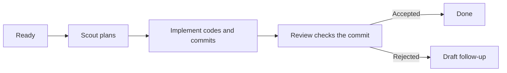

<p align="center">
  
</p>

<p align="center">
  <strong>English</strong> · <a href="README.zh-HK.md">繁體中文</a>
</p>

# Roc

Roc runs Codex coding tasks through a small, repeatable workflow:

```text
Ready task → Scout → Implement → Review → Done
```

- Scout reads the task and plans the change.
- Implement writes the code on a separate Git branch and commits it.
- Review checks that exact commit without changing it.

Roc saves every task and attempt in SQLite. If you stop the process, you can
continue later. If Review rejects a change, Roc creates a draft follow-up task
with the feedback instead of retrying forever.

Roc runs one task at a time. It does not merge, push, or delete branches.

## Quick start

You need [Bun](https://bun.sh/) 1.3 or later, Git, and the
[Codex CLI](https://github.com/openai/codex).

Run Roc inside a Git project:

```bash
npx roc-it@latest onboard
```

Onboarding creates Roc's local database and installs the `roc-create-tasks`
skill. It also asks how long an Agile cycle should last and which agent skills
Codex may use.

Create a backlog in Codex:

```text
$roc-create-tasks Add team invitations
```

The skill shows you the proposed tasks before it imports anything. It needs the
`grilling` skill, which you can install with:

```bash
npx skills add mattpocock/skills --skill grilling --global --agent codex
```

Check the tasks, run them, then open the board:

```bash
npx roc-it@latest task list
npx roc-it@latest scheduler run
npx roc-it@latest task board
```

Roc writes task code in a sibling folder named `<project>.agile-checkout`. Your
current checkout stays on its existing branch.

## The task board

The board is a terminal UI. It groups tasks by what needs your attention:

```text
Cycle 2026-W35 · 4 tasks · 8420/12000 tokens

Ready (1)                   │ In progress (1)             │ Attention (1)               │ Done (1)
─────────────────────────── │ ─────────────────────────── │ ─────────────────────────── │ ───────────────────────────
  email  Add email login    │ › ● api  Build auth API     │   tests  Fix auth tests     │   collapsed
  Status: ready             │   Status: implementing      │   Status: needs_input       │
  Phase: ready              │   Phase: implement          │   Phase: needs_input        │
                            │                             │   Blocked: api              │

↑↓ select · Space peek · Enter details · d Done · ? help · q quit
```

Select a task to see its problem, current phase, model, retry count, token use,
dependencies, and acceptance criteria. Press `Space` for a quick peek or
`Enter` for the full view. Press `r` to refresh.

The board is read-only. Opening it never starts the scheduler or changes a
task. Run `npx roc-it@latest task board --all` to include older cycles.

## What happens during a task



Each task gets its own branch in the dedicated checkout. Review receives the
commit created by Implement. It cannot edit the working tree.

Roc records task state, attempts, events, model choices, and token use. A token
target is an estimate for planning. It does not stop an agent when the target is
reached.

## Other ways to add tasks

You can import a Roc backlog JSON file:

```bash
npx roc-it@latest task import .agile/backlog/my-backlog.json
```

You can also import open GitHub Issues labelled `roc:ready`:

```bash
gh auth login
npx roc-it@latest task import-github
```

GitHub import is one-way. Roc skips an Issue after importing its ID, so later
edits to the Issue do not update the stored task.

## Useful commands

```text
npx roc-it@latest onboard                 Set up Roc in this project
npx roc-it@latest cycle current           Show the current Agile cycle
npx roc-it@latest task list               List stored tasks
npx roc-it@latest task board [--all]      Open the read-only board
npx roc-it@latest scheduler run           Run ready tasks with Codex
npx roc-it@latest scheduler inspect       Inspect scheduler state
npx roc-it@latest tokens [--no-color]     Show token use
npx roc-it@latest help                    Show all commands
```

You can install `roc-it` globally if you prefer a shorter command:

```bash
npm install -g roc-it@latest
roc-it help
```

## Current limits

Roc supports Codex today. It does not yet run tasks in parallel, ask for remote
approval, or send notifications. Pi, Claude Code, and Cursor support are
planned.

## More detail

- [Architecture notes](docs/architecture.md)
- [Interactive architecture diagram](output/archify/roc-system-architecture.html)
- [Contributing guide](CONTRIBUTING.md)
- [Research and project comparisons](docs/research/agent-agile-orchestration-landscape.md)

## License

Roc uses the [Apache License 2.0](LICENSE).
