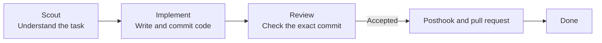

<p align="center">
  
</p>

<p align="center">
  <strong>English</strong> · <a href="README.zh-HK.md">繁體中文</a>
</p>

# Roc

Roc runs coding tasks through a small, repeatable workflow:

```text
Ready → Scout → Implement → Review → Pull request → Done
```

- Scout reads the task and plans the change.
- Implement writes the code on a separate Git branch and commits it.
- Review checks that exact commit without changing it.
- Roc publishes an accepted commit as a pull request.

Roc saves every task and attempt in SQLite. If you stop the process, you can
continue later. If Review rejects a change, Roc creates a draft follow-up task
with the feedback instead of retrying forever.

Roc runs one task at a time. It pushes accepted task branches and opens or
updates their pull requests. It does not merge pull requests or delete branches.

## Quick start

You need [Bun](https://bun.sh/) 1.3 or later, Git, the
[Codex CLI](https://github.com/openai/codex), and the
[GitHub CLI](https://cli.github.com/) signed in with `gh auth login`.

Run Roc inside a Git project:

```bash
npx roc-it@latest onboard
```

Onboarding creates Roc's local database and installs two skills:

- `roc-create-tasks` turns a requirement into an approved backlog.
- `pr-review-to-closure` tracks findings across repeated pull-request reviews.

The repeat-review skill needs Python 3.9 or later. Roc's scheduler and task
commands only need Bun.

Create a backlog in Codex:

```text
$roc-create-tasks Add team invitations
```

The skill shows you the proposed tasks before it imports anything. It needs the
`grilling` skill, which you can install with:

```bash
npx skills add mattpocock/skills --skill grilling --global --agent codex
```

Check the tasks, run them, then open the board:

```bash
npx roc-it@latest task list
npx roc-it@latest scheduler run --base-branch main
npx roc-it@latest task board
```

Roc writes task code in a sibling folder named `<project>.agile-checkout`. Your
current checkout stays on its existing branch.

## The task board

The board is a terminal UI. It groups tasks by what needs your attention:

```text
Cycle 2026-W35 · 4 tasks · 8420/12000 tokens

Ready (1)                   │ In progress (1)             │ Attention (1)               │ Done (1)
─────────────────────────── │ ─────────────────────────── │ ─────────────────────────── │ ───────────────────────────
  email  Add email login    │ › ● api  Build auth API     │   tests  Fix auth tests     │   collapsed
  Status: ready             │   Status: implementing      │   Status: needs_input       │
  Phase: ready              │   Phase: implement          │   Phase: needs_input        │
                            │                             │   Blocked: api              │

↑↓ select · Space peek · Enter details · d Done · ? help · q quit
```

Select a task to see its problem, current phase, model, retry count, token use,
dependencies, and acceptance criteria. Press `Space` for a quick peek or
`Enter` for the full view. Press `r` to refresh.

The board is read-only. Opening it never starts the scheduler or changes a
task. Run `npx roc-it@latest task board --all` to include older cycles. The
shorter `npx roc-it@latest tui` command opens the same board.

## How it works

Roc picks one ready task and passes it through three agent roles.



Each task gets its own branch in the dedicated checkout. Review receives the
commit created by Implement and cannot edit the working tree.

After an accepted Review, Roc runs the trusted posthook and verifies that the
Implement commit is clean. It then pushes `agile/<task-id>` and creates or updates one
pull request before the task becomes done. If Review rejects it,
Roc creates a follow-up ticket and moves on to the next ready task. A publishing
failure moves the task to `needs_replan` and keeps the local commit for recovery.

Use `--base-branch` to name the GitHub branch that should receive the pull
request. Use `--base` separately if task branches should start from a particular
local commit.

Roc records task state, attempts, events, model choices, and token use. A token
target is an estimate for planning. It does not stop an agent when the target is
reached.

## Experimental ZCode backend

Roc uses Codex by default. It can also run the Z.ai desktop app's headless ZCode
server:

```bash
cd /absolute/path/to/project
ROC_ZCODE_EXPERIMENTAL=1 npx roc-it@latest scheduler run --base-branch main --backend zcode
```

ZCode needs a signed-in Z.ai desktop app on the same machine. Roc reads the
enabled provider from `~/.zcode/v2/config.json` and launches the app's bundled
CLI through `ZCODE_BIN`. That CLI is undocumented and may change between app
versions.

ZCode has no protocol-level filesystem sandbox. An unattended session can write
outside the task checkout, and requests to disable command sandboxing are
approved automatically. Only run this backend inside an OS sandbox or container
that exposes the task checkout. Setting `ROC_ZCODE_EXPERIMENTAL=1` confirms that
you accept this risk.

## Other ways to add tasks

Import a Roc backlog JSON file:

```bash
npx roc-it@latest task import .agile/backlog/my-backlog.json
```

Or import open GitHub Issues labelled `roc:ready`:

```bash
npx roc-it@latest task import-github
```

GitHub import is one-way. Roc skips an Issue after importing its ID, so later
edits to the Issue do not update the stored task.

## Repeated pull-request reviews

Ask an agent to use the installed `pr-review-to-closure` skill when reviewing a
pull request again. It keeps stable finding IDs, compares the new head with the
previous review, and reports a merge decision after the required checks pass.
The skill does not comment, approve, commit, push, or merge unless you ask.

## Commands

```text
npx roc-it@latest onboard                 Set up Roc in this project
npx roc-it@latest cycle current           Show the current Agile cycle
npx roc-it@latest task list               List stored tasks
npx roc-it@latest task board [--all]      Open the read-only board
npx roc-it@latest tui                     Open the read-only board
npx roc-it@latest scheduler run --base-branch BRANCH [--base REF] [--backend <name>]
npx roc-it@latest scheduler inspect       Inspect scheduler state
npx roc-it@latest tokens [--no-color]     Show token use
npx roc-it@latest help                    Show all commands
```

You can install `roc-it` globally if you prefer a shorter command:

```bash
npm install -g roc-it@latest
roc-it help
```

## Current limits

Roc supports Codex and an experimental ZCode backend. It does not yet run tasks
in parallel, ask for remote approval, or send notifications. Pi, Claude Code,
and Cursor backends are planned.

## More detail

- [Architecture notes](docs/architecture.md)
- [Interactive architecture diagram](output/archify/roc-system-architecture.html)
- [Contributing guide](CONTRIBUTING.md)
- [Research and project comparisons](docs/research/agent-agile-orchestration-landscape.md)

## License

Roc uses the [Apache License 2.0](LICENSE).
