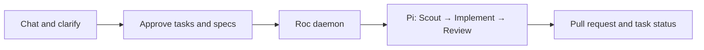

<p align="center">
  
</p>

[English](README.md) · [繁體中文](README.zh-HK.md)

# Roc

Turn a conversation into coding tasks. A local daemon implements them, opens
pull requests, and updates task status. You review and merge the results.

## How it works



**Pi is the execution core.** Onboarding connects your ChatGPT account and selects
a Codex model. Claude and GLM are advanced provider options.
Roc uses Pi's tools and agent loop; it does not launch Codex CLI or Claude Code.
GitHub Issues hold specifications, approvals and execution checkpoints.
One daemon runs up to two independent tasks, with a native Git worktree per Issue.
Use `--concurrency 1` for sequential execution. Overlapping or unclear scopes
and tasks with hooks run alone.
An open PR is `awaiting_merge`; `done` means its merge has been confirmed.

Pi automatically summarizes older context as a session approaches its context
limit. Auto-compaction is enabled by default; Roc uses Pi's setting. See
[context compaction](README.details.md#context-compaction) and
[Pi's compaction documentation](https://github.com/earendil-works/pi/blob/main/packages/coding-agent/docs/compaction.md).

**Development version:** use this checkout, as shown below. The Pi-only workflow
is not yet published to npm. Automated checks do not establish live provider
success; see [validation status](README.details.md#validation-status).

## Quick start

You need Bun 1.3+, Node.js 22.19+, Git, GitHub CLI, and your project's build/test
tools. Tasks live in GitHub Issues. Run one execution daemon for the repository.

### 1. Set up Roc

Run `bun install` in this Roc checkout. Pi is included as a dependency.
Then enter the project you want Roc to modify. Replace the entrypoint with
this checkout's absolute path:

```bash
export ROC_CLI_ENTRY=/absolute/path/to/Roc/src/cli/main.ts
cd /path/to/your-project
gh auth login
bun "$ROC_CLI_ENTRY" onboard
```

Onboarding installs Roc's skills, lets you choose trusted skills and an Agile
cycle, and asks once for permission to run coding tools with your account's
permissions. It opens your browser for ChatGPT login when needed, tests a small
Codex prompt, and saves the model after a successful response. Existing Pi
credentials are reused. You do not need to install or log into Pi separately.
The test uses a small amount of your model quota.

Use ↑/↓ to move, Space to toggle skills, and Enter to confirm. Choose Daily,
Weekly (the default), or Custom and enter the number of days. Terminal colors
are automatic.

### 2. Create tasks through chat

Open the project in your usual coding assistant and ask:

```text
Use roc-create-tasks to add team invitations. Publish approved tasks to this repository's GitHub Issues using the Roc entrypoint in ROC_CLI_ENTRY.
```

The skill asks questions and proposes tasks with acceptance criteria. It saves
them to GitHub after you approve the complete plan. If the assistant cannot read your
terminal environment, give it the absolute Roc entrypoint path.
Install `grilling` and `unslop` in your planning assistant if missing; see
[planning skills](README.details.md#planning-skills).

### 3. Start the daemon

In the same project and terminal, replace `main` with your target branch:

```bash
bun "$ROC_CLI_ENTRY" task list
bun "$ROC_CLI_ENTRY" scheduler run --base-branch main
```

Leave the terminal open. Press `Ctrl-C` to stop; repeat the command to recover
saved work. Roc keeps each task in `<project>.agile-worktrees/issue-<number>`.
For unattended work, use OS/container isolation because Pi has no built-in sandbox.

### 4. Follow progress

In another terminal, set the same `ROC_CLI_ENTRY`, enter the same project, and run:

```bash
bun "$ROC_CLI_ENTRY" task board
```

The board is read-only. Press `Enter` for details or `Q` to quit.
Colored columns show progress, attention, and completed work; the layout adapts
to your terminal width. Redirected output stays plain.
Use `task list`, `scheduler inspect`, or `help` for more information.

## Go further

The [detailed guide](README.details.md) covers the architecture diagram, provider
setup, GitHub Issues as a shared task source, daemon deployment, and recovery.
You can publish from a MacBook and run the sole daemon on a Mac mini.
Physical two-host operation still needs acceptance testing.

Development and releases: [CONTRIBUTING.md](CONTRIBUTING.md).
License: [Apache 2.0](LICENSE).
