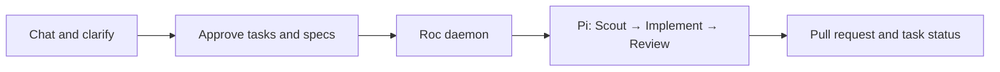

<p align="center">
  
</p>

[English](README.md) · [繁體中文](README.zh-HK.md)

# Roc

Turn a conversation into coding tasks. A local daemon implements them, opens
pull requests, and updates task status. You review and merge the results.

## How it works



**Pi is the execution core.** Choose a Codex, Claude, or GLM model in Pi.
Roc uses Pi's tools and agent loop; it does not launch Codex CLI or Claude Code.
One daemon runs one task at a time. Each task keeps its own branch.
`done` means the PR is published; you still merge it yourself.

**Development version:** use this checkout, as shown below. The Pi-only workflow
is not yet published to npm. Automated checks do not establish live provider
success; see [validation status](README.details.md#validation-status).

## Quick start

You need Bun 1.3+, Node.js 22.19+, Git, GitHub CLI, and your project's build/test
tools. Start with the local task queue on one machine.

### 1. Install and configure Pi

```bash
npm install -g @earendil-works/pi-coding-agent
pi
```

In Pi, use `/login` to authenticate, then `/model` to select a model that supports
`high` reasoning. Press **Ctrl+S in the model picker** to save the startup default.
See [provider setup](README.details.md#pi-provider-setup) for Claude and GLM API keys.

### 2. Set up Roc and your project

In this Roc checkout, run `bun install`. Then run the following in the project
you want Roc to modify. Replace the entrypoint with this checkout's absolute path:

```bash
export ROC_CLI_ENTRY=/absolute/path/to/Roc/src/cli/main.ts
cd /path/to/your-project
gh auth login
npx skills add mattpocock/skills --skill grilling --global --agent pi
npx skills add backnotprop/pstack --skill unslop --global --agent pi
bun "$ROC_CLI_ENTRY" onboard
pi
```

Onboarding creates the database, installs `roc-create-tasks`, and lets you choose
trusted agent skills. In Pi, ask:

```text
/skill:roc-create-tasks Add team invitations. Use the local queue and the Roc entrypoint in ROC_CLI_ENTRY.
```

The skill asks questions and proposes tasks with acceptance criteria. It saves
them after you approve the complete plan.

### 3. Start the daemon

Exit Pi, then use the same terminal. Replace `main` with your target branch.
Pi has no built-in sandbox. The variable below acknowledges that Pi tools have
your user account's permissions; use OS/container isolation for unattended runs.

```bash
bun "$ROC_CLI_ENTRY" task list
ROC_ALLOW_UNSANDBOXED=1 bun "$ROC_CLI_ENTRY" scheduler run --base-branch main
```

Leave the terminal open. Press `Ctrl-C` to stop; repeat the command to recover
saved work. Roc keeps task branches in a sibling `<project>.agile-checkout`.

### 4. Follow progress

In another terminal, set the same `ROC_CLI_ENTRY`, enter the same project, and run:

```bash
bun "$ROC_CLI_ENTRY" task board
```

The board is read-only. Press `Enter` for details or `Q` to quit.
Use `task list`, `scheduler inspect`, or `help` for more information.

## Go further

The [detailed guide](README.details.md) covers the architecture diagram, provider
setup, GitHub Issues as a shared task source, daemon deployment, and recovery.
Start with two clones on the same machine; move the execution clone later.

Development and releases: [CONTRIBUTING.md](CONTRIBUTING.md).
License: [Apache 2.0](LICENSE).
