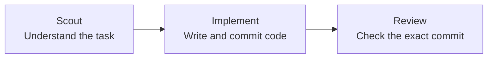

<p align="center">
  
</p>

# Roc

Roc is a local command-line tool that guides Codex agents through an agile
software flow. Each task moves through three steps: **Scout → Implement →
Review**.

Scout studies the task. Implement writes the code. Review checks the exact
finished commit. Roc saves progress and token use in SQLite, so work can continue
after a restart.

If Review rejects the work, Roc closes the original task and creates a linked
draft task with the code and feedback. It then returns to the ready backlog
instead of repeating the same task forever.

Roc currently provides:

- model settings that never use `low` thinking effort;
- a separate Git branch for each task in a dedicated work folder;
- a read-only Review of the exact commit made by Implement;
- saved task progress and token use, with restart support;
- a token-use chart in the terminal;
- a list of skills that agents are allowed to use.

Roc works on one task at a time. It does not merge or push code, delete task
branches, run several tasks at once, or limit token use.

Ticket import, weekly planning, and an interactive screen are planned but are
not available yet.

## Run it

Prerequisites:

- [Bun](https://bun.sh/)
- Git
- [Codex CLI](https://github.com/openai/codex) for Codex mode

From the repository root:

```bash
bun install
bun run src/cli/main.ts init
bun run src/cli/main.ts task list
bun run src/cli/main.ts tokens
```

Roc can create and inspect its local task database. A public command for adding
tickets is not ready, so Roc currently needs a prepared backlog.

To run a prepared backlog with Codex:

```bash
bun run src/cli/main.ts scheduler run --backend codex --repo /absolute/path/to/project
```

Codex mode creates or reuses a work folder at `<project>.agile-checkout`. Roc
never switches branches or makes commits in the source folder passed through
`--repo`.

## How it works

Roc picks one ready task and passes it through three agent roles.



If Review accepts the commit, the task is done. If Review rejects it, Roc
creates a follow-up ticket and moves on to the next ready task.

## Commands

All supported CLI commands:

```bash
bun run src/cli/main.ts init [--db PATH]
bun run src/cli/main.ts task list [--db PATH]
bun run src/cli/main.ts tokens [--db PATH] [--no-color]
bun run src/cli/main.ts scheduler run --backend fake --fake-script PATH [--db PATH]
bun run src/cli/main.ts scheduler run --backend codex --repo PATH [--base REF] [--db PATH]
bun run src/cli/main.ts scheduler inspect [--db PATH]
bun run src/cli/main.ts help
```

Development commands:

```bash
bun install
bun run typecheck
bun run test
bun run check
```

## Development

Roc uses Bun, TypeScript, Zod, `bun:sqlite`, `simple-git`, and the Codex
app-server. Start with these documents:

- [Architecture](docs/architecture.md)
- [Domain language](CONTEXT.md)
- [Approved specifications](docs/specs/)
- [Durable decisions](docs/adr/)
- [Research](docs/research/)
- [Testing policy](AGENTS.md)

Keep changes small and follow these safety rules:

- never change the source work folder;
- Review must check the exact clean commit from Implement;
- receiving the same update twice must not repeat the change;
- a rejected task must stay closed and create only one draft follow-up.

Before submitting a change, run:

```bash
bun run check
```

Tests should prove the most important behavior. Full test coverage is not the
goal. Use the Fake Harness to test retries, rejection, restart, and repeated
events.

## References

Roc learns from these projects without including their code:

| Project | What Roc learned |
| --- | --- |
| [OpenAI Codex](https://github.com/openai/codex) | Running agents, tracking token use, and keeping Review separate |
| [OpenAI Symphony](https://github.com/openai/symphony) | Picking tasks, using separate work folders, and showing run progress |
| [Pi](https://github.com/earendil-works/pi) | Saving session branches, shortening context, and running other tools |
| [Beads](https://github.com/gastownhall/beads) | Finding ready tasks, linking tasks, and creating follow-up work |
| [Gas Town](https://github.com/gastownhall/gastown) | Agent roles, stuck tasks, review steps, and terminal screen ideas |
| [OpenSpec](https://github.com/Fission-AI/OpenSpec) | Clear plans, designs, and task lists |

See [the project research](docs/research/agent-agile-orchestration-landscape.md)
for a full comparison and source list.
