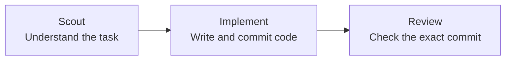

<p align="center">
  
</p>

<p align="center">
  <strong>English</strong> · <a href="README.zh-HK.md">繁體中文</a>
</p>

# Roc

Roc is a local command-line tool that guides Codex agents through an agile
software flow. Each task moves through three steps: **Scout → Implement →
Review**.

Scout studies the task. Implement writes the code. Review checks the exact
finished commit. Roc saves progress and token use in SQLite, so work can continue
after a restart.

If Review rejects the work, Roc closes the original task and creates a linked
draft task with the code and feedback. It then returns to the ready backlog
instead of repeating the same task forever.

Roc currently provides:

- model settings that never use `low` thinking effort;
- a separate Git branch for each task in a dedicated work folder;
- a read-only Review of the exact commit made by Implement;
- saved task progress and token use, with restart support;
- a token-use chart in the terminal;
- a read-only task board for the current Agile cycle;
- one-shot import of approved GitHub Issues into the ready backlog;
- a list of skills that agents are allowed to use.

Roc works on one task at a time. It does not merge or push code, delete task
branches, run several tasks at once, or limit token use.

## Quick Start

Prerequisites:

- [Bun](https://bun.sh/) 1.3.0 or later
- Git
- [GitHub CLI](https://cli.github.com/) for Issue import, authenticated with
  `gh auth login`
- [Codex CLI](https://github.com/openai/codex) for Codex mode
- The `grilling` skill for creating a backlog:

```bash
npx skills add mattpocock/skills --skill grilling --global --agent codex --agent claude-code --agent cursor
```

Run without a global install (Roc still requires Bun at runtime):

```bash
npx roc-it@latest help
```

You can also use `bunx` as Bun's package runner:

```bash
bunx roc-it@latest help
```

Or install the command globally:

```bash
npm install -g roc-it@latest
```

Onboard Roc in one project. This creates the local database and installs the
task-creation skill for Codex, Claude Code, and Cursor:

```bash
npx roc-it@latest onboard
```

Onboarding prints the project scope, each completed step, the selected cycle,
the settings path, and next steps to install `grilling` if needed, create a
first backlog with the installed task skill, and inspect the resulting tasks. If
a later step stops, Roc lists the work already completed and gives a retry
command; it does not claim to roll anything back.

Onboarding shows Roc's installed default agent skills as a checklist. Press Enter to accept the current selection, use Space to toggle a skill, or clear every item to run agents without skills. Roc saves the exact selection globally. A newly installed default stays disabled until you run onboarding again and select it.

Roc does not install a missing `unslop` skill. Install the pstack copy yourself, then rerun onboarding:

```bash
npx skills add backnotprop/pstack --skill unslop --global --agent codex --agent claude-code --agent cursor
npx roc-it@latest onboard
```

Use `NO_COLOR=1 npx roc-it@latest onboard` for plain terminal output.

Use `npx roc-it@latest onboard --global` to install the skill under your user
account instead; global onboarding does not create a project database.

### Agile cycle

During onboarding, choose Daily, Weekly, or a custom number of days. Roc saves
the choice for all projects in `~/.config/roc/settings.json`.

```json
{ "cycle": { "type": "weekly" } }
```

### Task board

Open the read-only board for the current cycle:

```bash
npx roc-it@latest task board
```

Use `--all` to include stored tasks from every cycle. In an interactive terminal,
the board groups compact task cards into Ready, In progress, Attention, and Done.
Use Up/Down or J/K to select a card, Space to peek, Enter for full details, D to
expand Done, R to refresh, ? for controls, Esc to return, and Q or Ctrl-C to exit.
The board never starts the scheduler or changes tasks, attempts, events, or leases.

When either terminal stream is not interactive, the same command prints one plain,
ANSI-free snapshot and exits. An empty board shows the usual backlog-creation
guidance.

Show the active cycle at any time:

```bash
npx roc-it@latest cycle current
```

The task-creation skill uses that value in the backlog manifest. For example:

```json
{ "cycleId": "2026-08-28-P14D" }
```

Create a backlog from a requirement with the installed skill. In Claude Code or
Cursor, use:

```text
/roc-create-tasks Add team invitations
```

In Codex, use:

```text
$roc-create-tasks Add team invitations
```

The skill uses `grilling` to agree on the requirement, previews the full task
list and dependencies, waits for your explicit approval, saves a JSON backlog
under `.agile/backlog`, and imports it into Roc.

### Import approved GitHub Issues

Run `npx roc-it@latest task import-github` inside a Git repository to import
open Issues carrying the fixed `roc:ready` label. Roc uses `gh` to identify the
current GitHub repository; the command has no repository or label override.

Every eligible Issue body must use these second-level headings exactly once and
in this order. List sections require dash-prefixed items.

```markdown
## Problem

Why this work is needed.

## Desired outcome

What should be true when it is done.

## Scope

- included work

## Non-goals

- None

## Acceptance criteria

- observable completion condition

## Validation

- verification command or check
```

Issue `#42` becomes task `github-42` in the active Agile Cycle. Import is
one-way: later runs skip that ID without reparsing or updating the stored task.
New tasks are approved and ready immediately. Their `tokenCeiling` defaults to
`12000` as a planning estimate only—Roc does not stop execution at that value.

A global install also exposes the compatibility alias `agile`, so
`agile task import-github` runs the same command.

Inspect the resulting tasks:

```bash
npx roc-it@latest task list
```

Run that backlog with Codex:

```bash
npx roc-it@latest scheduler run
```

Or with ZCode (the Z.ai desktop app's headless `app-server`). The backend is
experimental and production-gated — see below:

```bash
ROC_ZCODE_EXPERIMENTAL=1 npx roc-it@latest scheduler run --backend zcode --repo /absolute/path/to/project
```

ZCode mode expects a signed-in Z.ai desktop app on the same machine: Roc reads
the enabled provider from `~/.zcode/v2/config.json` and launches the bundled
CLI through `ZCODE_BIN` (for example
`/Applications/ZCode.app/Contents/Resources/glm/zcode.cjs` on macOS). The
ZCode CLI is undocumented and may change across app releases.

The gate exists because ZCode has no protocol-level filesystem sandbox:
unattended yolo sessions can write outside the task checkout, and requests to
disable command sandboxing are auto-approved. Only run this backend inside an
OS sandbox or container that exposes the task checkout, and set
`ROC_ZCODE_EXPERIMENTAL=1` to acknowledge. Details in
[docs/architecture.md](docs/architecture.md).

Codex mode creates or reuses a work folder at `<project>.agile-checkout`. Roc
never switches branches or makes commits in the current project's source
folder.

## How it works

Roc picks one ready task and passes it through three agent roles.



If Review accepts the commit, the task is done. If Review rejects it, Roc
creates a follow-up ticket and moves on to the next ready task.

Roc works on one small task at a time. When Review asks for changes, Roc sends
the feedback to an unapproved draft follow-up. That follow-up returns to the
ready backlog only after approval. Roc saves progress so the flow can continue
after a restart.

## Milestones

Roc is growing in small steps.

### Product

- [x] **GitHub Issues backlog** — Bring approved GitHub Issues into Roc's ready
  backlog.
- [ ] **Visible task board** — See task progress in a terminal UI.
- [ ] **Parallel task runs** — Run independent tasks at the same time.
- [ ] **Remote approvals** — Review and approve waiting work remotely.
- [ ] **Notifications** — Get updates when work finishes, fails, or needs
  approval.

### Agent support

- [x] **OpenAI Codex** — Available today.
- [ ] **Pi agents** — Run Roc tasks with Pi.
- [ ] **Claude Code** — Run Roc tasks with Claude Code.
- [ ] **Cursor** — Run Roc tasks with Cursor agents.

## Commands

The built-in `npx roc-it@latest help` describes the public command tree:

```text
Get started
npx roc-it@latest onboard [--global]

Manage your cycle
npx roc-it@latest cycle current

Plan work
npx roc-it@latest task import FILE
npx roc-it@latest task import-github
npx roc-it@latest task list
npx roc-it@latest task board [--all]
npx roc-it@latest task hook trust <task-id> <prehook|posthook>
npx roc-it@latest tokens [--no-color]

Run work
npx roc-it@latest scheduler run [--base REF]
npx roc-it@latest scheduler inspect

Get help
npx roc-it@latest help
```

## Contributing

See [CONTRIBUTING.md](CONTRIBUTING.md) for development and testing instructions.

## References

Roc learns from these projects without including their code:

| Project | What Roc learned |
| --- | --- |
| [OpenAI Codex](https://github.com/openai/codex) | Running agents, tracking token use, and keeping Review separate |
| [OpenAI Symphony](https://github.com/openai/symphony) | Picking tasks, using separate work folders, and showing run progress |
| [Pi](https://github.com/earendil-works/pi) | Saving session branches, shortening context, and running other tools |
| [Beads](https://github.com/gastownhall/beads) | Finding ready tasks, linking tasks, and creating follow-up work |
| [Gas Town](https://github.com/gastownhall/gastown) | Agent roles, stuck tasks, review steps, and terminal screen ideas |
| [OpenSpec](https://github.com/Fission-AI/OpenSpec) | Clear plans, designs, and task lists |

See [the project research](docs/research/agent-agile-orchestration-landscape.md)
for a full comparison and source list.

## License

Roc uses the [Apache License 2.0](LICENSE). You may use, change, and share it,
including for commercial work, as long as you follow the license terms.
