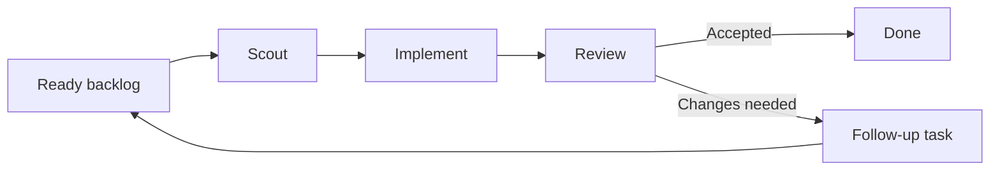

<p align="center">
  
</p>

# Roc

Roc is a local command-line tool that guides Codex agents through an agile
software flow. Each task moves through three steps: **Scout → Implement →
Review**.

Scout studies the task. Implement writes the code. Review checks the exact
finished commit. Roc saves progress and token use in SQLite, so work can continue
after a restart.

If Review rejects the work, Roc closes the original task and creates a linked
draft task with the code and feedback. It then returns to the ready backlog
instead of repeating the same task forever.

Roc currently provides:

- model settings that never use `low` thinking effort;
- a separate Git branch for each task in a dedicated work folder;
- a read-only Review of the exact commit made by Implement;
- saved task progress and token use, with restart support;
- a token-use chart in the terminal;
- a list of skills that agents are allowed to use.

Roc works on one task at a time. It does not merge or push code, delete task
branches, run several tasks at once, or limit token use.

Ticket import, weekly planning, and an interactive screen are planned but are
not available yet.

## Quick Start

Prerequisites:

- [Bun](https://bun.sh/) 1.3.0 or later
- Git
- [Codex CLI](https://github.com/openai/codex) for Codex mode

Run without a global install (Roc still requires Bun at runtime):

```bash
npx roc-it help
```

You can also use `bunx` as Bun's package runner:

```bash
bunx roc-it help
```

Or install the command globally:

```bash
npm install -g roc-it
roc-it help
```

Create and inspect the local task database:

```bash
npx roc-it init
npx roc-it task list
npx roc-it tokens
```

Roc does not yet have a public command for adding tickets, so the scheduler
needs a prepared backlog.

Run that backlog with Codex:

```bash
npx roc-it scheduler run --backend codex --repo /absolute/path/to/project
```

Codex mode creates or reuses a work folder at `<project>.agile-checkout`. Roc
never switches branches or makes commits in the source folder passed through
`--repo`.

## How it works

Roc follows a small agile loop. It moves each task through three focused agents:



- **Scout:** Understands the task, checks the code, and prepares a plan.
- **Implement:** Writes the code in a separate work folder and creates a commit.
- **Review:** Independently checks that exact commit. It accepts the work or
  creates a follow-up task with clear feedback.

Roc works on one small task at a time. When Review asks for changes, Roc sends
the feedback back to the ready backlog instead of repeating the finished
attempt. Roc saves progress so the flow can continue after a restart.

## Commands

```bash
roc-it init [--db PATH]
roc-it task list [--db PATH]
roc-it tokens [--db PATH] [--no-color]
roc-it scheduler run --backend fake --fake-script PATH [--db PATH]
roc-it scheduler run --backend codex --repo PATH [--base REF] [--db PATH]
roc-it scheduler inspect [--db PATH]
roc-it help
```

## Releases

See every published version and its notes on [GitHub Releases](https://github.com/devos-ing/Roc/releases).

To publish a stable version, a maintainer bumps `package.json`, runs the locked
Bun install and full check, and commits `bun.lock` only if Bun changes it:

```bash
bun install --frozen-lockfile
bun run check
```

Then merge that version and tag the exact release commit:

```bash
git tag vX.Y.Z
git push origin vX.Y.Z
```

The tag must match the version in `package.json`. GitHub Actions runs the checks,
publishes the package to npm, and creates the GitHub Release.

## Development

Roc uses Bun, TypeScript, Zod, `bun:sqlite`, `simple-git`, and the Codex
app-server.

From a source checkout:

```bash
bun install
bun run src/cli/main.ts help
bun run typecheck
bun run test
bun run check
```

Start with these documents:

- [Architecture](docs/architecture.md)
- [Domain language](CONTEXT.md)
- [Approved specifications](docs/specs/)
- [Durable decisions](docs/adr/)
- [Research](docs/research/)
- [Testing policy](AGENTS.md)

Keep changes small and follow these safety rules:

- never change the source work folder;
- Review must check the exact clean commit from Implement;
- receiving the same update twice must not repeat the change;
- a rejected task must stay closed and create only one draft follow-up.

Before submitting a change, run:

```bash
bun run check
```

Tests should prove the most important behavior. Full test coverage is not the
goal. Use the Fake Harness to test retries, rejection, restart, and repeated
events.

## References

Roc learns from these projects without including their code:

| Project | What Roc learned |
| --- | --- |
| [OpenAI Codex](https://github.com/openai/codex) | Running agents, tracking token use, and keeping Review separate |
| [OpenAI Symphony](https://github.com/openai/symphony) | Picking tasks, using separate work folders, and showing run progress |
| [Pi](https://github.com/earendil-works/pi) | Saving session branches, shortening context, and running other tools |
| [Beads](https://github.com/gastownhall/beads) | Finding ready tasks, linking tasks, and creating follow-up work |
| [Gas Town](https://github.com/gastownhall/gastown) | Agent roles, stuck tasks, review steps, and terminal screen ideas |
| [OpenSpec](https://github.com/Fission-AI/OpenSpec) | Clear plans, designs, and task lists |

See [the project research](docs/research/agent-agile-orchestration-landscape.md)
for a full comparison and source list.

## License

Roc uses the [Apache License 2.0](LICENSE). You may use, change, and share it,
including for commercial work, as long as you follow the license terms.
