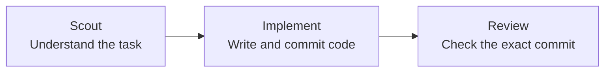

<p align="center">
  
</p>

<p align="center">
  <strong>English</strong> · <a href="README.zh-HK.md">繁體中文</a>
</p>

# Roc

Roc is a local command-line tool that guides Codex agents through an agile
software flow. Each task moves through three steps: **Scout → Implement →
Review**.

Scout studies the task. Implement writes the code. Review checks the exact
finished commit. Roc saves progress and token use in SQLite, so work can continue
after a restart.

If Review rejects the work, Roc closes the original task and creates a linked
draft task with the code and feedback. It then returns to the ready backlog
instead of repeating the same task forever.

Roc currently provides:

- model settings that never use `low` thinking effort;
- a separate Git branch for each task in a dedicated work folder;
- a read-only Review of the exact commit made by Implement;
- saved task progress and token use, with restart support;
- a token-use chart in the terminal;
- a list of skills that agents are allowed to use.

Roc works on one task at a time. It does not merge or push code, delete task
branches, run several tasks at once, or limit token use.

## Quick Start

Prerequisites:

- [Bun](https://bun.sh/) 1.3.0 or later
- Git
- [Codex CLI](https://github.com/openai/codex) for Codex mode
- The `grilling` skill for creating a backlog:

```bash
npx skills add mattpocock/skills --skill grilling --global --agent codex --agent claude-code --agent cursor
```

Run without a global install (Roc still requires Bun at runtime):

```bash
npx roc-it@latest help
```

You can also use `bunx` as Bun's package runner:

```bash
bunx roc-it@latest help
```

Or install the command globally:

```bash
npm install -g roc-it@latest
```

Onboard Roc in one project. This creates the local database and installs the
task-creation skill for Codex, Claude Code, and Cursor:

```bash
npx roc-it@latest onboard
npx roc-it@latest task list
npx roc-it@latest tokens
```

Use `npx roc-it@latest onboard --global` to install the skill under your user
account instead; global onboarding does not create a project database.

Create a backlog from a requirement with the installed skill. In Claude Code or
Cursor, use:

```text
/roc-create-tasks Add team invitations
```

In Codex, use:

```text
$roc-create-tasks Add team invitations
```

The skill uses `grilling` to agree on the requirement, previews the full task
list and dependencies, waits for your explicit approval, saves a JSON backlog
under `.agile/backlog`, and imports it into Roc.

Run that backlog with Codex:

```bash
npx roc-it@latest scheduler run --backend codex --repo /absolute/path/to/project
```

Codex mode creates or reuses a work folder at `<project>.agile-checkout`. Roc
never switches branches or makes commits in the source folder passed through
`--repo`.

## How it works

Roc picks one ready task and passes it through three agent roles.



If Review accepts the commit, the task is done. If Review rejects it, Roc
creates a follow-up ticket and moves on to the next ready task.

## Commands

All supported CLI commands:

Roc works on one small task at a time. When Review asks for changes, Roc sends
the feedback to an unapproved draft follow-up. That follow-up returns to the
ready backlog only after approval. Roc saves progress so the flow can continue
after a restart.

## Milestones

Roc is growing in small steps.

### Product

- [ ] **GitHub Issues backlog** — Bring approved GitHub Issues into Roc's ready
  backlog.
- [ ] **Visible task board** — See task progress in a terminal UI.
- [ ] **Parallel task runs** — Run independent tasks at the same time.
- [ ] **Remote approvals** — Review and approve waiting work remotely.
- [ ] **Notifications** — Get updates when work finishes, fails, or needs
  approval.

### Agent support

- [x] **OpenAI Codex** — Available today.
- [ ] **Pi agents** — Run Roc tasks with Pi.
- [ ] **Claude Code** — Run Roc tasks with Claude Code.
- [ ] **Cursor** — Run Roc tasks with Cursor agents.

## Commands

```bash
roc-it onboard [--global] [--db PATH]
roc-it task import FILE [--db PATH]
roc-it task list [--db PATH]
roc-it tokens [--db PATH] [--no-color]
roc-it scheduler run --backend codex --repo PATH [--base REF] [--db PATH]
roc-it help
```

## Contributing

See [CONTRIBUTING.md](CONTRIBUTING.md) for development and testing instructions.

## References

Roc learns from these projects without including their code:

| Project | What Roc learned |
| --- | --- |
| [OpenAI Codex](https://github.com/openai/codex) | Running agents, tracking token use, and keeping Review separate |
| [OpenAI Symphony](https://github.com/openai/symphony) | Picking tasks, using separate work folders, and showing run progress |
| [Pi](https://github.com/earendil-works/pi) | Saving session branches, shortening context, and running other tools |
| [Beads](https://github.com/gastownhall/beads) | Finding ready tasks, linking tasks, and creating follow-up work |
| [Gas Town](https://github.com/gastownhall/gastown) | Agent roles, stuck tasks, review steps, and terminal screen ideas |
| [OpenSpec](https://github.com/Fission-AI/OpenSpec) | Clear plans, designs, and task lists |

See [the project research](docs/research/agent-agile-orchestration-landscape.md)
for a full comparison and source list.

## License

Roc uses the [Apache License 2.0](LICENSE). You may use, change, and share it,
including for commercial work, as long as you follow the license terms.
