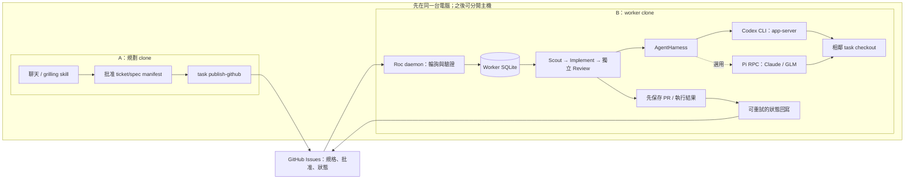
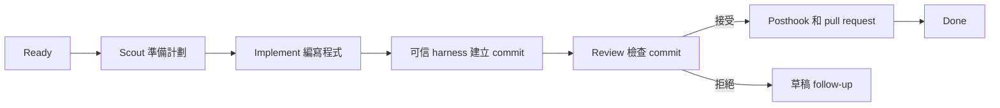

<p align="center">
  
</p>

<p align="center">
  <a href="README.md">English</a> · <strong>繁體中文</strong>
</p>

# Roc

Roc 會讓程式開發任務依次經過幾個固定步驟：

```text
Ready → Scout → Implement → Review → Pull request → Done
```

- Scout 讀取任務，了解程式碼並準備實作計劃。
- Implement 在獨立 Git branch 編寫程式，由 Roc 的可信 harness 建立 commit。
- Review 只檢查該 commit，不會修改程式碼。
- Roc 會把通過 Review 的 commit 發佈成 pull request。

Roc 會把每個任務和執行記錄儲存在 SQLite。停止程式後，之後仍可繼續。
如果 Review 不接受結果，Roc 會建立一個包含意見的草稿 follow-up 任務，
不會不停重試同一項工作。

Roc 每次只執行一個任務。它會 push 已接受的任務 branch，並建立或更新
pull request。它不會 merge pull request 或刪除 branch。

## 架構：先在同一台電腦執行

先建立兩個獨立 project clone。A 透過 `roc-create-tasks` 進行聊天、grilling 和批准，
再發佈獲批的 ticket/spec manifest。B 跑 daemon，負責執行。GitHub Issues 保存共用的
規格、批准和可見狀態；B 的 SQLite 保存執行次數、結果和待回寫紀錄。



只有 B 跑 daemon。同一個 worker 依次執行任務，在 `<project>.agile-checkout` 保留各任務的
branch。遠端發佈不會把任務匯入 A 的執行佇列。兩個 clone 各自持有
`.agile/runtime/agile.db`，巢狀 clone 也不會誤用外層專案的資料庫。

Daemon 直接輪詢 GitHub，所以這個架構毋須 GitHub Actions runner。執行用的 CLI、專案工具
和憑證放在 B。之後可按下方程序把 B 搬到另一台電腦，A 發佈後便可離線。
實體兩機運作仍待驗證。

目前先驗證 Codex。現有實驗性 Pi backend 沿用同一個 scheduler 和 RPC harness，
讓執行端選用 Claude、GLM 等 provider。每個 Pi daemon session 固定一組 provider/model，
不會按任務切換 provider。下方 Pi 部署範例是另一個 runtime 選項，使用 Codex 不需要先安裝 Pi。
ZCode 亦保留為實驗性 backend。

### 驗證狀態

截至 2026-09-06：

| 範圍 | 結果 |
| --- | --- |
| 直接執行 Codex CLI 0.144.4、`gpt-5.5`、`high` | 讀寫檔案、測試和獨立 commit Review 通過 |
| 明確設定啟動模型的 Codex app-server detached Review | 回傳符合 Roc Review schema 的 `accepted` JSON |
| 單機 Roc 配合真實 GitHub | 發佈、拉取、有界重試、worker 重用及失敗回寫已驗證；Review → PR → done 尚未通過 |
| Pi 配合真實 Claude/GLM；實體兩機運作 | 尚未驗證 |

Codex 測試揭露了模型傳遞問題：detached Review 使用全域預設模型，沒有沿用 anchor task
指定的模型。在 app-server 啟動時把 `model` 和 `review_model` 固定為 `gpt-5.5` 後，測試便通過。
Roc backend 仍須傳入選定的啟動設定，並令 profile routing、記錄的模型與實際執行一致。
CLI 測試成功不代表 Roc scheduler 的預設設定已能跑通。Native Review 的用量核算亦仍待驗證。

完整驗收條件見[流程圖](docs/design/remote-task-workflow.md)及
[任務交付規格](docs/specs/remote-task-workflow.md)。GitHub worker 新功能尚未發佈到 npm，
驗證時須使用下方這個 branch 的原始碼指令。

## 開始使用

你需要 [Bun](https://bun.sh/) 1.3 或以上版本、Git、
[Codex CLI](https://github.com/openai/codex)，以及已執行 `gh auth login` 的
[GitHub CLI](https://cli.github.com/)。

在 Git 專案內執行：

```bash
npx roc-it@latest onboard
```

Onboarding 會建立 Roc 的本機資料庫，並安裝兩個 skills：

- `roc-create-tasks` 把需求整理成經你批准的 backlog。
- `pr-review-to-closure` 在重複審查 pull request 時追蹤問題。

重複 PR 審查 skill 需要 Python 3.9 或以上版本。Roc 的 scheduler 和 task
指令只需要 Bun。

在 Codex 建立 backlog：

```text
$roc-create-tasks 加入團隊邀請功能
```

這個 skill 會先顯示建議的任務，得到你批准後才會匯入。它需要
`grilling` skill，你可以用以下指令安裝：

```bash
npx skills add mattpocock/skills --skill grilling --global --agent codex
```

查看任務、開始執行，然後打開看板：

```bash
npx roc-it@latest task list
npx roc-it@latest scheduler run --base-branch main
npx roc-it@latest task board
```

Roc 會在名為 `<project>.agile-checkout` 的相鄰資料夾編寫任務程式碼。
目前 checkout 會留在原有 branch。

## GitHub worker 設定

先在同一台電腦使用獨立的 A、B clone。兩者必須使用同一個 GitHub repository 和目標
branch。之後把 B 搬到另一台電腦時，仍沿用相同的發佈與輪詢流程。

在機器 A 以 publisher 身份登入 `gh`，然後發佈已批准的 manifest：

```bash
/absolute/path/to/bun /absolute/path/to/Roc/src/cli/main.ts task publish-github .agile/backlog/approved.json
```

Roc 會為每項任務建立或恢復同一個 `roc:task` Issue，記錄完整 task envelope
的精確批准，最後才加入 `roc:ready`。Remote publication 不會把任務匯入機器 A
的本機資料庫。

這個 workflow 尚未包含在目前 npm release。驗證這個 branch 時，下列每個
`roc-it` invocation 都應改用
`/absolute/path/to/bun /absolute/path/to/Roc/src/cli/main.ts`；不要把
`npx roc-it@latest` 的結果當成未發佈 workflow 的證據。

### Codex worker 驗證

B 需要 Bun、Git、GitHub CLI、Codex CLI、Roc、可 push 的 clone 和專案的 build/test tools。
在 B 登入 Codex 和 GitHub。修正上述模型傳遞問題後，使用以下入口重跑完整流程：

```bash
cd /absolute/path/to/worker-clone
ROC_GITHUB_PUBLISHERS=publisher-login /absolute/path/to/bun /absolute/path/to/Roc/src/cli/main.ts scheduler run --source github --backend codex --base-branch main
```

這是現有 scheduler 入口，目前還不會固定使用已測通的 `gpt-5.5` 設定。成功的 CLI 測試
另行指定了 app-server 啟動模型。每個 repository 只跑一個 daemon。

### 選用 Pi worker

使用 Pi runtime 時，B 需要 Bun、Git、GitHub CLI、Node.js 22.19 或以上、Pi、Roc、可 push
的 repository clone、目標專案的 build/test tools，以及 Pi provider credentials：

```bash
npm install -g @earendil-works/pi-coding-agent
gh auth login
cd /absolute/path/to/project
/absolute/path/to/bun /absolute/path/to/Roc/src/cli/main.ts onboard
```

啟動前先設定 Pi 的預設 provider 和 model。該 model 必須支援 `high` reasoning；
不支援時，Roc 會以 `PI_MODEL_UNSUPPORTED` 停止，不會靜默轉用其他 model。
在服務帳戶可讀、mode 為 `0600` 的 `/etc/roc/worker.env` 設定可信 publisher：

```bash
ROC_GITHUB_PUBLISHERS=publisher-login
ROC_PI_EXPERIMENTAL=1
```

每個專案只啟動一個 worker：

```bash
set -a
. /etc/roc/worker.env
set +a
/absolute/path/to/bun /absolute/path/to/Roc/src/cli/main.ts scheduler run --source github --backend pi --base-branch main
```

服務的 working directory 應固定在 project root，令 database 保持在穩定的
project-owned path `.agile/runtime/agile.db`。省略 `--source github` 會保留原有
local-queue scheduler 行為。

Worker 每 30 秒輪詢全部受管理 Issues，驗證完整計劃和可信批准，並在 SQLite
凍結獲批 envelope。網絡中斷會暫停新工作和狀態推進；正在執行的 agent 結果
仍會先存入本機，恢復連線後再同步。Status labels 和唯一一則 worker 擁有的
status comment 都只是本機資料庫的可重試投影。

任務建立 pull request 後會在本機成為 `done`，但 dependent task 要等 GitHub
確認該 PR 已 merge 到指定 target branch。Roc 會 fetch target、確認它包含實際
merge commit，並在 claim dependent task 前鎖定最新 target commit。PR 關閉但
未 merge、批准被更改，或 dependency 已 retired，都會令相關任務等待明確 replan。

Pi 沒有內置 filesystem sandbox。Working directory 只是起始目錄，並非安全
邊界；無人值守 worker 應放在 OS sandbox 或 container，只開放 repository、
相鄰 Roc checkout 和必要 credentials。

systemd 可使用以下單一服務，並把 Roc 和 Pi 安裝在固定絕對路徑：

```ini
[Unit]
Description=Roc GitHub worker
After=network-online.target

[Service]
Type=simple
User=roc
WorkingDirectory=/srv/project
EnvironmentFile=/etc/roc/worker.env
Environment=PATH=/usr/local/bin:/home/roc/.bun/bin:/usr/bin:/bin
ExecStart=/home/roc/.bun/bin/bun /opt/Roc/src/cli/main.ts scheduler run --source github --backend pi --base-branch main
Restart=on-failure

[Install]
WantedBy=multi-user.target
```

macOS launchd 可以把非秘密設定直接放入 plist；Pi 和 `gh` credentials 繼續使用
服務帳戶的本機 credential stores：

```xml
<?xml version="1.0" encoding="UTF-8"?>
<!DOCTYPE plist PUBLIC "-//Apple//DTD PLIST 1.0//EN"
  "http://www.apple.com/DTDs/PropertyList-1.0.dtd">
<plist version="1.0">
<dict>
  <key>Label</key>
  <string>dev.roc.github-worker</string>
  <key>WorkingDirectory</key>
  <string>/Users/roc/project</string>
  <key>ProgramArguments</key>
  <array>
    <string>/Users/roc/.bun/bin/bun</string>
    <string>/Users/roc/Roc/src/cli/main.ts</string>
    <string>scheduler</string><string>run</string>
    <string>--source</string><string>github</string>
    <string>--backend</string><string>pi</string>
    <string>--base-branch</string><string>main</string>
  </array>
  <key>EnvironmentVariables</key>
  <dict>
    <key>PATH</key>
    <string>/opt/homebrew/bin:/usr/local/bin:/Users/roc/.bun/bin:/usr/bin:/bin</string>
    <key>ROC_GITHUB_PUBLISHERS</key>
    <string>publisher-login</string>
    <key>ROC_PI_EXPERIMENTAL</key><string>1</string>
  </dict>
  <key>KeepAlive</key><true/>
  <key>RunAtLoad</key><true/>
</dict>
</plist>
```

轉移 worker 時，先停止舊服務並保持停用。確認沒有 Roc process 後，把 project
checkout、完整 `.agile/runtime/`（包括 SQLite sidecar files）和相鄰的
`<project>.agile-checkout` 複製到新機器。恢復 Pi 和 GitHub 服務帳戶 credentials，
檢查 target branch 和路徑後才啟動新服務。Roc 不提供 hot failover 或多 worker
協調。

Remote mode 保留一項明確上限：repository 有 1,000 個受管理 `roc:task` Issues
時，publication 和 polling 會清楚失敗，因為有界列表已不能證明 identity 唯一。
所有 managed Issues 和 identity labels 都必須保留；v1 到達上限後沒有受支援的
workaround。真實 provider 和兩機測試仍由 operator 作 release evidence；
repository test suite 使用本機 deterministic seams。

### 尚待完成的實測

修正 Codex 啟動模型傳遞後，用私有測試庫中的新批准任務重跑單機流程。保持 A 的執行
佇列為空，保留三角色結果、實作 SHA、PR 和原 Issue 的最終狀態。上述 CLI/RPC 測試不能
代替完整流程驗證。單機、Pi provider 和實體兩機的結果須分開記錄。

Release acceptance 要分別透過 Pi 執行兩項完整三角色任務：先把 Pi default 設為
支援 `high` 的 Claude model，再用支援 `high` 的 GLM model。每次保留 managed
Issue URL、證明 Scout、Implement 和 Review 的 structured scheduler log 或
`scheduler inspect`、implementation commit SHA、pull-request URL，以及最後由
worker 擁有的 status comment。確認記錄中的 model 正是 Pi default，而且 Roc
沒有切換 provider。

之後執行 machine-boundary check：由 A 發佈新批准計劃，停止 A 上的 Roc 並保持
A offline；B 要獨自 poll、執行、發佈 PR 和寫入 status。保留 A publication
output、B log 和 database snapshot、Issue history、commit 和 PR。測試 dependent
task 時，merge prerequisite，並保留 dependent claim 前包含實際 merge result
的 fetched target SHA。這些 live checks 不屬於本次變更報告的本機證據。

## 任務看板

看板是唯讀 terminal UI，目前使用英文介面。寬版保留四個任務欄和右側預覽；
窄版會上下排列，並以全畫面顯示詳情。實際畫面如下：

```text
Cycle 2026-W35 · 4 tasks · 8420 / 12000 tok

Ready · 1                   │ In progress · 1             │ Attention · 1               │ Done · 1
─────────────────────────── │ ─────────────────────────── │ ─────────────────────────── │ ───────────────────────────
    email  Add email login  │ ▌ ● api  Build auth API     │     tests  Fix auth tests   │   d to expand
    ready                   │     implement · implementing│     needs_input             │
                            │                             │     blocked by api          │

↑↓ move · Space preview · Enter details · d Done · ? help · q quit
```

選取色條、語意狀態色和精簡的 token 摘要讓你不用以完整卡片邊框也能看清下一步。
詳情會按狀態、執行資料、相依關係和任務摘要分類。按 `Space` 快速預覽，按
`Enter` 查看完整資料。

快捷鍵包括：`↑`/`↓` 或 `J`/`K` 移動、`Space` 預覽、`Enter` 詳情、`D` 展開
Done、`R` 更新、`?` 說明、`Esc` 返回，以及 `Q` 或 `Ctrl-C` 離開。`task board`
和較短的 `tui` 指令會打開同一個唯讀看板；兩者都不會啟動 scheduler 或改動
任務。執行 `npx roc-it@latest task board --all` 可以包括舊 cycle 的任務。

要保留歷史但停用過時的 draft、needs_input、needs_replan 或 ready 任務，可執行：

```bash
npx roc-it@latest task retire TASK_ID --reason "已過時的方案" [--replacement TASK_ID]
```

沒有 replacement 時 Roc 會顯示 Archived；有 replacement 時則顯示 Superseded。
一般 task list 和 board 會隱藏 retired 任務；使用 `task list --history` 或
`task board --history` 可查看保留的原因、replacement 和退休時間。

## 任務怎樣執行



每個任務都有自己的 branch，全部放在專用 checkout。Review 只會收到
可信 harness 建立的實作 commit，而且不能修改 working tree。

Review 接受結果後，Roc 會執行已信任的 posthook，並確認 Implement commit
是乾淨的。之後它會 push `agile/<task-id>`，再建立或更新一個 pull request。
發佈失敗會令任務進入 `needs_replan`，本機 commit 則會保留作恢復之用。

在 GitHub source mode，`done` 表示執行完成且 PR 已發佈，並不代表已 merge。
依賴該程式改動的後續任務，須等前置 PR merge 到目標 branch 後才開始。

`--base-branch` 指定 pull request 的 GitHub 目標 branch。如果任務 branch
需要從某個本機 commit 開始，另行使用 `--base`。

Roc 會記錄任務狀態、執行次數、事件、model 選擇和 token 用量。Token target
只用作規劃估算。Agent 用量到達 target 時，Roc 不會強制停止。

## 實驗性 ZCode backend

Roc 預設使用 Codex。它也可以使用 Z.ai 桌面應用程式的 headless ZCode server：

```bash
cd /absolute/path/to/project
ROC_ZCODE_EXPERIMENTAL=1 npx roc-it@latest scheduler run --base-branch main --backend zcode
```

ZCode 需要同一部電腦上已登入的 Z.ai 桌面應用程式。Roc 會從
`~/.zcode/v2/config.json` 讀取已啟用的 provider，再透過 `ZCODE_BIN` 啟動
應用程式附帶的 CLI。該 CLI 沒有公開文件，日後版本可能會改變。

ZCode 沒有協定層級的檔案系統 sandbox。無人看管的 session 可以寫入 task
checkout 以外的位置，而且停用 command sandbox 的要求會自動獲准。只應在
僅開放 task checkout 的 OS sandbox 或 container 內使用這個 backend。
設定 `ROC_ZCODE_EXPERIMENTAL=1` 表示你接受這項風險。

## 其他加入任務的方法

匯入 Roc backlog JSON 檔案：

```bash
npx roc-it@latest task import .agile/backlog/my-backlog.json
```

或者匯入帶有 `roc:ready` label 的 open GitHub Issues：

```bash
npx roc-it@latest task import-github
```

GitHub 匯入是單向操作。Roc 匯入 Issue ID 後會跳過同一個 Issue，
所以日後修改 Issue 不會更新已儲存的任務。

## 重複審查 pull request

再次審查 pull request 時，可以要求 agent 使用已安裝的
`pr-review-to-closure` skill。它會保留固定的 finding ID、把新 head 與上次
審查結果比較，並在必要檢查通過後提供 merge 判斷。除非你明確要求，這個
skill 不會留言、批准、commit、push 或 merge。

## 常用指令

```text
npx roc-it@latest onboard                 在目前專案設定 Roc
npx roc-it@latest cycle current           顯示目前 Agile cycle
npx roc-it@latest task list [--history]   列出目前任務或保留歷史
npx roc-it@latest task retire TASK_ID --reason TEXT [--replacement TASK_ID]
npx roc-it@latest task board [--all] [--history] 打開唯讀看板
npx roc-it@latest tui                     打開唯讀看板
npx roc-it@latest scheduler run --base-branch BRANCH [--base REF] [--backend <name>]
npx roc-it@latest scheduler inspect       查看 scheduler 狀態
npx roc-it@latest tokens [--no-color]     顯示 token 用量
npx roc-it@latest help                    顯示所有指令
```

如果想使用較短的指令，可以全域安裝 `roc-it`：

```bash
npm install -g roc-it@latest
roc-it help
```

## 目前限制

Roc 現時支援 Codex，以及實驗性 ZCode 和 Pi backend。每個專案同時只執行
一項任務和一個 GitHub worker。Remote approval 使用可信 GitHub comments；
Roc 不會 merge pull requests 或發送通知。Claude Code 和 Cursor backend
仍在計劃中。

## 詳細資料

- [系統架構說明](docs/architecture.md)
- [GitHub worker 流程與驗收圖](docs/design/remote-task-workflow.md)
- [任務交付規格](docs/specs/remote-task-workflow.md)
- [較早版本的互動式系統架構圖](output/archify/roc-system-architecture.html)
- [參與開發](CONTRIBUTING.md)
- [研究和專案比較](docs/research/agent-agile-orchestration-landscape.md)

## 授權條款

Roc 使用 [Apache License 2.0](LICENSE)。
