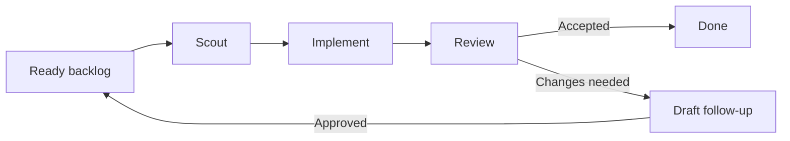

<p align="center">
  
</p>

<p align="center">
  <a href="README.md">English</a> · <strong>繁體中文</strong>
</p>

# Roc

Roc 是一個本機命令列工具，帶領 Codex agents 走完整的敏捷軟件開發流程。
每個任務都會經過三個步驟：**Scout → Implement → Review**。

Scout 先研究任務，Implement 負責編寫程式，Review 則檢查完成後的指定
commit。Roc 會把進度和 token 用量儲存在 SQLite，因此重新啟動後也能繼續
工作。

如果 Review 拒絕工作結果，Roc 會關閉原本的任務，並建立一個包含程式碼和
意見的草稿 follow-up 任務。它會回到 ready backlog，不會無限重複同一個
任務。

Roc 目前提供：

- 永遠不使用 `low` thinking effort 的模型設定；
- 每個任務都有獨立 Git branch 和工作資料夾；
- Review 只讀取 Implement 完成的指定 commit；
- 儲存任務進度和 token 用量，並支援重新啟動；
- 在終端顯示 token 用量圖表；
- 限制 agents 可以使用的 skills 清單。

Roc 目前一次只處理一個任務。它不會合併或 push 程式碼、刪除任務 branch、
同時執行多個任務，或限制 token 用量。

## 快速開始

使用前需要：

- [Bun](https://bun.sh/) 1.3.0 或以上版本
- Git
- 使用 Codex mode 時需要 [Codex CLI](https://github.com/openai/codex)
- 建立 backlog 時需要 `grilling` skill：

```bash
npx skills add mattpocock/skills --skill grilling --global --agent codex --agent claude-code --agent cursor
```

不用全域安裝也可以執行（Roc 執行時仍然需要 Bun）：

```bash
npx roc-it@latest help
```

你也可以使用 Bun 的 package runner `bunx`：

```bash
bunx roc-it@latest help
```

或者全域安裝指令：

```bash
npm install -g roc-it@latest
```

在單一專案中啟用 Roc。這會建立本機資料庫，並為 Codex、Claude Code 和
Cursor 安裝建立任務的 skill：

```bash
npx roc-it@latest onboard
npx roc-it@latest task list
npx roc-it@latest tokens
```

使用 `npx roc-it@latest onboard --global` 可改為在使用者帳戶下安裝 skill；
全域啟用不會建立專案資料庫。

### 敏捷週期

啟用時可以選擇每日、每週，或自訂日數。Roc 會把這個選擇儲存在
`~/.config/roc/settings.json`，並套用到所有專案。

```json
{ "cycle": { "type": "weekly" } }
```

你可以隨時查看目前的敏捷週期：

```bash
npx roc-it@latest cycle current
```

建立任務的 skill 會把這個值加入 backlog manifest。例如：

```json
{ "cycleId": "2026-08-28-P14D" }
```

使用已安裝的 skill，從需求建立 backlog。在 Claude Code 或 Cursor 中使用：

```text
/roc-create-tasks Add team invitations
```

在 Codex 中使用：

```text
$roc-create-tasks Add team invitations
```

這個 skill 會使用 `grilling` 釐清需求、預覽完整任務清單和相依關係、等待你的
明確批准，然後把 JSON backlog 儲存在 `.agile/backlog` 並匯入 Roc。

使用 Codex 執行 backlog：

```bash
npx roc-it@latest scheduler run --backend codex --repo /absolute/path/to/project
```

Codex mode 會在 `<project>.agile-checkout` 建立或重用工作資料夾。Roc 不會在
`--repo` 指定的來源資料夾切換 branch 或建立 commit。

## 運作方式

Roc 使用一個簡單的敏捷循環，讓每個任務依次交給三個專門的 agents：



- **Scout：**了解任務、檢查程式碼，並準備實作計劃。
- **Implement：**在獨立工作資料夾編寫程式。Roc 的 trusted Harness 會驗證
  結果並儲存為 commit。
- **Review：**獨立檢查該 commit，接受結果，或建立一個包含清楚意見、尚未
  核准的草稿 follow-up 任務。

Roc 每次只處理一個小任務。當 Review 要求修改時，Roc 會把意見送到一個尚未
核准的草稿 follow-up。只有獲得批准後，它才會回到 ready backlog。Roc 會儲存
進度，讓流程在重新啟動後繼續。

## 里程碑

Roc 正在逐步成長。

### 產品

- [ ] **GitHub Issues backlog** — 把已核准的 GitHub Issues 加入 Roc 的
  ready backlog。
- [ ] **可見的任務看板** — 在 terminal UI 查看任務進度。
- [ ] **平行執行任務** — 同時執行互不依賴的任務。
- [ ] **遠端核准** — 遠端檢查並核准等待中的工作。
- [ ] **通知** — 在工作完成、失敗或需要核准時收到更新。

### Agent 支援

- [x] **OpenAI Codex** — 現已支援。
- [ ] **Pi agents** — 使用 Pi 執行 Roc 任務。
- [ ] **Claude Code** — 使用 Claude Code 執行 Roc 任務。
- [ ] **Cursor** — 使用 Cursor agents 執行 Roc 任務。

## 指令

```bash
npx roc-it@latest onboard [--global] [--db PATH]
npx roc-it@latest cycle current
npx roc-it@latest task import FILE [--db PATH]
npx roc-it@latest task list [--db PATH]
npx roc-it@latest tokens [--db PATH] [--no-color]
npx roc-it@latest scheduler run --backend codex --repo PATH [--base REF] [--db PATH]
npx roc-it@latest help
```

## 參與貢獻

開發與測試說明請參閱 [CONTRIBUTING.md](CONTRIBUTING.md)。

## 參考項目

Roc 參考了以下專案的做法，但不包含它們的程式碼：

| 專案 | Roc 參考的部分 |
| --- | --- |
| [OpenAI Codex](https://github.com/openai/codex) | 執行 agents、追蹤 token 用量，以及保持獨立 Review |
| [OpenAI Symphony](https://github.com/openai/symphony) | 選擇任務、使用獨立工作資料夾，以及顯示執行進度 |
| [Pi](https://github.com/earendil-works/pi) | 儲存 session branches、縮短 context，以及執行其他工具 |
| [Beads](https://github.com/gastownhall/beads) | 尋找 ready 任務、連結任務，以及建立 follow-up 工作 |
| [Gas Town](https://github.com/gastownhall/gastown) | Agent 角色、卡住的任務、review 步驟，以及 terminal 畫面構思 |
| [OpenSpec](https://github.com/Fission-AI/OpenSpec) | 清楚的計劃、設計和任務清單 |

完整比較和資料來源請參閱
[專案研究](docs/research/agent-agile-orchestration-landscape.md)。

## 授權條款

Roc 使用 [Apache License 2.0](LICENSE)。只要遵守授權條款，你可以使用、修改及
分享 Roc，也可以用於商業用途。
