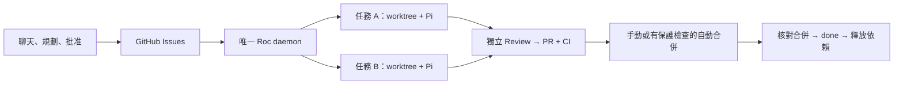

<p align="center">
  
</p>

[English](README.md) · [繁體中文](README.zh-HK.md)

# Roc

把批准的 GitHub Issues 變成經獨立 Review 的 pull requests。
Roc daemon 最多平行執行兩項任務，每項使用獨立 worktree；你可手動合併，
或啟用通過 CI 與 branch protection 檢查後的自動合併。

## 怎樣運作



[互動架構圖（英文）](output/archify/roc-current/roc-architecture.html) · [每項任務的流程](README.details.zh-HK.md#每項任務的流程)

互動圖請下載 HTML 後在瀏覽器開啟；GitHub 頁面顯示原始碼。

- **GitHub 保存任務狀態。** 規格、批准、checkpoint 與用量留在 Issues，PR 保存提交與合併證據。本機沒有 SQLite 任務佇列。
- **Roc 負責協調，Pi 負責執行。** 預設流程是 Scout → Implement → 獨立 Review，每個角色使用不同 Pi session。明確批准的低風險任務可用 `skipScout: true` 省略 Scout。
- **並行有範圍限制。** Scope 不重疊的任務才可並行；不明、重疊或帶 hooks 的任務單獨執行。每個 repository 只跑一個 daemon。
- **建立 PR 不等於完成。** PR 開啟時是 `awaiting_merge`，核對合併後才是 `done`。基底前進時最多兩次乾淨 rebase，每次都要新的 Review 與 CI。

新 Codex 設定使用 GPT-6 Astra；已有的模型設定會保留。新 Scout／Review 使用 `high`，
Implement 使用 `medium`。Roc 使用 Pi 的工具與 agent loop，
不會啟動 Codex CLI 或 Claude Code。

Pi 預設啟用自動 context 壓縮，接近 session 的 context 上限時會摘要較舊內容。
Roc 沿用 Pi 的設定。詳見[context 壓縮](README.details.zh-HK.md#context-壓縮)及
[Pi 官方文件](https://github.com/earendil-works/pi/blob/main/packages/coding-agent/docs/compaction.md)。

**目前狀態：** M1–M4 已按修訂範圍完成，真實 GitHub／GPT-6 sandbox 流程已驗收。
實體雙機驗收延後至 [#56](https://github.com/devos-ing/Roc/issues/56)，Superset 不在本階段。
[驗收與效能數據](README.details.zh-HK.md#驗證狀態) 會區分成功執行、失敗恢復與未驗證項目。
以下指令使用這份 development checkout，不假設 npm 版本包含相同功能。

## 開始使用

需要 Bun 1.3+、Node.js 22.19+、Git、GitHub CLI，以及專案的 build/test 工具。
任務直接存於 GitHub Issues，每個 repository 只啟動一個執行 daemon。

### 1. 設定 Roc

先在這份 Roc 原始碼目錄執行 `bun install`，Pi 會一併安裝。
再到你想讓 Roc 修改的專案執行以下指令，把 entrypoint 替換為這份原始碼的絕對路徑：

```bash
export ROC_CLI_ENTRY=/absolute/path/to/Roc/src/cli/main.ts
cd /path/to/your-project
gh auth login
bun "$ROC_CLI_ENTRY" onboard
```

Onboarding 會安裝 Roc skills，讓你選擇可信 skills 與 Agile 週期，並確認一次
工具執行權限。工具擁有目前帳戶的權限。
需要登入時，Roc 會開啟瀏覽器讓你授權 ChatGPT，發送一個小型 Codex 測試，
收到正確回應後才保存預設模型。已有的 Pi 認證會直接重用，毋須另外安裝或登入 Pi。
連線測試會使用少量模型額度。

用 ↑/↓ 移動、空白鍵勾選 skills、Enter 確認。週期可選 Daily、Weekly（預設），
或 Custom 後輸入天數。終端配色會自動啟用。

### 2. 透過聊天建立任務

在你平常使用的 coding assistant 開啟專案，輸入：

```text
使用 roc-create-tasks 加入團隊邀請功能。用 ROC_CLI_ENTRY 指定的 Roc，把批准後的任務發佈到這個 repository 的 GitHub Issues。
```

Skill 會提問釐清需求，提出任務與驗收條件，等你批准完整計劃後才發佈到 GitHub。
若 assistant 無法讀取 terminal 的環境變數，直接提供 Roc entrypoint 的絕對路徑。
規劃 assistant 須有 `grilling` 及 `unslop`；缺少時依照[詳細指南](README.details.zh-HK.md#規劃-skills)安裝。

### 3. 啟動 daemon

在同一專案與 terminal 執行；目標 branch 不是 `main` 時請替換名稱：

```bash
bun "$ROC_CLI_ENTRY" task list
bun "$ROC_CLI_ENTRY" scheduler run --base-branch main
```

保持 terminal 開啟。按 `Ctrl-C` 停止。重啟會核對已保存的 checkpoint；
若出現 `needs_replan` 或保留鎖，先依[恢復指引](README.details.zh-HK.md#進度與失敗恢復)處理。
每項任務位於 `<project>.agile-worktrees/issue-<number>`。
Pi 沒有內建 sandbox，無人看管時應使用 OS/container 隔離。

設定好目標 branch 的 required CI、strict up-to-date checks 及管理員保護後，可加入
`--auto-merge` 啟用自動合併；詳見[合併設定](README.details.zh-HK.md#可選的自動合併-pr)。
`--concurrency 1` 改為逐項執行，`--once` 只處理一項任務。

### 4. 查看進度

另開 terminal，設定同一個 `ROC_CLI_ENTRY`，進入同一專案：

```bash
bun "$ROC_CLI_ENTRY" task board
```

看板是唯讀的。按 `Enter` 查看詳情，按 `Q` 離開。
欄位以顏色區分進行中、待處理及已完成，排版會配合終端寬度；重新導向檔案時輸出純文字。
詳情會顯示總耗時、attempt 時間、等待合併時間、最近動作與用量是否完整。
逐項即時動作請看 daemon terminal。GitHub 摘要在階段切換時保存，
長時間工具活動最多每 30 秒補一次。
也可使用 `task list`、`scheduler inspect`、`tokens` 或 `help`。

## 進一步設定

[詳細指南](README.details.zh-HK.md) 包含架構圖、provider 設定、GitHub Issues
共享任務、daemon 部署與恢復方式。可在 MacBook 發佈任務，由 Mac mini 執行唯一的 daemon。
實體雙機流程尚未驗收，已延後處理。

開發與發版：[CONTRIBUTING.md](CONTRIBUTING.md)。
授權：[Apache 2.0](LICENSE)。
