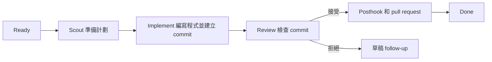

<p align="center">
  
</p>

<p align="center">
  <a href="README.md">English</a> · <strong>繁體中文</strong>
</p>

# Roc

Roc 會讓程式開發任務依次經過幾個固定步驟：

```text
Ready → Scout → Implement → Review → Pull request → Done
```

- Scout 讀取任務，了解程式碼並準備實作計劃。
- Implement 在獨立 Git branch 編寫程式，完成後建立 commit。
- Review 只檢查該 commit，不會修改程式碼。
- Roc 會把通過 Review 的 commit 發佈成 pull request。

Roc 會把每個任務和執行記錄儲存在 SQLite。停止程式後，之後仍可繼續。
如果 Review 不接受結果，Roc 會建立一個包含意見的草稿 follow-up 任務，
不會不停重試同一項工作。

Roc 每次只執行一個任務。它會 push 已接受的任務 branch，並建立或更新
pull request。它不會 merge pull request 或刪除 branch。

## 開始使用

你需要 [Bun](https://bun.sh/) 1.3 或以上版本、Git、
[Codex CLI](https://github.com/openai/codex)，以及已執行 `gh auth login` 的
[GitHub CLI](https://cli.github.com/)。

在 Git 專案內執行：

```bash
npx roc-it@latest onboard
```

Onboarding 會建立 Roc 的本機資料庫，並安裝兩個 skills：

- `roc-create-tasks` 把需求整理成經你批准的 backlog。
- `pr-review-to-closure` 在重複審查 pull request 時追蹤問題。

重複 PR 審查 skill 需要 Python 3.9 或以上版本。Roc 的 scheduler 和 task
指令只需要 Bun。

在 Codex 建立 backlog：

```text
$roc-create-tasks 加入團隊邀請功能
```

這個 skill 會先顯示建議的任務，得到你批准後才會匯入。安裝以下四個
skills，就可以使用完整流程：

```bash
# 把未整理的需求拆成清楚任務
npx skills add mattpocock/skills --skill grilling --global --agent codex

# 讓 agent 回覆容易閱讀和執行
codex plugin marketplace add ayghri/i-have-adhd --ref main
codex plugin add i-have-adhd@i-have-adhd

# 刪走文字中的 AI 語氣和廢話
npx skills add backnotprop/pstack --skill unslop --global --agent codex

# 優先選擇最簡單而可行的方案
codex plugin marketplace add DietrichGebert/ponytail
codex plugin add ponytail@ponytail
```

建立 backlog 必須使用 `grilling`。另外三個 skills 會引導 agent 怎樣寫作和
實作任務。安裝後，請再次執行 onboarding，並選擇 Roc agents 可以使用的
skills：

```bash
npx roc-it@latest onboard
```

查看任務、開始執行，然後打開看板：

```bash
npx roc-it@latest task list
npx roc-it@latest scheduler run --base-branch main
npx roc-it@latest task board
```

Roc 會在名為 `<project>.agile-checkout` 的相鄰資料夾編寫任務程式碼。
目前 checkout 會留在原有 branch。

## 任務看板

看板是 terminal UI，目前使用英文介面。實際畫面如下：

```text
Cycle 2026-W35 · 4 tasks · 8420/12000 tokens

Ready (1)                   │ In progress (1)             │ Attention (1)               │ Done (1)
─────────────────────────── │ ─────────────────────────── │ ─────────────────────────── │ ───────────────────────────
  email  Add email login    │ › ● api  Build auth API     │   tests  Fix auth tests     │   collapsed
  Status: ready             │   Status: implementing      │   Status: needs_input       │
  Phase: ready              │   Phase: implement          │   Phase: needs_input        │
                            │                             │   Blocked: api              │

↑↓ select · Space peek · Enter details · d Done · ? help · q quit
```

選取任務後，你可以查看問題、目前階段、使用中的 model、重試次數、token
用量、相依任務和驗收條件。按 `Space` 快速預覽，按 `Enter` 查看完整資料，
按 `r` 更新畫面。

看板只供查看。打開看板不會啟動 scheduler，也不會改動任務。
執行 `npx roc-it@latest task board --all` 可以包括舊 cycle 的任務。
較短的 `npx roc-it@latest tui` 指令會打開同一個看板。

## 任務怎樣執行



每個任務都有自己的 branch，全部放在專用 checkout。Review 只會收到
Implement 建立的 commit，而且不能修改 working tree。

Review 接受結果後，Roc 會執行已信任的 posthook，並確認 Implement commit
是乾淨的。之後它會 push `agile/<task-id>`，再建立或更新一個 pull request。
發佈失敗會令任務進入 `needs_replan`，本機 commit 則會保留作恢復之用。

`--base-branch` 指定 pull request 的 GitHub 目標 branch。如果任務 branch
需要從某個本機 commit 開始，另行使用 `--base`。

Roc 會記錄任務狀態、執行次數、事件、model 選擇和 token 用量。Token target
只用作規劃估算。Agent 用量到達 target 時，Roc 不會強制停止。

## 其他加入任務的方法

匯入 Roc backlog JSON 檔案：

```bash
npx roc-it@latest task import .agile/backlog/my-backlog.json
```

或者匯入帶有 `roc:ready` label 的 open GitHub Issues：

```bash
npx roc-it@latest task import-github
```

GitHub 匯入是單向操作。Roc 匯入 Issue ID 後會跳過同一個 Issue，
所以日後修改 Issue 不會更新已儲存的任務。

## 重複審查 pull request

再次審查 pull request 時，可以要求 agent 使用已安裝的
`pr-review-to-closure` skill。它會保留固定的 finding ID、把新 head 與上次
審查結果比較，並在必要檢查通過後提供 merge 判斷。除非你明確要求，這個
skill 不會留言、批准、commit、push 或 merge。

## 常用指令

```text
npx roc-it@latest onboard                 在目前專案設定 Roc
npx roc-it@latest cycle current           顯示目前 Agile cycle
npx roc-it@latest task list               列出已儲存的任務
npx roc-it@latest task board [--all]      打開唯讀看板
npx roc-it@latest tui                     打開唯讀看板
npx roc-it@latest scheduler run --base-branch BRANCH [--base REF]
npx roc-it@latest scheduler inspect       查看 scheduler 狀態
npx roc-it@latest tokens [--no-color]     顯示 token 用量
npx roc-it@latest help                    顯示所有指令
```

如果想使用較短的指令，可以全域安裝 `roc-it`：

```bash
npm install -g roc-it@latest
roc-it help
```

## 目前限制

這份說明只介紹 Codex backend。Roc 仍未支援平行執行任務、遠端批准或通知。
Pi、Claude Code 和 Cursor backend 仍在計劃中。

## 詳細資料

- [系統架構說明](docs/architecture.md)
- [互動式系統架構圖](output/archify/roc-system-architecture.html)
- [參與開發](CONTRIBUTING.md)
- [研究和專案比較](docs/research/agent-agile-orchestration-landscape.md)

## 授權條款

Roc 使用 [Apache License 2.0](LICENSE)。
