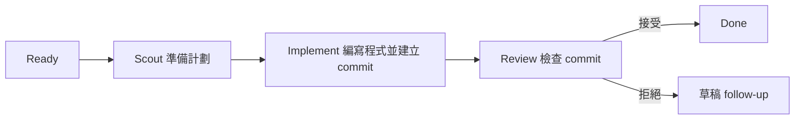

<p align="center">
  
</p>

<p align="center">
  <a href="README.md">English</a> · <strong>繁體中文</strong>
</p>

# Roc

Roc 會讓 Codex 的程式開發任務依次經過幾個固定步驟：

```text
Ready 任務 → Scout → Implement → Review → Done
```

- Scout 讀取任務，了解程式碼並準備實作計劃。
- Implement 在獨立 Git branch 編寫程式，完成後建立 commit。
- Review 只檢查該 commit，不會修改程式碼。

Roc 會把每個任務和執行記錄儲存在 SQLite。停止程式後，之後仍可繼續。
如果 Review 不接受結果，Roc 會建立一個包含意見的草稿 follow-up 任務，
不會不停重試同一項工作。

Roc 每次只執行一個任務。它不會 merge、push 或刪除 branch。

## 開始使用

你需要 [Bun](https://bun.sh/) 1.3 或以上版本、Git，以及
[Codex CLI](https://github.com/openai/codex)。

在 Git 專案內執行：

```bash
npx roc-it@latest onboard
```

Onboarding 會建立 Roc 的本機資料庫，並安裝 `roc-create-tasks` skill。
你亦會選擇 Agile cycle 的日數，以及 Codex 可以使用哪些 agent skills。

在 Codex 建立 backlog：

```text
$roc-create-tasks 加入團隊邀請功能
```

這個 skill 會先顯示建議的任務，得到你批准後才會匯入。它需要
`grilling` skill，你可以用以下指令安裝：

```bash
npx skills add mattpocock/skills --skill grilling --global --agent codex
```

查看任務、開始執行，然後打開看板：

```bash
npx roc-it@latest task list
npx roc-it@latest scheduler run
npx roc-it@latest task board
```

Roc 會在名為 `<project>.agile-checkout` 的相鄰資料夾編寫任務程式碼。
目前 checkout 會留在原有 branch。

## 任務看板

看板是 terminal UI，目前使用英文介面。實際畫面如下：

```text
Cycle 2026-W35 · 4 tasks · 8420/12000 tokens

Ready (1)                   │ In progress (1)             │ Attention (1)               │ Done (1)
─────────────────────────── │ ─────────────────────────── │ ─────────────────────────── │ ───────────────────────────
  email  Add email login    │ › ● api  Build auth API     │   tests  Fix auth tests     │   collapsed
  Status: ready             │   Status: implementing      │   Status: needs_input       │
  Phase: ready              │   Phase: implement          │   Phase: needs_input        │
                            │                             │   Blocked: api              │

↑↓ select · Space peek · Enter details · d Done · ? help · q quit
```

選取任務後，你可以查看問題、目前階段、使用中的 model、重試次數、token
用量、相依任務和驗收條件。按 `Space` 快速預覽，按 `Enter` 查看完整資料，
按 `r` 更新畫面。

看板只供查看。打開看板不會啟動 scheduler，也不會改動任務。
執行 `npx roc-it@latest task board --all` 可以包括舊 cycle 的任務。

## 任務怎樣執行



每個任務都有自己的 branch，全部放在專用 checkout。Review 只會收到
Implement 建立的 commit，而且不能修改 working tree。

Roc 會記錄任務狀態、執行次數、事件、model 選擇和 token 用量。Token target
只用作規劃估算。Agent 用量到達 target 時，Roc 不會強制停止。

## 其他加入任務的方法

你可以匯入 Roc backlog JSON 檔案：

```bash
npx roc-it@latest task import .agile/backlog/my-backlog.json
```

你亦可以匯入帶有 `roc:ready` label 的 open GitHub Issues：

```bash
gh auth login
npx roc-it@latest task import-github
```

GitHub 匯入是單向操作。Roc 匯入 Issue ID 後會跳過同一個 Issue，
所以日後修改 Issue 不會更新已儲存的任務。

## 常用指令

```text
npx roc-it@latest onboard                 在目前專案設定 Roc
npx roc-it@latest cycle current           顯示目前 Agile cycle
npx roc-it@latest task list               列出已儲存的任務
npx roc-it@latest task board [--all]      打開唯讀看板
npx roc-it@latest scheduler run           使用 Codex 執行 ready 任務
npx roc-it@latest scheduler inspect       查看 scheduler 狀態
npx roc-it@latest tokens [--no-color]     顯示 token 用量
npx roc-it@latest help                    顯示所有指令
```

如果想使用較短的指令，可以全域安裝 `roc-it`：

```bash
npm install -g roc-it@latest
roc-it help
```

## 目前限制

Roc 現時支援 Codex。它仍未支援平行執行任務、遠端批准或通知。
Pi、Claude Code 和 Cursor 支援仍在計劃中。

## 詳細資料

- [系統架構說明](docs/architecture.md)
- [互動式系統架構圖](output/archify/roc-system-architecture.html)
- [參與開發](CONTRIBUTING.md)
- [研究和專案比較](docs/research/agent-agile-orchestration-landscape.md)

## 授權條款

Roc 使用 [Apache License 2.0](LICENSE)。
