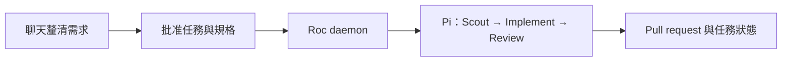

<p align="center">
  
</p>

[English](README.md) · [繁體中文](README.zh-HK.md)

# Roc

透過聊天把需求拆成程式開發任務，由本機 daemon 執行、建立 pull request，
並更新任務狀態。你負責審查及合併結果。

## 怎樣運作



**Pi 是唯一執行核心。** Onboarding 會連接你的 ChatGPT 帳戶，選用 Codex 模型。
Claude、GLM 屬於進階 provider 設定。Roc 使用 Pi 的工具與 agent loop，
不會啟動 Codex CLI 或 Claude Code。
一個 daemon 每次執行一項任務，每項任務保留自己的 branch。
`done` 表示 PR 已發佈，仍須由你合併。

Pi 預設啟用自動 context 壓縮，接近 session 的 context 上限時會摘要較舊內容。
Roc 沿用 Pi 的設定。詳見[context 壓縮](README.details.zh-HK.md#context-壓縮)及
[Pi 官方文件](https://github.com/earendil-works/pi/blob/main/packages/coding-agent/docs/compaction.md)。

**開發版本：**請依照下方指令使用這份原始碼。Pi 統一架構尚未發佈到 npm。
自動測試不代表真實模型流程已通過；詳見[驗證狀態](README.details.zh-HK.md#驗證狀態)。

## 開始使用

需要 Bun 1.3+、Node.js 22.19+、Git、GitHub CLI，以及專案的 build/test 工具。
先在同一台機器使用本機任務佇列。

### 1. 設定 Roc

先在這份 Roc 原始碼目錄執行 `bun install`，Pi 會一併安裝。
再到你想讓 Roc 修改的專案執行以下指令，把 entrypoint 替換為這份原始碼的絕對路徑：

```bash
export ROC_CLI_ENTRY=/absolute/path/to/Roc/src/cli/main.ts
cd /path/to/your-project
gh auth login
bun "$ROC_CLI_ENTRY" onboard
```

Onboarding 會安裝 Roc skills，讓你選擇可信 skills 與 Agile 週期，並確認一次
工具執行權限。工具擁有目前帳戶的權限。
需要登入時，Roc 會開啟瀏覽器讓你授權 ChatGPT，發送一個小型 Codex 測試，
收到正確回應後才保存預設模型。已有的 Pi 認證會直接重用，毋須另外安裝或登入 Pi。
連線測試會使用少量模型額度。

用 ↑/↓ 移動、空白鍵勾選 skills、Enter 確認。週期可選 Daily、Weekly（預設），
或 Custom 後輸入天數。終端配色會自動啟用。

### 2. 透過聊天建立任務

在你平常使用的 coding assistant 開啟專案，輸入：

```text
使用 roc-create-tasks 加入團隊邀請功能。使用本機佇列，以及 ROC_CLI_ENTRY 指定的 Roc。
```

Skill 會提問釐清需求，提出任務與驗收條件，等你批准完整計劃後才儲存。
若 assistant 無法讀取 terminal 的環境變數，直接提供 Roc entrypoint 的絕對路徑。
規劃 assistant 須有 `grilling` 及 `unslop`；缺少時依照[詳細指南](README.details.zh-HK.md#規劃-skills)安裝。

### 3. 啟動 daemon

在同一專案與 terminal 執行；目標 branch 不是 `main` 時請替換名稱：

```bash
bun "$ROC_CLI_ENTRY" task list
bun "$ROC_CLI_ENTRY" scheduler run --base-branch main
```

保持 terminal 開啟。按 `Ctrl-C` 停止，再執行同一指令恢復已保存的工作。
任務 branch 位於相鄰的 `<project>.agile-checkout`。
Pi 沒有內建 sandbox，無人看管時應使用 OS/container 隔離。

### 4. 查看進度

另開 terminal，設定同一個 `ROC_CLI_ENTRY`，進入同一專案：

```bash
bun "$ROC_CLI_ENTRY" task board
```

看板是唯讀的。按 `Enter` 查看詳情，按 `Q` 離開。
欄位以顏色區分進行中、待處理及已完成，排版會配合終端寬度；重新導向檔案時輸出純文字。
也可使用 `task list`、`scheduler inspect` 或 `help`。

## 進一步設定

[詳細指南](README.details.zh-HK.md) 包含架構圖、provider 設定、GitHub Issues
共享任務、daemon 部署與恢復方式。先用同一台機器的兩個 clone，再搬移執行端。

開發與發版：[CONTRIBUTING.md](CONTRIBUTING.md)。
授權：[Apache 2.0](LICENSE)。
