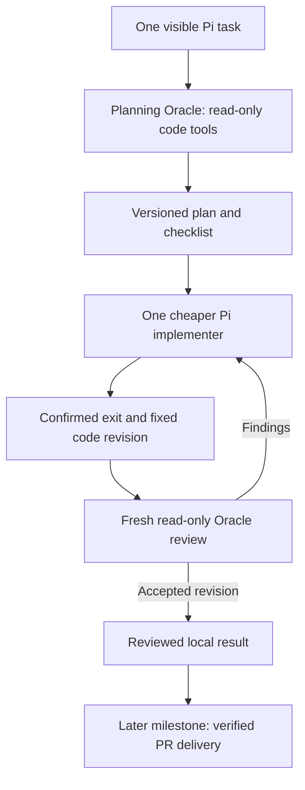

# OpenAmp minimal implementation plan

Status: source-reviewed implementation proposal, 2026-09-15. The new Oracle-led workflow is not yet implemented. Fresh final review is confirmed. Sandbox is deferred. This proposal narrows the first usable delivery while preserving automatic PR/manual merge and eventual Roc replacement.

This is the current planning document. It supersedes the September 13 milestone sequence and the preliminary sequence in the [architecture audit](2026-09-15-openamp-architecture-review.md). Earlier HTML diagrams describe the superseded design.

## Current implementation baseline

Before implementation, a fresh fetch found OpenAmp runtime commits already merged to `main`, including compiled runtime, delivery/recovery, and optional ObservationPack. The working source for this plan is `ff9861f` plus this documentation commit. The earlier local audit used an outdated checkout.

M0 now adapts the existing `src/openamp` runtime to the confirmed Oracle-led workflow. Reuse its native Pi integration, workspace, delivery and recovery checks. Do not create a duplicate CLI, remove accepted safety behavior, or redo completed packaging/migration. M1/M2 mean validating and adapting existing capabilities where needed. The existing `oracle-plan.md` describes an older optional-adviser model and is superseded for role policy.

## Goal

One visible task lets the user plan with a strong Oracle, follow a cheaper implementer's work, and receive a fresh Oracle review. Every code edit belongs to the implementer. Context stays focused and earlier evidence remains retrievable.

## Smallest proposed shape

One curated Pi extension package adds role delegation, checklist state, and review. Pi supplies the CLI/TUI, providers, authentication, model calls, transcripts, compaction, and session operations. Initially load the package in native Pi. A standalone OpenAmp launcher is optional packaging after the workflow works.

The main Oracle is persistent. Run one implementing Pi child at a time. Final review uses a fresh read-only Pi child with the Oracle model. The implementer process must exit with confirmed cleanup before review starts. Its Pi session persists so fixes can resume the same implementation context. Findings return to implementation. A new code or requirement revision invalidates acceptance.

Use one dedicated feature checkout. Oracle reads it; the implementer is its only model-driven writer. Keep validated source/result identity and inspect for external changes. No multiple-writer merge machinery is needed. Existing user changes must not be silently included in the result.

Use Pi custom entries for branch-aware task/checklist/run records if feasibility confirms durable readback. Use one durable task-state writer. Persist run intent and result IDs before reporting completion; bind state to the owning session branch. Keep child transcripts in Pi sessions. Store only pointers and result IDs in the parent. Do not introduce a second transcript, separate database, daemon, generic event bus, workflow engine, or plugin framework.

User steering and cancellation must remain available while implementation runs. Verify Pi's exact message/interrupt behavior in the first slice instead of assuming an awaited child tool permits an immediate Oracle response. If Pi needs a small asynchronous coordinator to meet this interaction contract, retain it.

The package still needs a small child lifecycle module. It owns the child handle, role/model/effort confirmation, cancellation, and result routing. Allow one unresolved child at a time, with no recursive delegation or queue. Initially prevent session switching or branching while a child is unresolved. On later branch/session changes, reconcile stored task state with current Git and process state. Removing a separately named supervisor must not remove those behaviors.

## Current workflow

Open the [architecture graph](openamp-cli/current/architecture.html) or the [plan/implement/review diagram](openamp-cli/current/workflow.html). Both show the current proposed design.

Pi status/widgets display checklist and real tool events throughout this loop. The reviewer receives requirements, actual diff, source references, check evidence, and prior findings. It can inspect additional code without inheriting the planning transcript.

## First complete milestone

In one visible Pi task:

1. Oracle creates a short checklist and bounded implementation brief.
2. A cheaper Pi session makes a small code change while the checklist shows the active step and actual tool activity.
3. Implementation returns the code revision, summary, and permitted check evidence.
4. A fresh read-only Oracle reviews the requirements and actual change. The implementer fixes a finding if present.
5. The task reports reviewed completion or a concrete blocker. Evidence and raw outputs remain available.

Include native compaction and compact handoffs from the beginning. Reuse existing optional ObservationPack without redesigning it. The first milestone must not claim measured context savings until live behavior is observed.

Use one focused orchestration integration with a controlled Pi transport/Fake Harness and real Git fixtures for the result/review contract. Verify the native Pi UI through focused manual inspection. Include load-bearing stop/recovery/result-identity cases before declaring the workflow accepted. Do not run the whole product end to end or write unit tests under repository policy.

## Follow-up milestones

- M1: reliable daily use and observed context behavior. Exercise cancel/restart/compaction, session changes, source recall, findings persistence, and model/effort readback. Compare context size and correctness before enabling more compression. Strengthen only gaps found in the first loop.
- M2: automatic PR delivery and release. Reuse existing Git/GitHub verification, bind review to the final requirements and code revision, confirm push/PR readback, preserve one feature PR, and keep manual merging. Add minimal installation/configuration. Retire Roc only after acceptance and unfinished-work preservation.
- M3: optional sandbox execution. Select local isolation and any remote execution requirements when this milestone starts.

M0 is the complete local plan/implement/progress/review loop above. M0 is the first usable slice; M2 completes the earlier delivery requirement.

## Required limits

### Waiting and execution have separate lifetimes

Confirmed after reviewing [Amp's plugin agent API](https://ampcode.com/docs/plugin-api): expiration of a caller's wait returns the existing run ID and its current status. It does not cancel the child, mark the run failed, consume a fix attempt, release its execution slot, or start a replacement. The caller can wait again or receive the existing result through normal parent-session delivery.

The local OpenAmp runtime retains ownership of the child while the CLI remains open. Explicit user cancellation, application shutdown, an unrecoverable process failure, or an explicitly configured execution budget ends execution. A caller's wait deadline is not an execution budget. Closing the CLI still requires confirmed child cleanup; this decision does not introduce a background daemon.

Expose elapsed time, current role, and the last observed activity. Silence during model reasoning does not prove a stalled process. Recoverable provider/request errors retain their own bounded handling and must not silently create duplicate agent runs.

M0 acceptance must include an expired wait followed by successful completion of the same child, with one delivered result and no duplicate writer. Cancellation must still stop that child and preserve its work. This behavior is approved but is not implemented by the separate Auto helper's candidate-output recovery fix.

### Role and delivery boundaries

Oracle and reviewer get only code-reading/search tools plus narrow coordination tools. Do not load Pi's plan-mode execution switch or unrestricted reviewer bash. Extensions remain trusted host code until sandbox work.

One writer per task, a bounded fix loop, visible blocked/error state, confirmed cancellation before another writer starts, and no blind replay after interruption. Proposed initial limit: one automatic fix/review cycle, then report remaining findings for explicit continuation. Do not silently upgrade the implementing model or reset counters. Preserve recorded model/effort on recovery and sanitized AgileError logging. Review has a fixed requirements revision and base/head. Durable results are delivered only to their owning task/session. A task is not complete merely because a child exits.

## Configurable role models

The user confirmed configurable model choices covering Codex, GLM, and DeepSeek. Keep two profiles: Oracle and implementer. Fresh final review inherits the Oracle profile, so a third independent configuration is unnecessary.

Each profile selects a Pi provider, an exact model from that provider's available catalog, and supported reasoning effort. Suggested pairing: a strong model through Pi's Codex provider at high effort for Oracle/review, and a selected GLM or DeepSeek model for implementation. This is a suggested pairing, not a fixed vendor restriction or a claim that a particular model is already authenticated.

Pi's pinned provider documentation lists Codex subscription access, ZAI providers for GLM access, and DeepSeek. Reuse Pi's provider catalog and credential handling. Codex here means model access through Pi, not launching another Codex agent CLI. GLM and DeepSeek likewise execute inside Pi sessions.

Validate model availability and role capabilities before starting. Oracle and review require the configured high effort; implementation uses the selected model's supported effort or provider default. Do not assume effort labels have identical meanings across providers. Show the effective provider/model/effort with task activity and preserve recorded settings on recovery. No silent fallback or model change during an attempt.

Exact model IDs remain user configuration, not hardcoded release assumptions. No automatic model tournament, extra model router, separate provider stack, or duplicate credentials store is needed. Provider listing is documentation evidence; a live call with each selected profile still needs verification in M0.

## What this removes from the critical path

A new CLI renderer/launcher, a Node/Bun migration, remote infrastructure, parallel writer worktrees, generic queues/supervision, custom context compression, a second state store, and Roc decommissioning do not establish the user's first plan/implement/review loop. Defer each unless a concrete failure proves it necessary.

These are source-based simplification proposals, not measured runtime results. The first integration validates whether native Pi extension hooks can meet the required behavior.

## Reuse with two specific corrections

Pi 0.82.1's `examples/extensions/subagent/index.ts` supplies the separate-process and streaming pattern, but its child command uses `--no-session`. OpenAmp needs persisted implementation sessions. The example also uses `proc.killed` during cancellation escalation, which does not prove process exit. Preserve Roc's confirmed-cleanup behavior instead.

Reuse `examples/extensions/todo.ts` for branch-aware state and `plan-mode/index.ts` for native status/widgets. Exclude the plan-mode switch that restores edit tools to the Oracle. Narrow the reviewer example's tools to remove arbitrary shell execution. These examples are adaptation sources, not a safe ready-made configuration.

The existing role backend requires high-effort support from every mapped model. The two new profiles must use Pi's actual model capabilities instead. Keep provider/model selection within Pi.

## Review and verification evidence

An independent Auto planner call used GPT-6 Astra at xhigh effort to review the source-backed simplifications. It agreed that this is the smallest realistic proposed path and identified session persistence, confirmed cleanup, and documentation consistency fixes incorporated here. Its read-only response is saved in `.scratch/auto/openamp-architecture-2026-09-15/plan-review-1/answer.txt`.

Only planning documents changed. Local references and consistency were checked. No production code or tests were changed or run. The complete Pi workflow, context savings, and runtime reliability remain unverified until M0/M1 evidence exists. Exact model choices and the proposed retry limit are configuration decisions to settle at implementation handoff.
