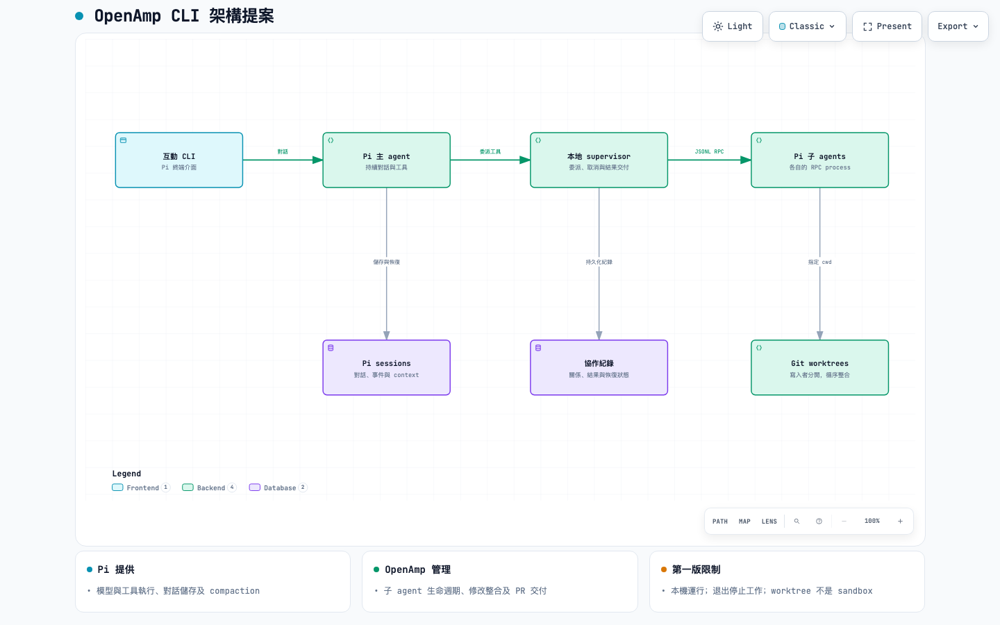
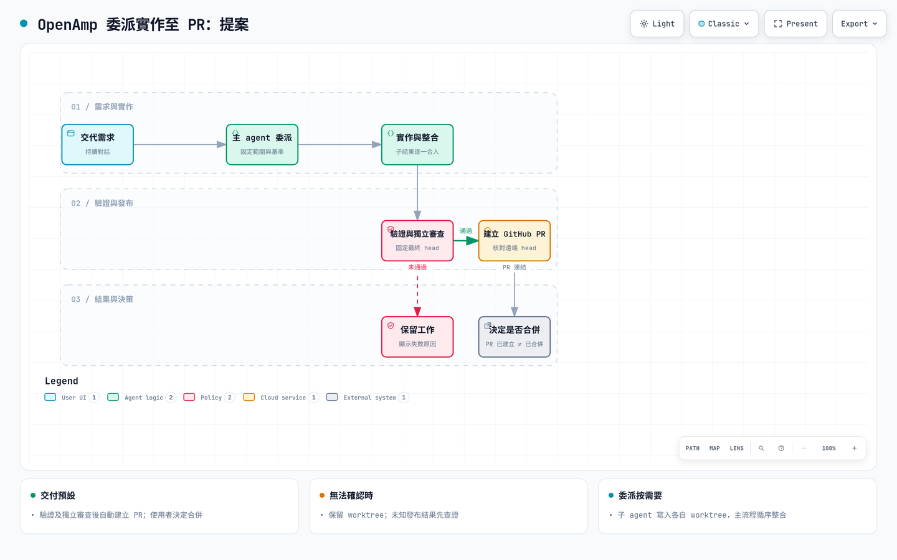

# OpenAmp current plan and diagrams

The [minimal implementation plan](../2026-09-15-openamp-minimal-plan.md) defines the approved Amp-style main-coding direction. It adapts the existing runtime; the source baseline correction is recorded in that plan.

- [Current architecture graph](current/architecture.html)
- [Current implementation and fresh-review flow](current/workflow.html)
- [Validated diagram receipts](current/delivery-receipts.json)
- [Historical local architecture audit](../2026-09-15-openamp-architecture-review.md)

The current graphs describe the target workflow. The earlier handoff and evidence below describe the already implemented first OpenAmp runtime. Its optional-adviser Oracle concept now matches the chosen direction; use the current minimal plan for model, review, and delivery policy.

---

# OpenAmp 實作交接

這個分支包含 Roc 轉向 OpenAmp 的產品計畫、架構圖、Node production runtime 與 M0–M5 本機驗證證據。公開 CLI 執行入口是 `openamp`。

## 從這裡開始

- [完整計畫](../2026-09-13-openamp-cli-plan.md) 是目前的規劃依據。
- [Oracle 實作計畫](oracle-plan.md) 定義隨選高推理第二意見、雙模型路由，以及它與強制 Delivery Review 的邊界。
- [M0 技術可行性結果](m0-feasibility.md) 記錄已驗證能力、`RpcClient` 限制及保留風險。
- [M1–M5 里程碑證據](milestone-evidence.md) 記錄實作、測試與尚待外部授權的驗收。
- [初步方向](../2026-09-13-openamp-cli-direction.md) 保留早期討論，衝突時以完整計畫為準。
- [架構圖](architecture.html) 與 [交付流程圖](delivery-workflow.html) 是可在本機瀏覽器開啟的獨立 HTML。GitHub 會顯示原始碼，可下載後開啟。
- [圖表驗證紀錄](diagram-validation.json) 包含規格與 HTML 的 SHA-256、檢查範圍及截圖證據。

## 已確認的背景

使用者希望參考 Amp 的互動與委派方式，以 Pi agents 建立 CLI 優先的 OpenAmp。產品從 GitHub Issue 驅動的固定 Scout → Implement → Review 流程，轉向持續對話與按需要委派。

使用者已選定：

- 互動 CLI，由主 agent 按需要委派 Pi 子 agent。
- OpenAmp 通過驗收後，分階段取代 Roc 的 backlog 與 daemon 流程。
- 完成修改後自動建立 GitHub PR，合併由使用者決定。
- 先完成計畫與圖，再開始實作。

所有修改型 PR 及其更新在交付前都必須由獨立 agent 審查固定的最終版本；新 commit、base 或需求變更必須重新驗證及審查。一般 agent 工具不得發布或合併，遠端發布只由 Delivery 執行，合併只由使用者決定。Node.js、Pi 原生 TUI、最多兩個子 agent、專用功能／writer worktrees、循序整合及自動 PR reconciliation 均已實作並通過可重現測試。

## 目前狀態與外部驗收

M0–M5 的 repository 內實作已完成。package archive 只包含 OpenAmp runtime；Roc daemon、queue、舊 CLI 與 onboarding skill 不會發布。舊 source、tests 和操作文件仍留在 repository／`docs/legacy`，供既有工作的回復與遷移參考。

尚未執行真實 macOS terminal、付費模型供應商或 GitHub mutation acceptance，也沒有發布 npm package。這些是發布前外部驗收，不可由本機替身結果代替；選定測試 repository 並取得 push／PR 授權後才可執行。

## 分支與證據範圍

分支為 `codex/openamp-cli-plan`，實作基準為已提交的規劃版本 `d0e69c7fa529bcf3c5f0f46629daf1df54a06351`。OpenAmp 建立專用 worktree，來源工作目錄的未提交修改不會被帶入功能 branch。

部分初始調查來自當時尚未提交的本機檔案。完整計畫已標記這項限制。開始實作前，以實際分支中的 package manifest、lockfile、Pi exports 與程式碼重新確認重用項目。

Pi SDK 文件隨安裝的固定版本套件提供，位於 `node_modules/@earendil-works/pi-coding-agent/docs/`。既有「同一功能共用 worktree」需求已摘要在完整計畫第 6 節，原始的另一項工作計畫不屬於此分支。

圖表通過 9/9 showcase 結構檢查及四種桌面尺寸檢查。圖表證據與 runtime 測試是兩組獨立證據；兩者都不代表 Amp 的非公開內部架構已被驗證。

## 架構預覽

## 交付流程預覽

