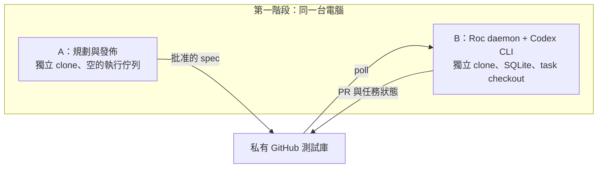
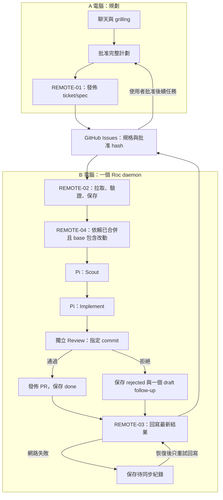
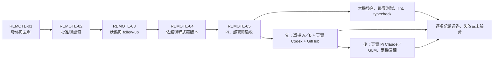

# 跨電腦任務的規格與驗收圖

行為來源：[remote-task-workflow spec](../specs/remote-task-workflow.md)。實作模型為 GPT-5.6 Sol／high。下圖描述跨機器流程；本機測試與真實 provider／兩機驗證會分開記錄。

先在同一台電腦演練：A、B 使用獨立 clone 和資料庫，只有 B 跑 daemon。首次使用已登入的 Codex；Pi 的 Claude／GLM 及實體兩機驗證另行記錄。

## 執行流程

未通過批准檢查、依賴缺失或 spec 改動時停止該任務，保留 needs_input／needs_replan。GitHub 無法存取時暫停新工作。執行中的任務更換 ready 標籤後仍需持續追蹤。

## 實作依賴與驗收

| 規格需求 | 實作 ticket | 必須取得的證據 |
| --- | --- | --- |
| remote-publication | REMOTE-01 | 發佈重試不重建 Issue；完整 spec 保留 |
| remote-admission | REMOTE-02 | 無效／撤銷批准不執行；獨立資料庫拉取 |
| remote-writeback | REMOTE-03 | 同步失敗和重啟不重跑已完成任務 |
| remote-followup | REMOTE-03 | rejected 只建立一個未批准的後續任務 |
| remote-dependencies | REMOTE-04 | 下游 base 包含上游合併結果；未合併時阻擋 |
| pi-provider-validation | REMOTE-05 | 真實 provider 的三角色結果、模型與使用量 |
| remote-operations | REMOTE-05 | A／B 安裝、單 worker、隔離與常駐服務文件 |
| remote-verification | REMOTE-05 | 本機檢查及兩機演練各自有結果，不互相替代 |

機器可讀對應表及核對命令位於 `.scratch/deliver-code/remote-task-workflow/traceability.json` 和 `check-traceability.mjs`。核對只證明規格需求沒有漏配 ticket、ticket 依賴無循環；程式是否符合規格仍須由測試及審查判斷。

## 程式與測試對應

以下是主要入口；是否符合規格仍以審查及實際檢查結果為準。

| Ticket | 主要程式 | 主要測試 |
| --- | --- | --- |
| REMOTE-01 | [發佈與去重](../../src/github/remote-tasks.ts) | [發佈測試](../../test/github/remote-tasks.test.ts) |
| REMOTE-02 | [遠端領取](../../src/github/remote-source.ts) | [核准與離線處理](../../test/github/remote-source.test.ts) |
| REMOTE-03 | [狀態回寫](../../src/github/remote-writeback.ts) | [回寫與後續草稿](../../test/github/remote-writeback.test.ts) |
| REMOTE-04 | [依賴與 base](../../src/github/remote-dependencies.ts) | [合併結果交接](../../test/github/remote-dependencies.test.ts) |
| REMOTE-05 | [Pi](../../src/agents/pi/backend.ts)、[操作說明](../../README.zh-HK.md) | [Pi 能力檢查](../../test/agents/pi/backend.test.ts)、[A／B 整合流程](../../test/integration/remote-task-workflow.test.ts) |

對應表核對也會檢查引用的程式與測試檔案存在；它不會把檔案存在當作行為已驗收。
