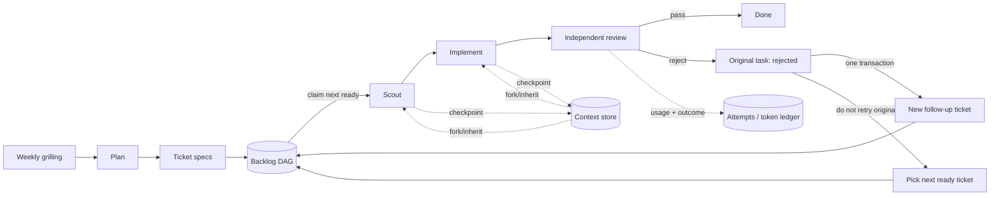

# Research: a local agile agent orchestrator

**Research date:** 2026-08-24
**Scope:** primary project documentation and source repositories; licenses and Bun support are called “verified” only where the project states them.

## Executive answer

The product is worth building, but most of its machinery already exists in pieces. The closest product-level analogue is [OpenAI Symphony](https://github.com/openai/symphony): it polls an issue tracker, claims work, creates an isolated workspace, runs Codex, enforces concurrency, and exposes run state. [Gas Town](https://github.com/gastownhall/gastown) is the closest multi-role operations analogue. [Beads](https://github.com/gastownhall/beads) has the best task/dependency vocabulary. [Pi](https://github.com/earendil-works/pi) and Codex app-server have the context/session primitives.

Do **not** combine all of those systems. The smallest credible implementation is:

- Bun + TypeScript + Zod;
- `bun:sqlite` for tasks, dependencies, attempts, token usage, context ancestry, and an append-only audit log;
- `Bun.spawn` for agent backends;
- `@opentui/core` for the TUI;
- one scheduler process and one explicit transition function;
- a Codex adapter first, with Pi as a second subprocess adapter;
- a deterministic model-routing policy, not another “advisor agent.”

This is essentially a **small, local Symphony with Beads-like dependency edges and Pi-like session ancestry**. Gas Town, Temporal, Redis queues, XState, an ORM, and a graph-layout package should remain design references until the single-process implementation proves insufficient.

## Recommended product flow



The important distinction is between two failure classes:

1. **Infrastructure failure** — a crashed process, transient API error, or lost stream may retry the same *attempt* a small, capped number of times.
2. **Semantic review rejection** — the review completed successfully and returned “not acceptable.” The original task becomes terminal `rejected`; a new backlog task is created with the review findings; the scheduler moves on. The original task is never reset to `ready`.

That rule prevents a difficult ticket from monopolizing the week while preserving a full lineage for later work.

## Closest existing products

| Project | What matches | What to reuse | Why it is not the core dependency | License / runtime |
|---|---|---|---|---|
| [OpenAI Symphony](https://github.com/openai/symphony) | Its [specification](https://github.com/openai/symphony/blob/main/SPEC.md) defines issue polling, eligibility, claiming, per-issue workspaces, bounded concurrency, Codex sessions, reconciliation, retries, and observability. | Single authoritative orchestrator; tracker adapter boundary; isolated workspaces; explicit run states; structured usage and rate-limit reporting. | The reference implementation is Elixir and currently targets Linear. Its transient-retry/continuation machinery re-runs the same issue, whereas review rejection here must create a new ticket and release the scheduler. The repository also labels the project a low-key engineering preview intended for trusted environments. | [Apache-2.0](https://github.com/openai/symphony/blob/main/LICENSE); external reference implementation, not a Bun package. |
| [Gas Town](https://github.com/gastownhall/gastown) | Multi-agent roles, work queues, worktree isolation, stuck-agent handling, merge/refinery review, session recovery, and a live terminal view. Its [architecture](https://github.com/gastownhall/gastown/blob/main/docs/design/architecture.md) describes Mayor, Polecat, Witness, Refinery, Convoy, Beads, and worktree boundaries; its [reference](https://github.com/gastownhall/gastown/blob/main/docs/reference.md) documents `gt feed`, scheduling, runtime presets, and recovery commands. | Role separation; “witness” supervision; merge/review gate; session/event recovery; task-family visualization. | It brings Go binaries, tmux, Dolt/Beads, daemons, git worktrees, and a larger operating model. That is useful evidence, but much more infrastructure than a local Bun MVP needs. | [MIT](https://github.com/gastownhall/gastown/blob/main/LICENSE); Go CLI and external tools. |
| [Beads](https://github.com/gastownhall/beads) | Dependency-aware agent issue tracker. Its [documentation](https://github.com/gastownhall/beads/blob/main/docs/index.md) exposes ready/unblocked work, atomic claiming, parent/child structure, and typed links such as blocking and discovered work. | Copy the vocabulary: `blocks`, `parent-child`, `discovered-from`, and optionally `supersedes`. A rejected task’s replacement should be `discovered-from` the review and share a stable root lineage. | Current Beads uses Dolt as its source of truth and is delivered as a Go CLI. It is a good optional external tracker adapter, but Dolt is unnecessary for one local scheduler and would duplicate the SQLite task store. | [MIT](https://github.com/gastownhall/beads/blob/main/LICENSE); CLI boundary works with Bun, no in-process TS library assumption. |
| [OpenSpec](https://github.com/Fission-AI/OpenSpec) | Artifact-driven flow from proposal/spec/design/tasks through implementation and archive. Its [workflows](https://github.com/Fission-AI/OpenSpec/blob/main/docs/workflows.md) and [concepts](https://github.com/Fission-AI/OpenSpec/blob/main/docs/concepts.md) preserve intent and implementation history. | Its Markdown artifact shapes are a strong candidate for weekly plan and ticket/spec files. Codex integration can be optional. | It solves specification lifecycle, not scheduling, attempts, review branching, usage accounting, or TUI state. Its [installation guide](https://github.com/Fission-AI/OpenSpec/blob/main/docs/installation.md) permits installation with Bun but states Node.js 20.19+ as the runtime requirement. Borrow the file convention before embedding the tool. | [MIT](https://github.com/Fission-AI/OpenSpec/blob/main/LICENSE); not verified as a Bun-only runtime. |
| [GitHub Spec Kit](https://github.com/github/spec-kit) | `specify → plan → tasks → implement`; the [lean preset](https://github.com/github/spec-kit/blob/main/presets/lean/README.md) produces focused Markdown artifacts. | Templates and separation of problem, plan, and tasks. | It is Python/`uv` tooling and does not provide the scheduler or agent runtime. OpenSpec is the closer optional integration for this project. | [MIT](https://github.com/github/spec-kit/blob/main/LICENSE); Python CLI. |
| [Pi](https://github.com/earendil-works/pi) | Stateful agent loop, tools, streaming, usage/cost accounting, persistent session trees, branching, compaction, and JSONL RPC. [Session format](https://github.com/earendil-works/pi/blob/main/packages/coding-agent/docs/session-format.md) uses append-only entries with parent IDs; [RPC mode](https://github.com/earendil-works/pi/blob/main/packages/coding-agent/docs/rpc.md) exposes events, model switching, prompts, and session statistics. | Use the subprocess/RPC pattern; copy its non-destructive session-tree model; optionally add Pi as backend two. `backend + session ID + entry anchor + git commit` is a sufficient context reference. | The former `@mariozechner/*` project has moved and its current packages are named `@earendil-works/*`. [`pi-agent-core`](https://github.com/earendil-works/pi/blob/main/packages/agent/package.json) and [`pi-ai`](https://github.com/earendil-works/pi/blob/main/packages/ai/package.json) currently declare Node.js 22.19+ and use TypeBox schemas. A strict Bun host should spawn Pi RPC rather than assume the in-process SDK is compatible. | [MIT](https://github.com/earendil-works/pi/blob/main/LICENSE); subprocess is the safe integration boundary. |

### What is genuinely novel here

None of the close matches combines all of these policies:

- weekly grilling into a bounded plan and agent-ready ticket specs;
- a local-only CLI/TUI with an explicit task DAG;
- scout → implement → independent review as first-class per-ticket roles;
- semantic rejection that closes the original and creates a new backlog item instead of retrying it indefinitely;
- token usage attributed to each role attempt;
- provider-neutral, non-destructive context ancestry across weeks;
- deterministic role/risk/budget-based selection among Luna, Terra, and Sol.

That combination is a coherent product boundary rather than another general agent framework.

## Minimal reusable stack

| Need | Use now | Evidence and compatibility |
|---|---|---|
| Process/runtime | Bun | [`Bun.spawn`](https://bun.com/docs/runtime/child-process) supports streaming stdio, exit handling, abort/kill, environment/cwd control, and resource usage. This is enough for Codex JSONL/app-server and Pi RPC. |
| Durable local state | `bun:sqlite` | The [native SQLite API](https://bun.com/docs/runtime/sqlite) provides prepared queries and transactions; enable WAL for the scheduler/event workload. Keep one scheduler as the task-state writer. |
| Boundary validation | Zod 4 | [Zod](https://zod.dev/) is a TypeScript-first, zero-dependency validation library under the [MIT license](https://github.com/colinhacks/zod/blob/main/LICENSE). Validate ticket files, database payloads, backend events, review decisions, and policy output. Its official material does not explicitly promise Bun support, so exercise it in the project test matrix. |
| Terminal UI | `@opentui/core` | [OpenTUI](https://github.com/anomalyco/opentui) has a native terminal core with TypeScript bindings, a Bun quickstart, and React/Solid adapters. Start with the core package to avoid a second UI framework. It is [MIT](https://github.com/anomalyco/opentui/blob/main/LICENSE). |
| Agent backend | Codex subprocess adapter | Start with a narrow internal interface over Codex CLI JSONL; use app-server when exact fork-at-turn and full thread history are needed. Both avoid coupling the Bun application to a Node package runtime. |
| Task graph display | A topological-level renderer | Render columns/rows and ASCII connectors in OpenTUI. Add [Dagre](https://github.com/dagrejs/dagre) only after real graphs become unreadable; it is [MIT](https://github.com/dagrejs/dagre/blob/master/LICENSE), but explicit Bun compatibility is not documented. |

### Deliberately deferred

- **XState:** [actors](https://stately.ai/docs/actors), [snapshot persistence, and event sourcing](https://stately.ai/docs/persistence) are good patterns, and XState is [MIT](https://github.com/statelyai/xstate/blob/main/LICENSE). It does not replace task claiming, database transactions, usage accounting, or audit storage. Persisted machine snapshots also require migration discipline. A plain discriminated-union transition function is smaller until concurrent/hierarchical states become difficult.
- **Stately Agent:** it is an unusually close design reference for event logs, forks, and budgets, but Agent 2/XState 6 are alpha and its SQLite adapter is Node-oriented. Do not place the MVP on alpha state infrastructure.
- **Inngest:** its [durable execution](https://www.inngest.com/docs/learn/how-functions-are-executed) and concurrency/retry controls are useful for distributed workers, and its TypeScript SDK supports Bun. It adds an external service/dev server and a broader licensing/deployment decision. Reconsider only when multiple scheduler processes are required.
- **BullMQ/Temporal:** both solve durable distributed work, which the first version does not have. They add Redis or a Temporal service and Node-worker constraints.
- **ORM:** direct, prepared SQLite statements plus a small repository module are enough for the proposed schema.
- **A learned advisor agent:** model selection should be deterministic and auditable. Calling another model to choose a model adds cost, latency, and recursion without creating a better first policy.

## Codex integration, usage, and context

### Lowest-risk integration sequence

1. **First adapter: `codex exec --json`.** The official [non-interactive documentation](https://developers.openai.com/codex/noninteractive/) defines JSONL events including thread start, turn lifecycle, items, errors, and a `turn.completed` usage object. The [CLI reference](https://developers.openai.com/codex/cli/reference/) documents `codex exec resume <session-id>` and marks `codex exec` stable. Persist the thread ID and the reported input, cached-input, output, and reasoning-output token counts for every attempt.
2. **Add exact context forks through `codex app-server`.** The official [app-server documentation](https://developers.openai.com/codex/app-server/) exposes `thread/start`, `thread/resume`, and `thread/fork`; the fork request can include `lastTurnId`, which copies history only through that turn. It also emits token-usage updates and exposes model capabilities. App-server is experimental, so isolate it behind the same adapter interface.
3. **Do not depend on `thread/rollback`.** The app-server documentation marks rollback deprecated. “Rollback” in this product should always create a child context reference, never mutate historical context.

The official [TypeScript SDK](https://developers.openai.com/codex/sdk/) supports thread start/resume and streaming, but currently documents Node.js 18+ as its requirement. It is attractive for Node applications, but a Bun-only product gains a cleaner compatibility boundary by consuming the CLI or app-server protocol through `Bun.spawn`. Codex itself is [Apache-2.0](https://github.com/openai/codex/blob/main/LICENSE).

### Context reference

Persist this small, provider-neutral record:

```text
backend
session_or_thread_id
entry_or_turn_anchor
source_task_id
git_commit
summary_artifact_path_or_hash
```

“Inherit last week’s Task C” becomes:

1. find Task C’s accepted context reference;
2. create a child reference anchored to it;
3. fork the backend session when supported, otherwise start a new session with Task C’s validated context capsule;
4. record the parent edge and current git commit;
5. leave Task C’s original history immutable.

Pi supports this naturally through its session tree, navigation, fork, and compaction semantics in the [session documentation](https://github.com/earendil-works/pi/blob/main/packages/coding-agent/README.md#sessions). Codex supports exact forks through app-server. Context capsules are still valuable because they are backend-independent and survive model or provider migration.

### Token ledger

Use the backend’s measured usage; do not estimate tokens in the scheduler.

- Codex JSONL reports usage at turn completion, while app-server publishes last-turn and cumulative token updates through its [token-usage schema](https://github.com/openai/codex/blob/main/codex-rs/app-server-protocol/schema/json/v2/ThreadTokenUsageUpdatedNotification.json).
- Pi RPC exposes session statistics, including input/output/cache tokens, cost, and context utilization in its [RPC operations](https://github.com/earendil-works/pi/blob/main/packages/coding-agent/docs/rpc.md).

Create a fresh backend thread/session per **task role attempt** where practical. That keeps usage attribution simple and prevents the reviewer from inheriting the implementer’s narrative bias. The review attempt should receive only the ticket spec, diff/commit, tests, and a compact implementation evidence capsule.

### Model advisor

Treat “Codex” as the backend/runtime and Luna, Terra, and Sol as selectable model profiles, not four equivalent provider names. The current [model guide](https://developers.openai.com/api/docs/guides/latest-model) positions Luna for high-volume work, Terra as the balanced default, and Sol for harder work. Query the backend’s model/capability list at runtime rather than hardcoding availability.

A sufficient first policy is:

| Situation | Route |
|---|---|
| Scout, classification, low-risk mechanical task | Luna |
| Normal implementation | Terra |
| High-risk design, security-sensitive change, difficult review, or an escalated follow-up | Sol |

Inputs should be role, risk label, ticket size, remaining weekly/task token budget, and lineage generation. Persist the policy decision as an event so the TUI can explain it. Do not spend model tokens on the selection itself.

## State and storage design

Use current-state tables for fast scheduling plus an append-only event table for audit/recovery; full event sourcing is unnecessary initially.

```text
weeks(id, starts_at, goal, status)
tasks(id, week_id, title, spec_path, status, priority,
      root_task_id, generation, created_from_review_id, context_id)
task_deps(task_id, depends_on_task_id, kind)
attempts(id, task_id, role, backend, model, status,
         thread_id, started_at, ended_at, git_commit)
usage(attempt_id, input_tokens, cached_input_tokens,
      output_tokens, reasoning_output_tokens, cost)
contexts(id, backend, provider_ref, anchor, source_task_id,
         parent_context_id, git_commit, summary_artifact)
events(seq, task_id, attempt_id, type, payload_json, occurred_at)
```

Suggested task states:

```text
draft → ready → claimed → scouting → implementing → reviewing → done
                                                    └──────────→ rejected
blocked is derived from unsatisfied dependency edges, not manually toggled.
```

In one SQLite transaction, a review rejection should:

1. write the structured review result;
2. mark the original task `rejected` and its attempt complete;
3. insert a linked follow-up task in `draft`/backlog, never directly in `ready`;
4. link it with `created_from_review_id`, `root_task_id`, and `generation + 1`;
5. append both events;
6. release the worker so the next ready ticket can be selected.

Add a maximum automatic lineage generation—three is a reasonable starting default—after which a human must reshape or drop the work. This bounds a chain of newly generated tickets without violating the no-retry-original rule.

## CLI/TUI shape

Keep the interface read-model simple:

```text
WEEK 34 / SHIPPING GOAL                         TOKENS
✓ A  ticket specs                              18.2k
● B  parser cleanup     [IMPLEMENT · TERRA]     9.4k
│  └─ ○ B2 review follow-up                    0
○ C  inherited context: week-33/C              0
⊘ D  blocked by C                              0

EVENTS
12:41 B implement turn completed · +3,208 tokens
12:42 B moved to review · reviewer=sol
```

Start with topological levels and stable ordering by priority/creation time. The key interactions are inspect ticket/spec, inspect attempts and usage, inspect context ancestry, pause/stop claiming, and approve/reshape an over-generation follow-up. A general free-form graph editor is outside the first product boundary.

## Recommended build order

1. **Ticket contract and scheduler:** Zod schemas, SQLite migrations, DAG readiness, atomic claim, transition function, and append-only events.
2. **Codex execution:** `codex exec --json` adapter, per-role attempts, structured outputs, measured usage, cancellation, and capped infrastructure retry.
3. **No-loop review gate:** independent reviewer, terminal rejection, transactional follow-up creation, and lineage cap.
4. **CLI read model:** plan/import/list/run/inspect commands.
5. **OpenTUI:** graph/status, role/model, context ancestry, live event stream, and task/weekly token totals.
6. **Context ancestry:** provider-neutral capsules first; app-server exact turn fork and Pi RPC adapter after the task flow is stable.
7. **Optional integrations:** OpenSpec artifact import/export, Beads tracker adapter, and remote/distributed scheduler only when demanded by real use.

## Final recommendation

Build the scheduler and product policy; reuse the runtimes. The strongest reference combination is:

- **Symphony** for orchestrator/workspace/run-state shape;
- **Beads** for ready-work and typed task lineage;
- **Pi** for session-tree/context concepts and optional RPC backend;
- **Codex CLI/app-server** for execution, measured token usage, resume, and fork;
- **Gas Town** for operational role and TUI ideas;
- **OpenSpec** for optional human-readable spec artifacts.

The MVP should remain one Bun process, one SQLite database, one OpenTUI application, and one backend adapter. That is enough to prove the product’s distinctive behavior: weekly planning, visible task flow, bounded review failure, per-task token accountability, and cross-week context inheritance.
