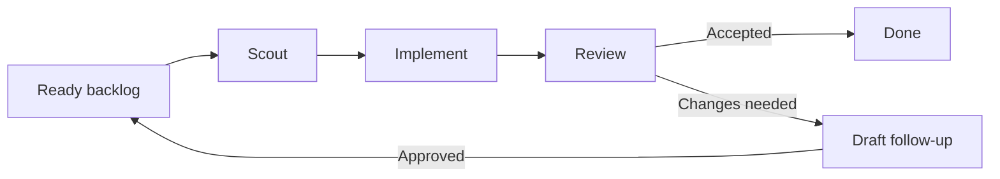

# Production Help and Chinese README Implementation Plan

> **For agentic workers:** REQUIRED SUB-SKILL: Use superpowers:subagent-driven-development (recommended) or superpowers:executing-plans to implement this plan task-by-task. Steps use checkbox (`- [ ]`) syntax for tracking.

**Goal:** Keep Roc's public help and README production-focused, move contributor-only guidance into `CONTRIBUTING.md`, and add a complete Traditional Chinese README.

**Architecture:** Treat `src/cli/help.ts`, `README.md`, and `README.zh-HK.md` as Roc's public surface. Keep fake scheduling, inspection, development, testing, and release instructions available through the existing CLI implementation and the new contributor guide, but do not advertise them in public help or public command lists.

**Tech Stack:** TypeScript, Bun test, Markdown

**Spec:** `docs/superpowers/specs/2026-08-27-production-help-chinese-readme-design.md`

## Global Constraints

- Keep `scheduler run --backend fake` and `scheduler inspect` callable; only hide them from public help and public READMEs.
- Do not add `--dev`, `--all`, or another help mode.
- Use Traditional Chinese in `README.zh-HK.md` and keep command names, code blocks, URLs, product names, and Mermaid node identifiers unchanged.
- Keep every package-runner example on `roc-it@latest`.
- Move release and development instructions to `CONTRIBUTING.md`; do not change the release workflow.
- Follow the project's focused-testing policy and run `bun run check` before completion.

---

## File structure

- Modify `src/cli/help.ts`: list production commands only.
- Modify `test/cli/help.test.ts`: protect the public-help boundary.
- Modify `README.md`: add language navigation and remove contributor-only content.
- Create `README.zh-HK.md`: provide the complete public README in Traditional Chinese.
- Create `CONTRIBUTING.md`: own development, testing, hidden commands, safety, and release instructions.
- Modify `test/release-workflow.test.ts`: protect production documentation, language navigation, and contributor guidance.

### Task 1: Hide development commands from public CLI help

**Files:**
- Modify: `test/cli/help.test.ts`
- Modify: `src/cli/help.ts`

**Interfaces:**
- Consumes: `helpText: string`, printed by `runCli` for no command or `help`.
- Produces: the same exported `helpText` constant with only production commands.

- [ ] **Step 1: Replace the help contract test**

Replace the existing test in `test/cli/help.test.ts` with:

```typescript
test("help lists only production roc-it commands", () => {
  expect(helpText).toContain(
    "roc-it - run Codex agents through an agile software flow",
  );
  expect(helpText).toContain("roc-it init [--db PATH]");
  expect(helpText).toContain("roc-it task list [--db PATH]");
  expect(helpText).toContain("roc-it tokens [--db PATH] [--no-color]");
  expect(helpText).toContain(
    "roc-it scheduler run --backend codex --repo PATH [--base REF] [--db PATH]",
  );
  expect(helpText).toContain("roc-it help");
  expect(helpText).not.toContain("--backend fake");
  expect(helpText).not.toContain("--fake-script");
  expect(helpText).not.toContain("scheduler inspect");
  expect(helpText).not.toMatch(/^\s*agile(?:\s|$)/m);
  expect(helpText).not.toContain("--low");
});
```

- [ ] **Step 2: Run the help test and confirm the new boundary fails**

Run:

```bash
rtk bun test test/cli/help.test.ts
```

Expected: FAIL because `helpText` still contains `--backend fake`,
`--fake-script`, and `scheduler inspect`.

- [ ] **Step 3: Reduce `helpText` to production commands**

Replace `src/cli/help.ts` with:

```typescript
export const helpText = `roc-it - run Codex agents through an agile software flow

Usage:
  roc-it init [--db PATH]
  roc-it task list [--db PATH]
  roc-it tokens [--db PATH] [--no-color]
  roc-it scheduler run --backend codex --repo PATH [--base REF] [--db PATH]
  roc-it help
`;
```

Do not change `src/cli/run.ts`; hidden development commands must keep their
current dispatch behavior.

- [ ] **Step 4: Run the CLI help and command tests**

Run:

```bash
rtk bun test test/cli/help.test.ts test/cli/scheduler.test.ts test/cli/run.test.ts
```

Expected: all tests pass, proving the public help changed without disabling CLI
behavior.

- [ ] **Step 5: Commit the public-help boundary**

Run:

```bash
rtk git add src/cli/help.ts test/cli/help.test.ts
rtk env HUSKY=0 git commit -m "feat: hide development commands from help"
```

Expected: one commit containing only the help text and its contract test.

### Task 2: Move contributor guidance out of the English README

**Files:**
- Modify: `test/release-workflow.test.ts`
- Modify: `README.md`
- Create: `CONTRIBUTING.md`

**Interfaces:**
- Consumes: the existing production command examples, release instructions,
  development commands, safety rules, and documentation links in `README.md`.
- Produces: a public `README.md` that links to `CONTRIBUTING.md`, plus one
  contributor guide that owns all non-production instructions.

- [ ] **Step 1: Replace the English README/release documentation test**

In `test/release-workflow.test.ts`, replace the test named
`README leads with npx production commands and explains tagged releases` with
these two tests:

```typescript
test("English README stays production-focused", async () => {
  const readme = await readProjectFile("README.md");

  expect(readme.indexOf("npx roc-it@latest help")).toBeLessThan(
    readme.indexOf("bunx roc-it@latest help"),
  );
  expect(readme).toContain("npx roc-it@latest init");
  expect(readme).toContain("npx roc-it@latest task list");
  expect(readme).toContain("npx roc-it@latest tokens");
  expect(readme).toContain(
    "npx roc-it@latest scheduler run --backend codex --repo /absolute/path/to/project",
  );
  expect(readme).toContain("npm install -g roc-it@latest");
  const packageRunnerCommands =
    readme.match(/^(?:npx|bunx) roc-it(?:@\S+)?(?: .*)?$/gm) ?? [];
  expect(packageRunnerCommands.length).toBeGreaterThan(0);
  expect(
    packageRunnerCommands.every((command) =>
      /^(?:npx|bunx) roc-it@latest(?: |$)/.test(command),
    ),
  ).toBe(true);
  expect(readme).toContain(
    "Run without a global install (Roc still requires Bun at runtime):",
  );
  expect(readme).toContain("`bunx` as Bun's package runner");
  expect(readme).toContain(
    '<strong>English</strong> · <a href="README.zh-HK.md">繁體中文</a>',
  );
  expect(readme).toContain("[CONTRIBUTING.md](CONTRIBUTING.md)");
  expect(readme).not.toContain("--backend fake");
  expect(readme).not.toContain("--fake-script");
  expect(readme).not.toContain("scheduler inspect");
  expect(readme).not.toContain("## Releases");
  expect(readme).not.toContain("## Development");
  expect(readme).not.toContain("git tag vX.Y.Z");
});

test("CONTRIBUTING owns development and release instructions", async () => {
  const contributing = await readProjectFile("CONTRIBUTING.md");

  expect(contributing).toContain("bun install --frozen-lockfile");
  expect(contributing).toContain("bun run typecheck");
  expect(contributing).toContain("bun run test");
  expect(contributing).toContain("bun run check");
  expect(contributing).toContain(
    "scheduler run --backend fake --fake-script /absolute/path/to/scenario.json",
  );
  expect(contributing).toContain("scheduler inspect");
  expect(contributing).toContain("https://github.com/devos-ing/Roc/releases");
  expect(contributing).toContain("commit `bun.lock` only if Bun changes it");
  expect(contributing).toContain("git tag vX.Y.Z");
  expect(contributing).toContain("git push origin vX.Y.Z");
});
```

- [ ] **Step 2: Run the documentation test and confirm it fails**

Run:

```bash
rtk bun test test/release-workflow.test.ts
```

Expected: FAIL because `README.md` still exposes development and release
content and `CONTRIBUTING.md` does not exist.

- [ ] **Step 3: Add language navigation to the English README**

Immediately after the centered image block at the top of `README.md`, add:

```markdown
<p align="center">
  <strong>English</strong> · <a href="README.zh-HK.md">繁體中文</a>
</p>
```

- [ ] **Step 4: Keep only production commands in the English README**

Replace the `## Commands` code block with:

````markdown
## Commands

```bash
roc-it init [--db PATH]
roc-it task list [--db PATH]
roc-it tokens [--db PATH] [--no-color]
roc-it scheduler run --backend codex --repo PATH [--base REF] [--db PATH]
roc-it help
```
````

- [ ] **Step 5: Replace Releases and Development with one contributor link**

Delete everything from `## Releases` through the end of the Development
section, stopping immediately before `## References`. Insert this block in its
place:

```markdown
## Contributing

See [CONTRIBUTING.md](CONTRIBUTING.md) for development, testing, and release
instructions.
```

- [ ] **Step 6: Create the contributor guide**

Create `CONTRIBUTING.md` with this exact content:

````markdown
# Contributing to Roc

Thanks for helping improve Roc. Keep changes small, explain the behavior they
change, and add only the tests needed to protect important paths.

## Setup

You need:

- [Bun](https://bun.sh/) 1.3.0 or later
- Git
- [Codex CLI](https://github.com/openai/codex) when testing Codex mode

Install the locked dependencies from a source checkout:

```bash
bun install --frozen-lockfile
```

## Development checks

Run Roc directly from source:

```bash
bun run src/cli/main.ts help
```

Run the checks that match your change:

```bash
bun run typecheck
bun run test
bun run check
```

Always run `bun run check` before submitting a change. It runs linting, type
checks, and the test suite.

## Development-only commands

Roc keeps a fake scheduler for deterministic tests and an inspection command
for debugging saved scheduler state. They work from source but are intentionally
hidden from production help and the public READMEs.

Run a prepared fake scenario:

```bash
bun run src/cli/main.ts scheduler run --backend fake --fake-script /absolute/path/to/scenario.json
```

Inspect the scheduler database:

```bash
bun run src/cli/main.ts scheduler inspect
```

Both commands accept `--db PATH` when you need a specific database.

## Project documents

Start with:

- [Architecture](docs/architecture.md)
- [Domain language](CONTEXT.md)
- [Approved specifications](docs/specs/)
- [Durable decisions](docs/adr/)
- [Research](docs/research/)
- [Testing policy](AGENTS.md)

## Safety and testing

Follow these rules:

- never change the source work folder;
- Review must check the exact clean commit from Implement;
- receiving the same update twice must not repeat the change;
- a rejected task must stay closed and create only one draft follow-up.

Tests should prove the most important behavior. Full test coverage is not the
goal. Use the Fake Harness for deterministic retry, rejection, restart, and
repeated-event cases.

## Releases

See published versions and notes on
[GitHub Releases](https://github.com/devos-ing/Roc/releases).

Only maintainers publish releases. Bump the version in `package.json`, run the
locked Bun install and full check, and commit `bun.lock` only if Bun changes it:

```bash
bun install --frozen-lockfile
bun run check
```

Merge the version change, then tag that exact commit:

```bash
git tag vX.Y.Z
git push origin vX.Y.Z
```

The tag must match the version in `package.json`. GitHub Actions checks the tag,
installs locked dependencies, runs the full check, publishes the package to npm,
and creates the GitHub Release.
````

- [ ] **Step 7: Run the English documentation contract**

Run:

```bash
rtk bun test test/release-workflow.test.ts
```

Expected: all tests in the file pass.

- [ ] **Step 8: Commit the public/contributor documentation split**

Run:

```bash
rtk git add README.md CONTRIBUTING.md test/release-workflow.test.ts
rtk env HUSKY=0 git commit -m "docs: separate contributor guidance"
```

Expected: one commit containing the English documentation boundary and its
tests.

### Task 3: Add the Traditional Chinese README

**Files:**
- Modify: `test/release-workflow.test.ts`
- Create: `README.zh-HK.md`

**Interfaces:**
- Consumes: the public structure, code blocks, URLs, milestones, references,
  and product claims in `README.md` after Task 2.
- Produces: a complete Traditional Chinese public README linked from the English
  README.

- [ ] **Step 1: Add the Chinese README contract test**

Add this test to `test/release-workflow.test.ts` after the English README test:

```typescript
test("Traditional Chinese README mirrors the public product surface", async () => {
  const readme = await readProjectFile("README.zh-HK.md");

  expect(readme).toContain(
    '<a href="README.md">English</a> · <strong>繁體中文</strong>',
  );
  expect(readme).toContain("# Roc");
  expect(readme).toContain("## 快速開始");
  expect(readme).toContain("## 運作方式");
  expect(readme).toContain("## 里程碑");
  expect(readme).toContain("## 指令");
  expect(readme).toContain("## 參與貢獻");
  expect(readme).toContain("## 參考項目");
  expect(readme).toContain("## 授權條款");
  expect(readme).toContain("npx roc-it@latest help");
  expect(readme).toContain("bunx roc-it@latest help");
  expect(readme).toContain("npm install -g roc-it@latest");
  expect(readme).toContain(
    "npx roc-it@latest scheduler run --backend codex --repo /absolute/path/to/project",
  );
  expect(readme).toContain("B[Ready backlog] --> S[Scout]");
  expect(readme).toContain("[CONTRIBUTING.md](CONTRIBUTING.md)");
  expect(readme).not.toContain("--backend fake");
  expect(readme).not.toContain("--fake-script");
  expect(readme).not.toContain("scheduler inspect");
  expect(readme).not.toContain("git tag vX.Y.Z");
});
```

- [ ] **Step 2: Run the Chinese README test and confirm it fails**

Run:

```bash
rtk bun test test/release-workflow.test.ts
```

Expected: FAIL because `README.zh-HK.md` does not exist.

- [ ] **Step 3: Create the Traditional Chinese README**

Create `README.zh-HK.md` with this exact content:

````markdown
<p align="center">
  
</p>

<p align="center">
  <a href="README.md">English</a> · <strong>繁體中文</strong>
</p>

# Roc

Roc 是一個本機命令列工具，帶領 Codex agents 走完整的敏捷軟件開發流程。
每個任務都會經過三個步驟：**Scout → Implement → Review**。

Scout 先研究任務，Implement 負責編寫程式，Review 則檢查完成後的指定
commit。Roc 會把進度和 token 用量儲存在 SQLite，因此重新啟動後也能繼續
工作。

如果 Review 拒絕工作結果，Roc 會關閉原本的任務，並建立一個包含程式碼和
意見的草稿 follow-up 任務。它會回到 ready backlog，不會無限重複同一個
任務。

Roc 目前提供：

- 永遠不使用 `low` thinking effort 的模型設定；
- 每個任務都有獨立 Git branch 和工作資料夾；
- Review 只讀取 Implement 完成的指定 commit；
- 儲存任務進度和 token 用量，並支援重新啟動；
- 在終端顯示 token 用量圖表；
- 限制 agents 可以使用的 skills 清單。

Roc 目前一次只處理一個任務。它不會合併或 push 程式碼、刪除任務 branch、
同時執行多個任務，或限制 token 用量。

## 快速開始

使用前需要：

- [Bun](https://bun.sh/) 1.3.0 或以上版本
- Git
- 使用 Codex mode 時需要 [Codex CLI](https://github.com/openai/codex)

不用全域安裝也可以執行（Roc 執行時仍然需要 Bun）：

```bash
npx roc-it@latest help
```

你也可以使用 Bun 的 package runner `bunx`：

```bash
bunx roc-it@latest help
```

或者全域安裝指令：

```bash
npm install -g roc-it@latest
roc-it help
```

建立並查看本機任務資料庫：

```bash
npx roc-it@latest init
npx roc-it@latest task list
npx roc-it@latest tokens
```

Roc 暫時沒有新增 ticket 的公開指令，因此 scheduler 需要一個已準備好的
backlog。

使用 Codex 執行 backlog：

```bash
npx roc-it@latest scheduler run --backend codex --repo /absolute/path/to/project
```

Codex mode 會在 `<project>.agile-checkout` 建立或重用工作資料夾。Roc 不會在
`--repo` 指定的來源資料夾切換 branch 或建立 commit。

## 運作方式

Roc 使用一個簡單的敏捷循環，讓每個任務依次交給三個專門的 agents：



- **Scout：**了解任務、檢查程式碼，並準備實作計劃。
- **Implement：**在獨立工作資料夾編寫程式。Roc 的 trusted Harness 會驗證
  結果並儲存為 commit。
- **Review：**獨立檢查該 commit，接受結果，或建立一個包含清楚意見、尚未
  核准的草稿 follow-up 任務。

Roc 每次只處理一個小任務。當 Review 要求修改時，Roc 會把意見送到一個尚未
核准的草稿 follow-up。只有獲得批准後，它才會回到 ready backlog。Roc 會儲存
進度，讓流程在重新啟動後繼續。

## 里程碑

Roc 正在逐步成長。

### 產品

- [ ] **GitHub Issues backlog** — 把已核准的 GitHub Issues 加入 Roc 的
  ready backlog。
- [ ] **可見的任務看板** — 在 terminal UI 查看任務進度。
- [ ] **平行執行任務** — 同時執行互不依賴的任務。
- [ ] **遠端核准** — 遠端檢查並核准等待中的工作。
- [ ] **通知** — 在工作完成、失敗或需要核准時收到更新。

### Agent 支援

- [x] **OpenAI Codex** — 現已支援。
- [ ] **Pi agents** — 使用 Pi 執行 Roc 任務。
- [ ] **Claude Code** — 使用 Claude Code 執行 Roc 任務。
- [ ] **Cursor** — 使用 Cursor agents 執行 Roc 任務。

## 指令

```bash
roc-it init [--db PATH]
roc-it task list [--db PATH]
roc-it tokens [--db PATH] [--no-color]
roc-it scheduler run --backend codex --repo PATH [--base REF] [--db PATH]
roc-it help
```

## 參與貢獻

開發、測試及發版說明請參閱 [CONTRIBUTING.md](CONTRIBUTING.md)。

## 參考項目

Roc 參考了以下專案的做法，但不包含它們的程式碼：

| 專案 | Roc 參考的部分 |
| --- | --- |
| [OpenAI Codex](https://github.com/openai/codex) | 執行 agents、追蹤 token 用量，以及保持獨立 Review |
| [OpenAI Symphony](https://github.com/openai/symphony) | 選擇任務、使用獨立工作資料夾，以及顯示執行進度 |
| [Pi](https://github.com/earendil-works/pi) | 儲存 session branches、縮短 context，以及執行其他工具 |
| [Beads](https://github.com/gastownhall/beads) | 尋找 ready 任務、連結任務，以及建立 follow-up 工作 |
| [Gas Town](https://github.com/gastownhall/gastown) | Agent 角色、卡住的任務、review 步驟，以及 terminal 畫面構思 |
| [OpenSpec](https://github.com/Fission-AI/OpenSpec) | 清楚的計劃、設計和任務清單 |

完整比較和資料來源請參閱
[專案研究](docs/research/agent-agile-orchestration-landscape.md)。

## 授權條款

Roc 使用 [Apache License 2.0](LICENSE)。只要遵守授權條款，你可以使用、修改及
分享 Roc，也可以用於商業用途。
````

- [ ] **Step 4: Run the full documentation contract**

Run:

```bash
rtk bun test test/release-workflow.test.ts
```

Expected: all workflow and English/Chinese documentation tests pass.

- [ ] **Step 5: Commit the Traditional Chinese README**

Run:

```bash
rtk git add README.zh-HK.md test/release-workflow.test.ts
rtk env HUSKY=0 git commit -m "docs: add Traditional Chinese README"
```

Expected: one commit containing the Chinese README and its contract test.

### Task 4: Verify the complete public/contributor boundary

**Files:**
- Verify: `src/cli/help.ts`
- Verify: `README.md`
- Verify: `README.zh-HK.md`
- Verify: `CONTRIBUTING.md`
- Verify: `test/cli/help.test.ts`
- Verify: `test/release-workflow.test.ts`

**Interfaces:**
- Consumes: the three independently committed deliverables from Tasks 1–3.
- Produces: a clean, fully checked branch ready for integration.

- [ ] **Step 1: Run the focused public-surface tests**

Run:

```bash
rtk bun test test/cli/help.test.ts test/release-workflow.test.ts
```

Expected: all focused tests pass.

- [ ] **Step 2: Verify the hidden commands remain implemented**

Run:

```bash
rtk zsh -lc 'set -euo pipefail
rg -q "command === \"scheduler\" && subcommand === \"inspect\"" src/cli/run.ts
rg -q "backend !== \"fake\" && backend !== \"codex\"" src/cli/run.ts
! rg -q -- "--backend fake" src/cli/help.ts
! rg -q "scheduler inspect" src/cli/help.ts'
```

Expected: exit code 0, proving implementation remains while help hides both
development commands.

- [ ] **Step 3: Run the full project check**

Run:

```bash
rtk bun run check
```

Expected: lint, typecheck, and tests pass; the existing intentional detached
Review integration test may remain skipped, and existing non-blocking Biome
warnings may remain.

- [ ] **Step 4: Verify repository cleanliness and commit scope**

Run:

```bash
rtk git diff --check main...HEAD
rtk git status --short
rtk git log --oneline main..HEAD
```

Expected: no whitespace errors, a clean worktree, and five commits: the design
spec, this implementation plan, and one commit for each implementation task.
