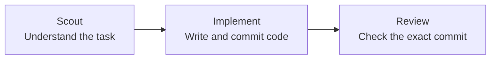

# Simpler README “How it works” Implementation Plan

> **For agentic workers:** REQUIRED SUB-SKILL: Use superpowers:subagent-driven-development (recommended) or superpowers:executing-plans to implement this plan task-by-task. Steps use checkbox (`- [ ]`) syntax for tracking.

**Goal:** Replace the README’s branched workflow diagram with a three-role flow that a first-time Roc user can understand immediately.

**Architecture:** Keep the explanation entirely inside the existing `README.md` section. Mermaid shows only Scout, Implement, and Review; two short paragraphs explain how a task enters the flow and what accepted or rejected Review results mean.

**Tech Stack:** Markdown, GitHub Mermaid, Git

---

### Task 1: Simplify the workflow explanation

**Files:**
- Modify: `README.md:64-84`
- Reference: `docs/superpowers/specs/2026-08-27-readme-how-it-works-design.md`

- [ ] **Step 1: Replace only the existing “How it works” section**

Replace everything from `## How it works` up to, but not including,
`## Commands` with this exact content:

````markdown
## How it works

Roc picks one ready task and passes it through three agent roles.



If Review accepts the commit, the task is done. If Review rejects it, Roc
creates a follow-up ticket and moves on to the next ready task.
````

- [ ] **Step 2: Inspect the rendered-source boundary**

Run:

```bash
rtk sed -n '64,86p' README.md
```

Expected: the section contains three Mermaid nodes and two arrows, followed by
the accepted/rejected explanation; `## Commands` is unchanged and immediately
follows the section.

- [ ] **Step 3: Verify the documentation change**

Run:

```bash
rtk git diff --check -- README.md
rtk bun run check
```

Expected: both commands exit `0`; the complete suite reports 146 passing tests,
one expected skip, and no failures. Existing non-failing Biome warnings are
allowed by the repository policy.

- [ ] **Step 4: Stage only the workflow hunk**

`README.md` already contains a separate, user-owned Apache License section.
Partially stage the “How it works” hunk and decline the License hunk:

```bash
rtk git add -p README.md
rtk git diff --cached -- README.md
rtk git diff -- README.md
```

Expected: the cached diff contains only the simplified workflow section. The
unstaged diff still contains the Apache License section. Do not stage
`package.json`, `LICENSE`, `.codegraph/`, `.cursor/`, or `output/`.

- [ ] **Step 5: Commit the README change**

```bash
rtk git commit -m "docs: simplify the Roc workflow diagram"
```

Expected: the Husky hook passes, the commit contains only `README.md`, and the
unrelated user changes remain uncommitted.
