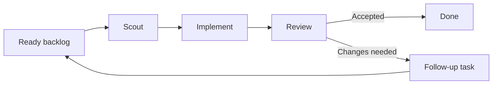

# Simpler README Agile Flow Implementation Plan

> **For agentic workers:** REQUIRED SUB-SKILL: Use superpowers:subagent-driven-development (recommended) or superpowers:executing-plans to implement this plan task-by-task. Steps use checkbox (`- [ ]`) syntax for tracking.

**Goal:** Replace the dense README diagram with a simple explanation of Roc’s agile Scout → Implement → Review loop.

**Architecture:** Keep one small Mermaid flow for task movement and explain each agent in three plain-language bullets. Keep publishing, token accounting, and model-routing details outside this section so the core loop stays easy to scan.

**Tech Stack:** Markdown, Mermaid, Bun test

---

## File structure

- Modify `README.md`: simplify only the “How it works” section.
- Modify `test/release-workflow.test.ts`: add a focused README contract test using the existing `readProjectFile` helper.

### Task 1: Explain Roc’s agile loop clearly

**Files:**
- Modify: `README.md:82-106`
- Test: `test/release-workflow.test.ts`

- [ ] **Step 1: Add the failing README contract test**

Append this test to `test/release-workflow.test.ts`:

```ts
test("README explains the agile Scout, Implement, Review loop", async () => {
  const readme = await readProjectFile("README.md");
  const start = readme.indexOf("## How it works");
  const end = readme.indexOf("## Commands", start);
  const howItWorks = readme.slice(start, end);

  expect(howItWorks).toContain("Roc follows a small agile loop");
  expect(howItWorks).toContain("B[Ready backlog] --> S[Scout]");
  expect(howItWorks).toContain("S --> I[Implement]");
  expect(howItWorks).toContain("I --> R[Review]");
  expect(howItWorks).toContain("R -->|Accepted| D[Done]");
  expect(howItWorks).toContain("R -->|Changes needed| F[Follow-up task]");
  expect(howItWorks).toContain("- **Scout:** Understands the task");
  expect(howItWorks).toContain("- **Implement:** Writes the code");
  expect(howItWorks).toContain("- **Review:** Independently checks that exact commit");
  expect(howItWorks).toContain("Roc works on one small task at a time");
  expect(howItWorks).toContain("saves progress so the flow can continue after a restart");
  expect(howItWorks).not.toContain("Token ledger");
  expect(howItWorks).not.toContain("GitHub Release");
});
```

- [ ] **Step 2: Run the focused test and confirm it fails**

Run:

```bash
rtk bun test test/release-workflow.test.ts
```

Expected: FAIL because the current section does not contain “Roc follows a small agile loop” and still contains “Token ledger”.

- [ ] **Step 3: Replace the README section with the simple agile flow**

Replace the content from `## How it works` up to `## Commands` with:

````markdown
## How it works

Roc follows a small agile loop. It moves each task through three focused agents:



- **Scout:** Understands the task, checks the code, and prepares a plan.
- **Implement:** Writes the code in a separate work folder and creates a commit.
- **Review:** Independently checks that exact commit. It accepts the work or
  creates a follow-up task with clear feedback.

Roc works on one small task at a time. When Review asks for changes, Roc sends
the feedback back to the ready backlog instead of repeating the finished
attempt. Roc saves progress so the flow can continue after a restart.

````

- [ ] **Step 4: Run the focused README tests**

Run:

```bash
rtk bun test test/release-workflow.test.ts
```

Expected: all tests in the file PASS.

- [ ] **Step 5: Run the full project check**

Run:

```bash
rtk bun run check
```

Expected: lint, typecheck, and tests PASS; the existing intentional detached Review test may remain skipped.

- [ ] **Step 6: Commit the README update**

Run:

```bash
rtk git add README.md test/release-workflow.test.ts
rtk env HUSKY=0 git commit -m "docs: simplify Roc agile flow"
```

Expected: one commit containing only the README explanation and its contract test.
