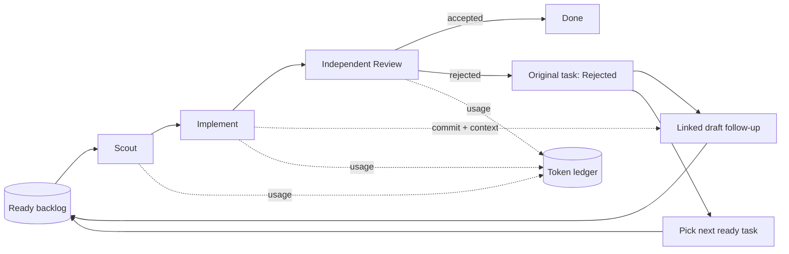

# Operator-First README Implementation Plan

> **For agentic workers:** REQUIRED SUB-SKILL: Use superpowers:subagent-driven-development (recommended) or superpowers:executing-plans to implement this plan task-by-task. Steps use checkbox (`- [ ]`) syntax for tracking.

**Goal:** Create an accurate operator-first README that explains the implemented Agile Agents foundation, its no-loop review flow, every CLI command, development workflow, and upstream references.

**Architecture:** Add one root `README.md` as the public entry point. Source all runtime claims and commands from the existing CLI help, package scripts, architecture document, and research; keep future Grilling and interactive TUI work explicitly out of the implemented feature list.

**Tech Stack:** Markdown, Mermaid, Bun, TypeScript, Zod, SQLite, Git, Codex app-server

---

### Task 1: Create and verify the operator README

**Files:**
- Create: `README.md`
- Reference: `src/cli/help.ts`
- Reference: `package.json`
- Reference: `docs/architecture.md`
- Reference: `docs/research/agent-agile-orchestration-landscape.md`

- [x] **Step 1: Create `README.md` with the approved structure**

Write the following content:

````markdown
# Agile Agents

Agile Agents is a local, sequential development orchestrator for Codex. It turns
ready tickets into isolated **Scout → Implement → Review** attempts, persists
task and token state in SQLite, and keeps the scheduler moving when a review
fails.

The key policy is simple: a semantic review rejection never loops the same task.
The original task becomes terminal, a linked draft follow-up inherits the
implementation commit and review findings, and the scheduler picks the next
ready ticket. Infrastructure failures may retry within a small cap.

The current foundation provides:

- deterministic model routing without `low` reasoning effort;
- isolated task branches in a scheduler-owned sibling checkout;
- detached, read-only review of the exact implementation commit;
- durable attempts, events, recovery cursors, and per-role token accounting;
- a terminal token-usage bar chart;
- source-based skill allowlisting for Matt Pocock skills, i-have-adhd, and
  Ponytail.

This is a local CLI foundation. Weekly Grilling, ticket authoring/import, and the
interactive TUI are planned product layers, not current commands. Version 1 is
sequential and does not merge, push, delete task branches, run tasks in parallel,
or enforce token budgets.

## Run it

Prerequisites:

- [Bun](https://bun.sh/)
- Git
- [Codex CLI](https://github.com/openai/codex) for the real Codex backend

From the repository root:

```bash
bun install
bun run src/cli/main.ts init
bun run src/cli/main.ts task list
bun run src/cli/main.ts tokens
```

The current CLI initializes and inspects the local scheduler database. Tickets
are currently populated through the internal planning repository; a public
Grilling/import command is not implemented yet.

To run a prepared backlog with Codex:

```bash
bun run src/cli/main.ts scheduler run --backend codex --repo /absolute/path/to/project
```

The Codex backend creates or reuses a sibling checkout at
`<project>.agile-checkout`. It never switches or commits in the source checkout
passed through `--repo`.

## Core flow



Review rejection is a successful review result, not an infrastructure error.
That distinction prevents one difficult ticket from monopolizing the workflow
while preserving its lineage for later work.

## Commands

All supported CLI commands:

```bash
bun run src/cli/main.ts init [--db PATH]
bun run src/cli/main.ts task list [--db PATH]
bun run src/cli/main.ts tokens [--db PATH] [--no-color]
bun run src/cli/main.ts scheduler run --backend fake --fake-script PATH [--db PATH]
bun run src/cli/main.ts scheduler run --backend codex --repo PATH [--base REF] [--db PATH]
bun run src/cli/main.ts scheduler inspect [--db PATH]
bun run src/cli/main.ts help
```

Development commands:

```bash
bun install
bun run typecheck
bun run test
bun run check
```

## Contributing and development

Agile Agents uses Bun, TypeScript, Zod, `bun:sqlite`, `simple-git`, and the Codex
app-server protocol. Start with these documents:

- [Architecture](docs/architecture.md)
- [Domain language](CONTEXT.md)
- [Approved specifications](docs/specs/)
- [Durable decisions](docs/adr/)
- [Research](docs/research/)
- [Testing policy](AGENTS.md)

Keep changes small and preserve the core safety boundaries: the source checkout
must remain untouched, Review must inspect the exact clean Implement commit,
duplicate events must be idempotent, and review rejection must create one new
draft follow-up without reopening the original task.

Before submitting a change, run:

```bash
bun run check
```

The project optimizes for confidence in core behavior rather than 100% coverage.
Prefer one vertical integration test and focused boundary tests. Use the Fake
Harness for deterministic retry, rejection, restart, and deduplication cases.

## References

The design borrows focused patterns rather than embedding another orchestration
framework:

| Project | What informed Agile Agents |
| --- | --- |
| [OpenAI Codex](https://github.com/openai/codex) | Agent execution, app-server threads, structured events, usage, and review isolation |
| [OpenAI Symphony](https://github.com/openai/symphony) | Authoritative orchestration, issue claiming, isolated workspaces, and run-state visibility |
| [Pi](https://github.com/earendil-works/pi) | Session trees, non-destructive context ancestry, compaction, and subprocess/RPC patterns |
| [Beads](https://github.com/gastownhall/beads) | Ready-work queries, dependency edges, and discovered follow-up lineage |
| [Gas Town](https://github.com/gastownhall/gastown) | Multi-role operations, stuck-work handling, review gates, and terminal workflow ideas |
| [OpenSpec](https://github.com/Fission-AI/OpenSpec) | Human-readable proposal, specification, design, and task artifacts |

See [the orchestration landscape research](docs/research/agent-agile-orchestration-landscape.md)
for the detailed comparison, trade-offs, and sources.
````

- [x] **Step 2: Verify every implemented CLI command is represented**

Run:

```bash
bun run src/cli/main.ts help
```

Expected: output lists `init`, `task list`, `tokens`, both `scheduler run`
backends, `scheduler inspect`, and `help`; each appears in the README command
block with the same flags.

- [x] **Step 3: Check the Markdown for incomplete markers and malformed whitespace**

Run:

```bash
rg -n 'T[B]D|T[O]DO|<repo[-]url>' README.md
git diff --check
```

Expected: `rg` has no matches and `git diff --check` exits successfully.

- [x] **Step 4: Run the project verification**

Run:

```bash
bun run check
```

Expected: TypeScript compilation succeeds; the test suite reports 146 passing,
1 skipped real-Codex integration test, and 0 failures.

- [x] **Step 5: Commit the README**

```bash
git add README.md docs/superpowers/plans/2026-08-27-readme-implementation-plan.md
git commit -m "docs: add operator README"
```
