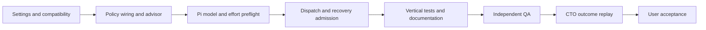

# Pi multi-model routing implementation plan

Date: 2026-09-11. Status: approved for M1 implementation by the user's instruction to update the plan, create diagrams before implementation, and use a suitable model. No paid provider qualification or external publication is authorized by this approval.

Follow-up authorization: after functional verification, the user requested a PR. This authorizes the feature-branch commits, push, and pull request needed to deliver M1. Benchmarking remains deferred. The original implementation boundary below records the permissions in effect during implementation.

PR integration note: upstream PR #101 added top-level per-role `efforts` while this feature was in progress. The PR must preserve those overrides and their legacy behavior while retaining exact allowlist admission. The primary implementation setting remains scoped to Terra. Role defaults and the diagrams describe the default configuration; an explicit per-role setting may override the effort used elsewhere. Integration tests must cover both settings together before publication.

Roc will run Codex, Kimi, and GLM models through its existing Pi backend. Operators can select a GLM or Kimi implementer while retaining Codex for Scout, independent Review, and high-risk work. Billing details are not a prerequisite. The feature makes lower-cost execution possible; it does not establish savings before measurement.

One active milestone, M1, delivers the configuration, routing, and recovery behavior below. The CTO owns the technical outcome. QA owns verification. The existing CTO and QA planning packets inform this plan; their candidate-list disagreement was resolved by a targeted CTO review in favor of one primary implementer per run.

The advisor research clarifies the boundary: architectural advice and worker-model selection are different jobs. Roc's `ModelAdvisor` remains deterministic. It uses the approved role, risk, retry state, exact catalog, and configured policy; it does not ask another LLM which model to use. Public architecture-consultant defaults are examples, not evidence for a most-used routing model. No new architecture-consultant role is added in M1. [Advisor research](../../research/2026-09-11-advisor-model-usage.md)

The architecture diagram and execution graph were authored before code implementation. Both pass Archify's nine showcase checks with zero composition errors and warnings:

- [Interactive architecture diagram](../../../output/archify/pi-multi-model/architecture.html), backed by [architecture JSON](../../design/pi-multi-model-architecture.json).
- [Interactive execution graph](../../../output/archify/pi-multi-model/flow.html), backed by [flow JSON](../../design/pi-multi-model-flow.json).

The implementation sequence also forms this dependency graph:



Execution uses the installed internal delivery profile, GPT-5.6 Terra at high effort. The installed QA lead and CTO profiles use GPT-5.6 Sol at high effort. These are development roles for this change, separate from the configurable models that Roc will run afterward. Root and global model settings stay unchanged. The mutation boundary permits repository code, tests, documentation, and local evidence; it excludes commits, pushes, GitHub publication, credential changes, global configuration changes, and paid provider trials.

The architecture stays as follows:

```text
Roc scheduler
  Scout, when required: Pi process + Codex model
  Implement:            Pi process + selected GLM or Kimi model
  Review:               separate Pi process + Codex model

Roc owns role order, attempts, task workspaces, trusted commits, and acceptance.
Pi owns provider requests, the agent loop, tools, and native sessions.
```

Using a model through Pi does not launch that provider's native CLI. Several independent tasks can use the existing bounded concurrency. The roles within one task retain their dependency order and independent sessions.

The scope is an exact model allowlist, one selected implementation model, a supported primary effort, and enforcement across startup, retries, and recovery. Keep the existing Pi RPC integration and backend interface. Native Codex/Kimi CLI adapters, a learned advisor, automatic GLM-to-Kimi switching, provider onboarding UI, price services, and new billing storage are outside M1.

The proposed settings extend the existing `models` object:

| Field | Meaning |
| --- | --- |
| `luna` | Existing exact Scout model mapping |
| `terra` | Existing exact primary Implement model mapping |
| `sol` | Existing exact Review, high-risk, and escalation mapping |
| `allowlist` | Optional nonempty array of unique exact `provider/modelId` values |
| `implementPrimaryEffort` | Optional `medium` or `high`, defaulting to the existing `medium` |

The first documented configuration uses the `openai-codex`, `kimi-coding`, and `zai` provider routes. Admission compares full IDs, never display names or model-name suffixes. A similarly named model exposed by a gateway or another regional endpoint is not admitted by that comparison. No model IDs are added automatically when a catalog refresh discovers new models.

Existing settings without the new fields keep their current behavior. Enabling the allowlist restricts all effective profile mappings and new model execution to those exact entries. Dormant allowed entries do not need to be available until selected. The existing operator-selected Codex model is preserved; the feature does not pick a new global default or modify credentials.

The documented role policy is:

| Route | Model | Pi effort |
| --- | --- | --- |
| Scout | Codex through Luna | High |
| Low/medium-risk primary Implement | Selected Terra model | Configured primary effort |
| Retry that retains Terra | Same Terra model | Same configured primary effort |
| High-risk or escalated Implement | Codex through Sol | Medium |
| Independent Review | Codex through Sol | High |

These are profile mappings, not a claim that provider names imply quality. Keep the existing bounded retry rules. When escalation selects Sol, compute the effort for that new route; do not copy the primary model's effort onto it. A selected primary that fails preflight must stop before a prompt rather than silently becoming Sol. Escalation after an observed attempt failure remains distinct from preflight substitution.

Implement M1 in this order:

1. Extend settings and preserve existing configurations.

   Change `src/domain/agile-cycle.ts` from a profile-only partial record to a strict models object with the three optional mappings and the two new fields. Reuse the existing exact-ID validation. Reject empty/duplicate allowlists and unsupported effort values. Add the effort field to the safe diagnostic names in `src/settings.ts`. Confirm repeat onboarding preserves the full models object. Tests belong in `test/settings.test.ts` and the existing onboarding integration fixture.

2. Carry routing policy into the existing advisor.

   Add an optional routing-policy value to `BackendRuntime` in `src/agents/types.ts`. Have `src/agents/pi/backend.ts` return the validated policy alongside its existing catalog and mappings. Pass that value into `createModelAdvisor` from `runBackendSession` in `src/cli/runtime.ts`. Keep existing callers valid through an omitted/default policy. Use one immutable policy snapshot per scheduler run.

   Update `src/scheduler/model-routing.ts` to compute effort from the selected role and profile. Apply the primary override only to Terra Implement. Keep Scout/Review high and Sol Implement medium. Filter candidates by exact allowlist membership and effort compatibility. Under the new policy, an incompatible explicit primary must not be skipped silently. Extend the existing advisor tests and one backend-session wiring test.

3. Validate the selected Pi routes before role execution.

   In `src/agents/pi/backend.ts`, validate actual role requirements instead of requiring high for every profile indiscriminately. Luna must support high; Terra must support the configured primary effort; Sol must support high for Review and medium for Implement. Validate any Pi default that fills an omitted mapping. Under the new policy, a default that is unused because all mappings are explicit should not control their eligibility.

   Check membership in the discovered catalog and the allowlist. Missing authentication or catalog access must remain a clear startup failure. Catalog listing is not proof of successful inference or immutable provider identity. Preserve exact `set_model`, `set_thinking_level`, and `get_state` checks before a prompt. Use the scripted Pi clients in `test/agents/pi/backend.test.ts` and `test/agents/pi/harness.test.ts`; do not make network calls in repository tests.

4. Enforce admission without rewriting recovery history.

   Pass the allowlist snapshot into the Pi execution boundary. Before starting model work for a new or recovered attempt, check the recorded exact model against that policy. A denied historical model must lead to `needs_replan` through the existing policy-failure path, with its descriptor, cursor, and task work retained. Never reroute a recovered attempt through today's preferred Terra model.

   Reading an already recorded output does not authorize another model call. Reconciliation and cleanup must remain possible without falsifying the old model or effort. Apply the check before prompt dispatch, preserve existing cancellation and ownership rules, and test the denied-recovery boundary alongside the current recovery fixture. Policy changes apply when a scheduler run starts; live revocation of an already running provider request is outside M1.

5. Prove the full flow and document operator use.

   Extend one deterministic vertical test to run Codex Scout, Kimi or GLM Implement, and a distinct Codex Review session. Assert the exact routed model and effort, the sole trusted implementation commit, and Review's matching commit/base. Exercise the other model family in a focused catalog/effort test rather than duplicating the full flow.

   Update `README.details.md`, `docs/specs/model-routing-context.md`, and `docs/architecture.md` with the approved behavior and a validated configuration example. The setup instructions use Pi's existing provider configuration and explain that Roc onboarding remains Codex-specific. Preserve existing user settings rather than replacing the whole settings file. Include safe correction instructions for a denied or incompatible selection.

Keep edits within those boundaries unless a focused test identifies a necessary missing connection. In particular, inspect `src/scheduler/github-runner.ts` only if the existing policy-failure path cannot represent the denied recovery. Do not refactor the scheduler, replace RPC with the in-process SDK, or add a runtime discriminator to historical records during M1. Every new or changed named production function needs the repository's one-sentence JSDoc.

Acceptance requires all of the following:

- Old settings still parse and keep their existing model choices and effort behavior.
- The allowlist governs effective defaults, primary routes, escalation, and new execution from recovered attempts.
- Kimi K3 at medium is rejected before a prompt; a catalog-qualified high route is admitted.
- A primary high route retains high on a same-profile retry and uses medium after Codex Sol escalation.
- A denied model or model/effort readback mismatch produces no role prompt.
- Recovery preserves the recorded model, effort, cursor, and work. It never silently substitutes the latest configured model.
- Independent Review validates the exact trusted commit in a separate session.
- Onboarding preserves the routing fields; logs retain sanitized errors.
- No new paid router call, extra reviewer, or automatic provider-switch loop is introduced.

Run the focused settings, routing, backend, harness, backend-session, and selected vertical tests while implementing. After they pass, run `rtk bun run check`. Do not add exhaustive provider/role/effort matrices. No automated tests were run for this document-only planning turn.

Budget work uses existing behavior first. Keep required Scout and Review constant while comparing implementers. Use `skipScout: true` only where the approved low-risk ticket already permits it and includes complete scope and acceptance information. Keep handoffs concise without truncating required source context or restoring a Scout byte cap. Treat retry and repair usage as part of the original task's cost.

Real provider qualification is a separate activation step after M1's repository checks. Discover the current account-accessible IDs and supported settings, then run one isolated fixed fixture per selected provider with prewritten acceptance checks and stubbed publication. Count failures, verify independent Review, and confirm process cleanup. A pass proves only that the tested route completed that fixture. A broader paid cost comparison requires its own bounded scope; billing details do not block M1 design or repository implementation.

Current evidence has these limits:

| Classification | Evidence and consequence |
| --- | --- |
| Verified | Roc has `BackendFactory`, `BackendRuntime`, and `AgentHarness` boundaries, and only Pi is registered publicly. Sources: `src/agents/types.ts`, `src/agents/registry.ts`, `src/harness/contracts.ts`. |
| Verified | The current advisor fixes new Implement effort to medium and selects profiles by role/risk/retry. Source: `src/scheduler/model-routing.ts`. |
| Verified | Pi 0.82.1's installed metadata includes Kimi K3 routes that reject medium and a GLM-5.2 mapping from Pi medium to provider high. These are local adapter facts, not account qualification. |
| Verified | Kimi documents low/high/max for K3. Z.ai documents Coding Plan redirection from GLM-5.2 requests to GLM-5.3. Exact requested IDs do not guarantee an immutable underlying model. |
| Inferred | An allowlist plus a narrow primary-effort override fits the existing Pi architecture without another runtime. |
| Unverified | Actual provider access, resolved server-side aliases where not exposed, and accepted-task savings. These remain activation/measurement questions. |

Existing attempt effort means the Roc/Pi setting. Do not relabel it as measured provider compute. Explain any known provider mapping in validation evidence and documentation. If a provider reports a resolved model identity, retain it in the qualification evidence; otherwise disclose that only the requested/read-back ID is known. No new inferred billing or provider-compute fields are required in the durable attempt schema.

Primary provider references, observed 2026-09-11: [Kimi reasoning settings](https://platform.kimi.ai/docs/guide/use-reasoning-effort), [Z.ai Coding Plan routing](https://docs.z.ai/devpack/overview), and [Pi RPC](https://github.com/earendil-works/pi/blob/main/packages/coding-agent/docs/rpc.md). Repository context is also recorded in the [cross-provider research](../../research/2026-09-11-cross-provider-model-advisor.md).

A later native-runtime milestone starts only when a capability requires another agent's own runtime. It would implement another `BackendFactory`/`AgentHarness`, qualify event translation and cancellation, and extend the registry. Mixing runtimes within one task would additionally require a persisted runtime identity, an owning-runtime dispatcher, separate native cursors, and an explicit historical-record migration rule. M1 leaves that existing interface intact and adds none of those speculative paths.

After implementation, an independent QA pass checks the acceptance criteria. The accountable CTO then replays the operator journey against the original requirement: configure an admitted model, run a task, inspect its actual route, receive independent Review, and recover or stop safely. M1 ends at user acceptance. Later provider qualification or native-runtime work does not begin automatically.
