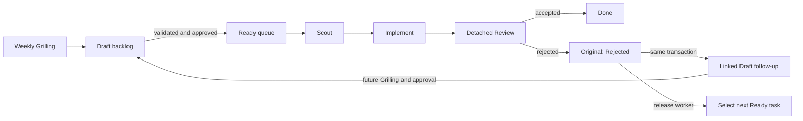

# Agent Agile Orchestrator Design

Date: 2026-08-24
Status: Approved for implementation planning

## 1. Decision summary

Build a local-first CLI/TUI system that turns weekly goals into executable tickets, schedules role-separated Codex work, prevents semantic failure loops, accounts for tokens per task, and supports non-destructive context inheritance across weeks.

The MVP is one Bun process with one SQLite database, one scheduler writer, one OpenTUI interface, and one Codex app-server integration. It uses TypeScript and Zod throughout.

The control plane contains two first-class decision components:

- a two-stage Grilling Agent that converts weekly intent into validated ticket specifications;
- a mixed Model Advisor that combines auditable rules with an LLM escalation path.

Codex is the only MVP execution backend. [Pi](https://github.com/earendil-works/pi) is a design reference for JSONL event streams, append-only session trees, non-destructive branching, and compaction; no Pi package, process adapter, configuration, or backend selection is included in the MVP.

This approved design supersedes earlier research recommendations where they differ, specifically the earlier deterministic-only Advisor and possible Pi backend.

## 2. Goals

1. Run an interactive weekly Grilling flow that produces a bounded weekly plan and ordered draft tickets.
2. Grill each ticket into an agent-ready specification with explicit acceptance and validation criteria.
3. Execute each ready ticket through Scout, Implement, and independent Review roles.
4. Show current task flow, role, model, reasoning effort, context ancestry, events, and token usage in a terminal UI.
5. On semantic review rejection, terminalize the original task, create a linked draft follow-up, and immediately schedule the next ready task.
6. Attribute backend-measured token usage to week, task, role, and attempt.
7. Allow a new task to inherit an exact, immutable context anchor from a previous task.
8. Optimize expected success within a hard weekly token budget.
9. Recover safely after scheduler or backend interruption without duplicating completed work.

## 3. Non-goals

- No web UI or hosted service.
- No distributed scheduler, Redis queue, Temporal workflow, ORM, or complete event-sourcing architecture.
- No Pi backend in the MVP.
- No multi-provider model routing in the MVP.
- No mid-turn model switching or automatic interruption to change models.
- No automatic retry of semantic review failures.
- No learned policy that can bypass hard budget, schema, effort, approval, or security constraints.

## 4. Product flow



Semantic review rejection and infrastructure failure are different failure classes:

- Semantic rejection never retries the original task. It creates a new draft and moves on.
- A transient backend or process failure gets an initial attempt plus at most two retries (`retry_index` 0, 1, and 2). If attempt 2 fails, the task becomes `failed_infra` and the scheduler moves on.

## 5. Architecture

```text
core/       Zod schemas, domain values, state transition functions
store/      bun:sqlite migrations, transactions, queries, audit events
grilling/   weekly and ticket Grilling workflows
advisor/    deterministic rules, LLM escalation, budget allocation
scheduler/  readiness, atomic claim, role progression, reconciliation
codex/      app-server protocol, event normalization, session operations
cli/        non-interactive commands
tui/        OpenTUI Weekly Control Room
```

Boundary rules:

- Only `scheduler` may request task-state transitions.
- Only `store` may write SQLite directly.
- Grilling, Advisor, Scheduler, and Codex communicate with Zod-validated commands and results.
- Codex runs as a child process. A Codex crash cannot terminate the scheduler or TUI.
- Each implementation ticket runs in an isolated Git worktree.
- SQLite is the operational source of truth. Markdown artifacts preserve human-readable intent and evidence.

Default local paths:

```text
.agile/plans/<week-id>.md
.agile/tickets/<ticket-id>.md
.agile/evidence/<ticket-id>/<attempt-id>.md
.agile/runtime/agile.db
.agile/runtime/worktrees/
```

The plan, ticket, and evidence artifacts are versionable. Runtime database and worktrees are local and ignored by Git.

## 6. Grilling Agent

### 6.1 Weekly Grilling

Inputs:

- the user's desired weekly outcome and constraints;
- unfinished backlog from previous weeks;
- the previous week's results and token usage;
- the hard weekly token budget;
- explicit or Advisor-suggested inherited contexts.

The Agent asks one question at a time until it has:

- outcome and non-goals;
- priorities and deadlines;
- task dependencies;
- risk classification;
- per-ticket token ceilings;
- human-approval requirements.

It emits a Zod-validated `WeeklyPlan` and ordered draft tickets.

### 6.2 Ticket Grilling

Every ticket must contain:

```ts
type TicketSpec = {
  problem: string;
  desiredOutcome: string;
  scope: string[];
  nonGoals: string[];
  acceptanceCriteria: string[];
  validation: string[];
  dependencies: string[];
  risk: "low" | "medium" | "high";
  contextCandidates: ContextRef[];
  tokenCeiling: number;
};
```

Low-risk, unambiguous tickets are grilled automatically. The user is asked only when there is material ambiguity, a product tradeoff, high risk, conflicting context candidates, or an expected token overrun.

A ticket moves from `draft` to `ready` only when:

1. its schema is valid;
2. material ambiguity is resolved;
3. dependencies are valid and acyclic;
4. a token ceiling is assigned;
5. any required human approval is recorded;
6. Grilling questions, answers, and rationales are persisted.

Unresolved tickets remain `needs_input` and are not schedulable.

## 7. Model Advisor

### 7.1 Objective

Maximize expected task success while remaining within the hard weekly token budget.

The Advisor runs only before Scout, Implement, and Review attempts, and after infrastructure failures. It never interrupts an active attempt to change models.

### 7.2 Inputs and output

```ts
type AdvisorInput = {
  ticket: TicketSpec;
  role: "scout" | "implement" | "review";
  priorAttempts: AttemptSummary[];
  lineageGeneration: number;
  remainingWeeklyTokens: number;
  remainingTaskTokens: number;
  contextCandidates: ContextRef[];
  availableModels: ModelCapability[];
};

type ModelDecision = {
  model: string;
  reasoningEffort: "medium" | "high" | "xhigh";
  tokenBudget: number;
  contextRef?: ContextRef;
  fallbackModels: string[];
  decidedBy: "rule" | "advisor-llm" | "fallback";
  confidence: number;
  rationale: string[];
};
```

`low` reasoning effort is invalid at every boundary. Zod schemas, configuration parsing, persisted decisions, and Codex commands reject it.

All roles default to `high`. `xhigh` is used for high-risk architecture, security, complex review, or failed-lineage work. `medium` is allowed only when the Advisor explicitly downshifts an exceptionally simple task to preserve budget and records the reason.

### 7.3 Mixed decision policy

The deterministic rule layer runs first:

- Scout baseline: Luna.
- Implement baseline: Terra.
- Review baseline: Sol.
- Prior rejection, high risk, security scope, or complex context can escalate the model or effort.
- Simple, low-risk work can be downshifted only with an explicit rationale.
- Review capacity is reserved before implementation budget is allocated.
- Models that do not report the required effort or capability are excluded.

The Advisor queries Codex `model/list` at runtime. If no available model supports at least `high`, the ticket becomes `needs_replan`; the system never falls back to `low`.

The Advisor LLM is invoked only for ambiguous routing, risk-budget conflicts, previous failure, conflicting contexts, or low rule confidence. Its bootstrap configuration is Terra with `high`; Sol with `high` is the fallback. If neither is available, the system uses deterministic rules only.

Every decision is an audit event so the TUI can explain model, effort, budget, context, confidence, and rationale.

## 8. Roles and Codex execution

### Scout

- Reads the ticket and repository structure.
- Locates relevant symbols, files, tests, risks, and possible contexts.
- Produces a compact Scout Capsule; it does not change implementation files.

### Implement

- Runs in the ticket's isolated worktree.
- Receives the ticket, selected inherited context, and Scout Capsule.
- Produces a commit or diff plus an Implementation Evidence Capsule containing tests, commands, risks, and known limitations.

### Review

- Runs through Codex `review/start` with detached delivery.
- Receives the ticket specification, commit or diff, test evidence, and compact implementation evidence.
- Does not inherit the Implement conversation.
- Returns a Zod-validated accepted/rejected decision and structured findings.

The `CodexHarness` uses the app-server JSON-RPC protocol for:

- `thread/start`, `thread/resume`, and `thread/fork`;
- `turn/start` and `turn/interrupt`;
- detached `review/start`;
- `model/list` capability discovery;
- `thread/tokenUsage/updated` events;
- approval and sandbox requests.

The protocol is isolated inside `codex/` so app-server changes do not affect Scheduler, Advisor, or TUI domain types.

Pi is not implemented. The Codex boundary borrows only these Pi-inspired patterns:

- append-only normalized agent events;
- explicit parent context references;
- non-destructive branching;
- compact context capsules;
- backend-measured usage rather than scheduler estimates.

## 9. Task state machine

```text
draft -> needs_input|needs_replan|ready
needs_input -> draft
needs_replan -> draft
ready -> needs_input|needs_replan|claimed
claimed -> scouting -> implementing -> reviewing
reviewing -> done
reviewing -> rejected
claimed|scouting|implementing|reviewing -> failed_infra
```

Terminal states are `done`, `rejected`, and `failed_infra`. A terminal task is never returned to `ready`.

Readiness requires:

- status `ready`;
- all blocking dependencies `done`;
- approval present when required;
- sufficient unreserved weekly and task token budget;
- no existing active claim.

SQLite performs readiness verification and claim creation in one transaction. A single scheduler is the task-state writer, and the transaction still prevents duplicate claims if multiple workers request work concurrently.

## 10. Review rejection transaction

In one SQLite transaction:

1. store the structured review and token usage;
2. complete the Review attempt;
3. mark the original task `rejected`;
4. create a new ticket in `draft` with the findings and remaining acceptance gaps;
5. link it with `root_task_id`, `parent_task_id`, and `discovered_from_review_id`;
6. attach the rejected commit, evidence capsule, and context anchor;
7. append audit events;
8. release the worker claim.

The follow-up is not eligible for immediate scheduling. It returns through Ticket Grilling and any required approval in a future planning pass. The scheduler selects the next unrelated ready ticket.

## 11. Context inheritance

```ts
type ContextRef = {
  threadId: string;
  anchorId: string;
  sourceTaskId: string;
  gitCommit: string;
  summaryArtifact?: string;
};
```

When the user asks to inherit last week's Task C:

1. locate Task C's accepted context reference;
2. verify its thread, completed turn anchor, and Git commit;
3. let the Advisor rank it against other candidates;
4. show the source and rationale during Grilling, allowing user override;
5. call Codex `thread/fork` with `lastTurnId`;
6. store a new child context reference;
7. leave Task C and its history unchanged.

If the anchor is missing or cannot be forked, the task becomes `needs_input`. The system does not silently substitute a different context.

Reviewer isolation is mandatory: review uses a fresh detached thread and receives evidence artifacts instead of the implementation conversation.

## 12. Token ledger and budget

The scheduler never estimates backend usage. It records usage reported by Codex and associates it with the applicable week, task, Advisor decision, or role attempt.

Usage scopes:

- Weekly Grilling -> week.
- Ticket Grilling -> task.
- Model Advisor LLM -> task and role decision.
- Scout, Implement, and Review -> task, role, and attempt.
- Context compaction or summarization -> the task that requested it.

Task totals are the exact sum of all task-scoped attempts and decisions. Week totals include all task totals plus weekly Grilling.

The weekly budget is a hard dispatch limit:

1. Weekly Grilling assigns explicit ticket ceilings.
2. Before dispatch, the Scheduler reserves the selected role budget and future Review minimum.
3. The Advisor cannot return a decision above remaining task or weekly capacity.
4. Actual usage decrements the reservation and weekly balance.
5. Insufficient capacity moves the ticket to `needs_replan`.
6. Budget overrun from an already active backend call is recorded, but no new attempt is dispatched until replanning restores a valid allocation.

## 13. Storage model

```text
weeks(id, starts_at, goal, token_budget, status)
tasks(id, week_id, title, spec_path, spec_hash, status, priority,
      risk, token_ceiling, root_task_id, parent_task_id,
      discovered_from_review_id, context_id)
task_deps(task_id, depends_on_task_id, kind)
attempts(id, task_id, role, model, effort, status,
         thread_id, started_at, ended_at, git_commit, retry_index)
reviews(id, task_id, attempt_id, decision, findings_json)
model_decisions(id, task_id, role, model, effort, token_budget, context_id,
                fallback_models_json, decided_by, confidence, rationale_json)
usage(id, week_id, task_id, attempt_id, model_decision_id, category,
      input_tokens, cached_input_tokens, output_tokens,
      reasoning_output_tokens, cost)
contexts(id, thread_id, anchor_id, source_task_id, parent_context_id,
         git_commit, summary_artifact)
events(seq, task_id, attempt_id, type, payload_json, occurred_at)
```

Current-state tables support fast scheduling. The append-only event table supports explanation, reconciliation, and recovery without introducing full event sourcing.

## 14. CLI and TUI

Initial CLI commands:

```text
agile plan
agile run
agile tui
agile task list
agile task show <id>
agile advisor explain <task-id> [role]
agile context show <task-id>
agile context fork <source-task-id> --for <target-task-id>
agile budget show
```

The OpenTUI Weekly Control Room contains:

- Backlog, Scout, Implement, Review, and Done lanes;
- rejected originals and linked draft follow-ups;
- active role, model, effort, and live status;
- weekly and per-task token totals;
- an inspector for Advisor rationale, context ancestry, evidence, and events;
- keyboard actions for Grilling, approval, rejection, context, Advisor, and token views.

The TUI reads the same query layer as the CLI and never writes SQLite directly.

## 15. Error handling and recovery

- Invalid Zod payload: reject the command and do not advance state.
- Invalid Advisor LLM output: use deterministic fallback and record `advisor_fallback`.
- Temporary Codex/process failure: run the initial attempt and at most two retries; failure at `retry_index = 2` produces `failed_infra`.
- Semantic review rejection: zero retries; create a draft follow-up and move on.
- Missing Context anchor: `needs_input`.
- Insufficient budget: `needs_replan`.
- Unsupported `high` or `xhigh`: select a compatible model or `needs_replan`; never use `low`.
- Scheduler restart: reconcile SQLite attempts with Codex thread state and worktree/commit evidence before dispatch.
- Active attempt with a completed Codex turn but missing local completion event: import the terminal event idempotently.
- Active attempt with no live process and no completed turn: classify as infrastructure failure and apply the retry cap.

All state-changing operations use idempotency keys derived from task, role, attempt, and backend event identity.

## 16. Security

- Codex approval and sandbox requests are surfaced through the TUI or resolved by explicit project policy.
- No blanket bypass of sandbox or approvals is part of the MVP.
- Git worktrees isolate implementation changes by task.
- Reviewer threads are read-only with respect to implementation files unless a future approved workflow explicitly permits review fixes.
- Credentials remain in Codex authentication/configuration and are not copied into SQLite or ticket artifacts.
- Logs redact environment values, tokens, and credential-shaped payloads.

## 17. Verification strategy

Use Bun Test with a deterministic Fake Codex Harness for domain and integration tests. Use recorded protocol fixtures for the real Codex boundary.

Required acceptance tests:

1. Weekly Grilling produces schema-valid plans and an acyclic ticket graph.
2. Blocked tickets cannot be claimed.
3. Concurrent claim attempts cannot claim the same ticket twice.
4. Review rejection terminalizes the original, creates one linked draft, and selects the next ready ticket.
5. Reconciliation cannot duplicate the follow-up ticket or completion event.
6. Context inheritance forks the exact task, turn, and commit and preserves the source.
7. Review does not inherit the Implement conversation.
8. Task and week token totals equal the sum of normalized Codex usage events.
9. Budget exhaustion prevents new dispatch.
10. Every role defaults to `high`; no accepted schema or command can contain `low`.
11. Unsupported effort produces model reselection or `needs_replan`.
12. Scheduler restart resumes without repeating completed work.
13. Failure of the initial attempt and both permitted retries produces `failed_infra` and releases the worker.
14. CLI and TUI render the same task status, usage, and Advisor decision.

## 18. Delivery slices

1. Domain schemas, SQLite store, migrations, and transition tests.
2. Markdown plan/ticket artifacts and two-stage Grilling.
3. Fake Codex Harness, scheduler, readiness, atomic claim, and recovery.
4. Codex app-server integration, normalized events, models, and token ledger.
5. Mixed Model Advisor and budget enforcement.
6. Context forks, isolated review, and no-loop rejection transaction.
7. CLI read/write workflows.
8. OpenTUI Weekly Control Room and end-to-end acceptance tests.

Detailed commit-sized implementation steps belong in the implementation plan created only after this design is reviewed.

## 19. Primary references

- [Agent orchestration landscape](../../research/agent-agile-orchestration-landscape.md)
- [OpenAI Symphony specification](https://github.com/openai/symphony/blob/main/SPEC.md)
- [Codex app-server](https://developers.openai.com/codex/app-server)
- [Codex non-interactive mode](https://developers.openai.com/codex/noninteractive)
- [Pi Agent Harness](https://github.com/earendil-works/pi)
- [Pi RPC mode](https://github.com/earendil-works/pi/blob/main/packages/coding-agent/docs/rpc.md)
- [Pi session format](https://github.com/earendil-works/pi/blob/main/packages/coding-agent/docs/session-format.md)
