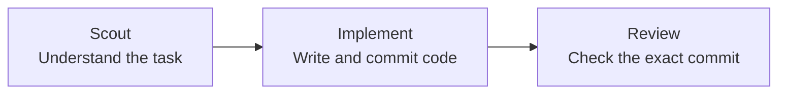

# README “How it works” simplification

## Goal

Make the README’s “How it works” section understandable to someone seeing Roc
for the first time. The reader should understand the three agent roles without
having to trace scheduler, token, context, or rejection-state edges.

## Approved design

Replace the current multi-branch diagram with one left-to-right Mermaid flow:

Introduce the diagram with:

> Roc picks one ready task and passes it through three agent roles.

Follow the diagram with:

> If Review accepts the commit, the task is done. If Review rejects it, Roc
> creates a follow-up ticket and moves on to the next ready task.

## Constraints

- Keep the main diagram to three nodes and two arrows.
- Keep accepted and rejected outcomes in prose, outside the diagram.
- Do not show token accounting, context inheritance, Git branches, scheduler
  state, or database details in this section.
- Do not change other README sections as part of this edit.
- Use Mermaid because GitHub renders it directly and the source remains easy to
  review in Git.

## Acceptance checks

- A first-time reader can identify what Scout, Implement, and Review do.
- The diagram has no branches, crossing lines, or overlapping connectors.
- The prose explains both accepted and rejected Review outcomes.
- The Markdown has no trailing whitespace or broken local links.
